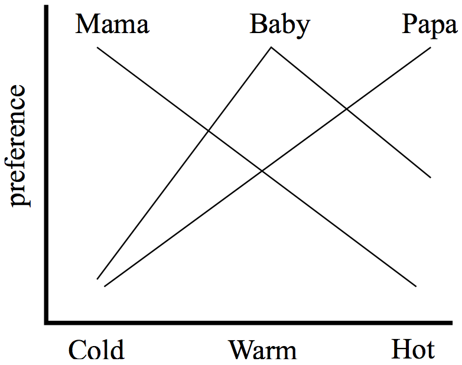
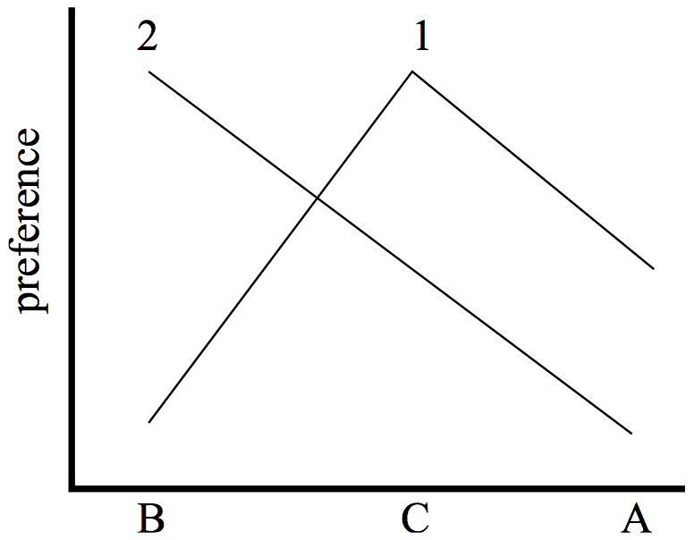

# 阿罗悖论 Arrow’s theorem (Michael Morreau)

_首次发表于 2014 年 10 月 13 日；实质性修订于 2019 年 11 月 26 日_

肯尼斯·阿罗的“不可能性”定理，或者他所称的“一般可能性”定理，回答了集体决策理论中一个非常基本的问题。假设有一些可供选择的替代方案。它们可以是政策、公共项目、选举中的候选人、社会成员之间的收入和劳动需求分配，或者几乎任何其他事物。有一些人的偏好将决定这个选择，问题是：有哪些程序可以根据已知或可以了解到的他们的偏好，从更好到更差地推导出一种集体或“社会”对替代方案的排序？答案令人震惊。阿罗的定理说根本就没有这样的程序，无论如何，它们都不能满足关于人们的自治和偏好的合理假设。阿罗给出了社会排序问题的技术框架，使其具有明确的意义和严格的答案，现在广泛用于研究福利经济学中的问题。不可能性定理本身为当代社会选择理论的大部分议程设定了基调。阿罗在研究生时期就取得了这一成就。1972 年，他因其贡献而获得了诺贝尔经济学奖。

* [1. 人民的意愿？](https://plato.stanford.edu/entries/arrows-theorem/#WilPeo)
* [2. 阿罗悖论的框架](https://plato.stanford.edu/entries/arrows-theorem/#ArrFra)
* [2.1 个体偏好](https://plato.stanford.edu/entries/arrows-theorem/#IndPre)
* [2.2 多重配置文件](https://plato.stanford.edu/entries/arrows-theorem/#MulPro)
* [2.3 社会福利函数](https://plato.stanford.edu/entries/arrows-theorem/#SocWelFun)
* [3. 不可能性](https://plato.stanford.edu/entries/arrows-theorem/#Imp)
* [3.1 这些条件…](https://plato.stanford.edu/entries/arrows-theorem/#TheCon)
* [3.2 …不相容](https://plato.stanford.edu/entries/arrows-theorem/#HarInc)
* [4. 条件，再次](https://plato.stanford.edu/entries/arrows-theorem/#ConAga)
* [4.1 无限制的定义域](https://plato.stanford.edu/entries/arrows-theorem/#UnrDom)
* [4.2 社会排序](https://plato.stanford.edu/entries/arrows-theorem/#SocOrd)
* [4.3 弱帕累托](https://plato.stanford.edu/entries/arrows-theorem/#WeaPar)
* [4.4 非独裁](https://plato.stanford.edu/entries/arrows-theorem/#NonDic)
* [4.5 不相关选择的独立性](https://plato.stanford.edu/entries/arrows-theorem/#IndIrrAlt)
* [5. 可能性](https://plato.stanford.edu/entries/arrows-theorem/#Pos)
* [5.1 域限制](https://plato.stanford.edu/entries/arrows-theorem/#DomRes)
* [5.2 更多序数信息](https://plato.stanford.edu/entries/arrows-theorem/#OrdInf)
* [5.3 更多序数信息：分数和等级](https://plato.stanford.edu/entries/arrows-theorem/#ScoGra)
* [5.4 基数信息](https://plato.stanford.edu/entries/arrows-theorem/#CarInf)
* [6. 重新解释](https://plato.stanford.edu/entries/arrows-theorem/#Rei)
* [6.1 判断聚合](https://plato.stanford.edu/entries/arrows-theorem/#JudAgg)
* [6.2 多准则决策](https://plato.stanford.edu/entries/arrows-theorem/#MulCriDec)
* [6.3 总体相似性](https://plato.stanford.edu/entries/arrows-theorem/#OveSim)
* [参考文献](https://plato.stanford.edu/entries/arrows-theorem/#Bib)
* [学术工具](https://plato.stanford.edu/entries/arrows-theorem/#Aca)
* [其他互联网资源](https://plato.stanford.edu/entries/arrows-theorem/#Oth)
* [相关条目](https://plato.stanford.edu/entries/arrows-theorem/#Rel)

***

## 1. 人民的意愿？

社会秩序中的一些问题在一个简单但重要的例子中是可见的。假设有三个可供选择的替代方案 A、B 和 C。有一个由 1、2 和 3 三个人组成的群体，他们的偏好将决定这个选择，并被要求按照自己的标准将这些替代方案进行排名，从最好到最差。他们个人的偏好排序结果如下：

1. _ABC_
2. _BCA_
3. _CAB_

也就是说，人 1 更喜欢 A 而不是 B，更喜欢 B 而不是 C，而且更喜欢 A 而不是 C；人 2 更喜欢 B 而不是 C，依此类推。现在，我们可能希望以某种方式得出一个反映所有三个人偏好的单一的“社会”排序。然后我们可以选择任何社会上最好的选择，或者如果有多个选择并列第一，我们可以选择任何一个与其他选择一样好的选择。假设我们逐对地对这些选择进行投票：如果有更多的选民喜欢一个选择而不是另一个选择，我们就认为这个选择是_社会上更受欢迎_的选择。通过这种方式，我们确定 A 在社会上优先于 B，因为有两个选民（1 和 3）更喜欢 A 而不是 B，但只有一个选民（2 号选民）更喜欢 B 而不是 A。同样地，社会上更偏好 B 而不是 C。因此，我们可能期望发现 A 在社会上优先于 C。然而，根据这种计算，情况正好相反，因为有两个选民更喜欢 C 而不是 A。我们根本没有一个社会上的_排序_。我们有一个_循环_。从任何一个选择开始，转移到一个社会上更受欢迎的选择，然后再转移到下一个，你很快就会发现自己回到了起点。\[1]

这就是“投票悖论”。由孔多塞侯爵（1785 年）发现，它表明当个体偏好被聚合成社会偏好时，理性选择的可能性会丧失。选民 1 将 A 放在他的个人排序的首位。通过选择 A，这个选民的偏好可以被_最大化_。通过选择他们的最大值 B 或 C，2 或 3 的偏好也可以被最大化。然而，两两多数决策并不能得出社会最大值。A 不是社会最大值，因为大多数人更喜欢其他东西，即 C。同样，B 和 C 也不是社会最大值。个体偏好适合最大化；但是，由于它们循环，社会偏好却不能。

是否有其他比两两多数决策更好的聚合程序，或者不同的程序是否有其自身的缺点？孔多塞、他的同时代人让·夏尔·德·博达（1781 年）以及后来的查尔斯·道奇森（1844 年）和邓肯·布莱克（1948 年）等人通过研究各种程序并比较它们的特性来回答这个问题。阿罗从相反的角度打破了新的领域。他从聚合程序可能满足的各种要求开始，问哪些程序能够满足这些要求。其中之一是_社会排序_，它坚持聚合的结果始终是替代方案的排序，而不是循环。在[第 2 节](https://plato.stanford.edu/entries/arrows-theorem/#ArrFra)中介绍了阿罗为研究社会选择而建立的技术框架，[第 3.1 节](https://plato.stanford.edu/entries/arrows-theorem/#TheCon)则提出了他施加的进一步条件。简而言之，这些条件包括：_无限制的域_，即聚合程序必须能够处理任何个体偏好；_弱帕累托_，要求它们尊重一致的个体偏好；_非独裁_，排除了社会偏好总是与某个个体的严格偏好一致的程序；最后是_无关替代品的独立性_，即对于任何给定的两个替代方案，社会比较只应取决于该对中的个体偏好。阿罗的定理在[第 3.2 节](https://plato.stanford.edu/entries/arrows-theorem/#HarInc)中陈述，告诉我们，除了非常简单的情况外，没有任何聚合程序能够满足所有要求。

阿罗悖论的要旨与启蒙时代的政治理想背道而驰。事实证明，康多塞悖论并不是一个孤立的异常，也不仅仅是某种特定投票方法的失败。相反，它展示了将许多个体偏好集合成一个整体的概念存在着更广泛的问题。表面上看，无论如何，人们不可能就集体决策达成一个共同的意愿，这个意愿能够融合构成社会的所有个体男女的品味和价值观。

有些人（参考 Riker，1982）认为阿罗悖论表明民主，即以人民意愿为基础的政府，是一个不连贯的幻觉。其他人则认为，悖论的一些条件是不合理的，从他们的观点来看，集体选择的前景要明朗得多。在介绍悖论本身之后，本文将讨论一些主要的批评讨论要点。[第 4 节](https://plato.stanford.edu/entries/arrows-theorem/#ConAga)考虑了阿罗条件的含义和范围。[第 5 节](https://plato.stanford.edu/entries/arrows-theorem/#Pos)讨论了在不满足所有阿罗条件或对社会选择的性质有不同基本假设的情况下可用的聚合程序。[第 6 节](https://plato.stanford.edu/entries/arrows-theorem/#Rei)总结了在阿罗的技术框架内研究除了他关心的聚合问题之外的一些提案。

阿马蒂亚·森曾经表示遗憾的是，社会选择理论与诗歌不同，它在被理解之前并不具备友好的沟通特征（森，1986 年）。阿罗悖论并不特别难以理解，关于它的许多内容可以很容易地传达出来，即使不是用诗歌，至少也可以用简单的英语来表达。然而，非正式的介绍只能做到这一点，有时候停下来的地方就是误解开始的地方。为了清晰起见，本文使用了最少的技术语言。

## 2. 阿罗悖论的框架

在阿罗悖论中，寻找一种聚合程序的问题是与某些给定的选择相关的，这些选择之间需要做出选择。这些选择的性质取决于正在研究的选择问题的种类。在选举理论中，这些选择是可能作为候选人参选的人。在福利经济学中，它们是社会的不同状态，例如收入分配和劳动需求。这些选择通常用字母表末尾的小写字母 x、y、z 等来表示；所有这些选择的集合为 X。假设参与选择的人的品味和价值是有限的，并且它们被编号为 1、2、3...n。

然后，阿罗的问题只在一些选择和人员被确定之后才出现。为他们寻找一种聚合程序。然而，关键是，这个问题在人们对选择之间的偏好的相关信息被收集之前就出现了，无论是通过民意调查还是其他方法来获取或确定偏好。阿罗的定理回答的问题更准确地说是：有哪些程序可以根据人们对给定选择的偏好来得出社会排序，而不管这些偏好最终是什么？

在实践中，有时我们必须选择一种社会决策程序，而不知道它将用于哪些选择和人群。例如，在某些公职的定期选举中，每次都有不同的候选人名单和不同的选民群体，我们必须使用相同的投票方法来确定获胜者，无论候选人和选民是谁，无论他们的数量有多少。这样的程序在阿罗悖论的框架内无法直接进行研究，因为它固定了一组备选方案和人群 1,...,n。然而，阿罗悖论仍然与它们相关。它告诉我们，即使备选方案和人群被固定，仍然没有一种“好”的方法来推导社会排序。现在，如果甚至一次投票都没有好的方法，那么很可能也没有一种可以重复使用的好方法，每次都有不同的候选人和选民。

### 2.1 个人偏好

阿罗假设社会秩序将从人们的偏好信息中推导出来，如果有的话。在他的框架中，这些信息仅仅是_序数_的。这是一种与康多塞悖论有关的信息，在[第 1 节](https://plato.stanford.edu/entries/arrows-theorem/#WilPeo)中，每个人将备选方案从好到坏进行排名，但除此之外，没有任何关于任何人的偏好有多强烈，或者一个人的偏好与另一个人的偏好相比强度如何的信息。通过将聚合程序限制在序数信息中，阿罗认为：

> \[我]似乎没有意义将一个个体的效用，即他心中的心灵大小，与另一个个体的效用相加。(阿罗 1951 \[1963]: 11)

他的观点是，即使人们确实有更强和更弱的偏好，即使他们的偏好强度可以以某种方式进行测量并作为社会决策的基础，但由于偏好是“人际不可比较的”，因此只有序数信息才是重要的。直观地说，这意味着无法确定某人必须更强烈地偏好一件事情而不是另一件事情，以弥补其他人的偏好正好相反的事实。阿罗认为没有理由向聚合程序提供关于偏好强度的信息，因为他认为它们无法对这些信息进行有意义的利用。

因此，个人的偏好在阿罗的框架中通过二元关系 Ri 来表示，这些关系是在备选方案之间的：xRiy 表示个人 i_弱偏好_备选方案 x 而不是备选方案 y。也就是说，要么 i_严格偏好_x 而不是 y，要么 i 对它们_无差别_，认为它们一样好。假设每个个人偏好关系 Ri 都是_连通的_（对于所有备选方案 x 和 y，要么 xRiy，要么 yRix，或者两者都有）和_传递的_（对于所有 x、y 和 z，如果 xRiy 且 yRiz，则 xRiz）。对于阿罗来说，这些关系具有这些结构属性是偏好的“合理性”问题；有关进一步讨论，请参阅有关偏好和经济哲学的条目。连通的、传递的关系被称为_弱序_。它们是“弱”的，因为它们允许并列，也就是无差别。

一个_偏好配置_是一个由人们 1,...,n 的集合 X 的每个人的弱排序 R1,...,Rn 组成的列表⟨R1,...,Rn⟩。在投票悖论中的三个个人排序的列表是对于备选项 A、B 和 C 以及人们 1、2 和 3 的偏好配置的一个例子。一个配置是对于在备选项之间进行选择时将被咨询的每个人的个人偏好的表示。正是通过配置的形式，阿罗的聚合程序才能获得关于个人偏好的信息。通常，我们可以写成⟨Ri⟩而不是⟨R1,...,Rn⟩。其他配置可以写成⟨R∗i⟩等等。

通过将个人输入限制为备选项的弱排序，阿罗忽视了人们可以以序数分数或等级的形式输入有关其偏好的信息的可能性。等级输入使得能够“逃脱”阿罗的不可能性，这在[第 5.3 节](https://plato.stanford.edu/entries/arrows-theorem/#ScoGra)中有所解释。阿马蒂亚·森将阿罗的框架扩展到不仅考虑人们在备选项对中的偏好的序数信息，还考虑了他们从每个备选项中获得的_基数_信息。通过这种方式，他能够研究除了阿罗关于个人偏好的可测性和人际可比性之外的其他假设的后果。有关详细信息和参考资料，请参阅[第 5.4 节](https://plato.stanford.edu/entries/arrows-theorem/#CarInf)和条目[社会选择理论](https://plato.stanford.edu/entries/social-choice/)。

### 2.2 多个个人档案

阿罗悖论要求从不仅仅是一个单一的个人档案中推导出社会排序的聚合程序，以代表每个人的_实际_偏好。在他的框架中，他们必须考虑到许多个人档案，代表着人们_可能_拥有的偏好。

在阿罗悖论的解释中，偏好的多样性是由于我们评估选择的不同标准所导致的。我们的偏好取决于我们个人消费的“口味”，但对于社会选择来说，它们还取决于我们社会导向的“价值观”。现在，我们在某种程度上可以自由地拥有各种口味、价值观和偏好；而且我们也可以独立地拥有它们。因此，任何个体都可以拥有一系列的偏好，对于任何给定的人群和选择集，都存在许多可能的偏好配置。一个偏好配置⟨Ri⟩代表了这些人在他们的选择之间的偏好，可以说是在一个可能的世界中。另一个偏好配置⟨R∗i⟩代表了同样的人们在同样的选择之间的偏好，但在另一个可能的世界中，他们的口味和价值观是不同的。

阿罗悖论要求聚合程序处理许多偏好配置的理由是认识论的。在他提出集体选择问题时，寻求一种程序来根据某些给定的人的口味和价值观对一些给定的选择进行社会排序。然而，在知道这些口味和价值观是什么之前，就要寻求这种程序。在阿罗的观点中，要考虑的偏好配置的多样性是对每个人的偏好在事先已知或假定的程度的衡量，也就是说，在这些偏好被引出之前。当了解较少时，可能需要从更多的偏好配置中得出社会排序。当了解较多时，可能需要从较少的偏好配置中得出社会排序。

有其他原因可以解释为什么即使人们的实际偏好事先完全已知，也要使用多个配置文件进行工作。Serge Kolm（1996）提出，当我们开始为某个给定的过程辩护时，反事实偏好是相关的。敏感性分析用于处理输入错误的不确定性，并确定哪些信息是关键的，即输出结果依赖于它，这也要求过程处理一系列的输入。

在使用多个配置文件时，聚合过程可能存在“配置文件间”条件。这些条件同时协调了多个配置文件的聚合结果。在阿罗悖论中，一个起着关键作用的条件是“无关替代品的独立性”。它要求只要在一个配置文件中，每个人对两个替代品的偏好与另一个配置文件中的偏好相同，那么对于这些替代品，集体排序在两个配置文件中也必须相同。即使人们的口味和价值发生变化，社会排序之间也应该有这么多的相似性。[3.1 节](https://plato.stanford.edu/entries/arrows-theorem/#TheCon)和[4.5 节](https://plato.stanford.edu/entries/arrows-theorem/#IndIrrAlt)更详细地讨论了这一有争议的要求的含义，以及将其强加在聚合过程上的合理程度。

Ian Little 在对（Arrow 1951）的早期讨论中提出了以下异议：

> 如果口味改变，我们可以预期所有可想象的状态会有一个新的排序；但我们并不要求新旧排序之间的差异与口味的变化有任何特定的关系。可以说，我们有一个新世界和一个新秩序；我们并不要求世界的变化与秩序的变化相对应（Little 1952: 423–424）。

小人物显然不同意阿罗悖论，即如果人们的口味不同，可能会有不同的社会排序，但与阿罗不同的是，他认为它不必以任何特殊方式类似于实际或当前的排序。小人物的反对被认为支持了亚伯拉罕·伯格森（1938 年）和保罗·萨缪尔森（1947 年）对社会福利判断的“单一配置文件”方法，并且就哪种方法更好进行了辩论，是他们的方法还是阿罗的方法。可以说，在这场辩论中争议的问题不是或不应该是聚合程序是否必须处理多个偏好配置文件，而是在不同配置文件的输出之间是否应该有任何协调。塞恩（1977 年）和弗勒贝和蒙金（2005 年）等人提出了这一观点。如果他们是对的，那么小人物的反对意见的实质可以通过在阿罗的多配置文件框架中不施加任何配置文件间约束来容纳。不管怎样，阿罗的框架现在是主导的。

### 2.3 社会福利函数

有时在征询之前，人们对每个人的偏好都有一定了解。与所知相符的个人偏好代表了人们可能拥有的偏好，也可能实际上拥有的偏好，我们希望从这些“可接受”的个人偏好中得出社会排序。在阿罗的框架中，技术上，一个_领域_是一组可接受的个人偏好，每个偏好涉及相同的选择 X 和人 1,...,n。一个_社会福利函数_f 为领域中的每个个人偏好⟨Ri⟩分配了一个关于 X 的二元关系 f⟨Ri⟩。直观地说，f 是一个聚合过程，f⟨Ri⟩表示它从⟨Ri⟩中得出的社会偏好。阿罗的社会福利函数有时被称为“宪法”。

阿罗将社会福利函数的概念进一步纳入了 f⟨Ri⟩始终是选择集 X 的弱序的要求。简单地说，这意味着社会福利函数的输出必须始终是从更好到更差的选择排名，可能存在并列。它永远不能是一个循环。这个要求将在这里出现，就像阿罗定理的其他当代表述中一样，作为社会福利函数可能需要满足的一个单独条件的_社会排序_。参见[第 3.1 节](https://plato.stanford.edu/entries/arrows-theorem/#TheCon)。这样，我们可以考虑放弃这个条件的后果，而不改变框架的任何基本部分。参见[第 4.2 节](https://plato.stanford.edu/entries/arrows-theorem/#IndIrrAlt)。

阿罗建立了一个仍然广泛遵守的惯例，使用“R”来表示从“⟨Ri⟩”派生出的社会偏好。用于推导社会偏好的社会福利函数在他的符号表示中是隐含的。使用‘f⟨Ri⟩’而不是‘R’的一个优点是，在下一节中陈述不可能性定理的条件时，社会福利函数将在其中明确地出现。这使得很清楚，这些条件约束的是个体和社会偏好之间的_功能_关系。将注意力集中在这一点上是阿罗方法的一个重要创新。

## 3. 不可能性

在现有的概念框架下，[第 3.1 节](https://plato.stanford.edu/entries/arrows-theorem/#TheCon)阐述了阿罗对社会福利函数施加的“条件”或约束，[第 3.2 节](https://plato.stanford.edu/entries/arrows-theorem/#MulPro)则陈述了该定理本身。[第 4 节](https://plato.stanford.edu/entries/arrows-theorem/#ConAga)更详细地解释了这些条件，讨论了阿罗为何施加这些条件的原因，并考虑是否适当这样做。

阿罗的条件通常被称为公理，他的方法被称为公理化。这可能会引起误解。与逻辑或几何的公理不同，阿罗的条件并不意味着表达更或多或少不容置疑的真理，或构成对研究对象的隐含定义。阿罗本人认为这些条件是有问题的“价值判断”，它们“以非常一般的形式表达了公民主权和理性的学说”（阿罗 1951 \[1963]：31）。事实上，正如我们将在[第 4 节](https://plato.stanford.edu/entries/arrows-theorem/#ConAga)中看到的，阿罗本人也承认，有时社会福利函数并不必满足不可能性定理的所有条件，甚至这样做也不一定是可取的。

阿罗在《社会选择与个人价值》第二版中重新阐述了这些条件（阿罗，1963 年）。它们以此后已经确立的规范形式出现在这里。

### 3.1 这些条件...

第一个要求是社会福利函数 f 能够处理任何个体偏好的任意组合：

> _无限制的定义域_（_U_）：f 的定义域包括 X 的 n 个弱序列 ⟨R1,…,Rn⟩ 的每一个列表。

条件_U_要求对于每个“逻辑上可能”的个体偏好配置，函数 f 都有定义。第二个要求是，在每种情况下，f 都能产生一种替代方案的排序，可能存在并列的情况：

> _社会排序_（_SO_）：对于域中的任何个体偏好配置⟨Ri⟩，f⟨Ri⟩都是 X 的弱排序。

注意到，正如第 1 节中的投票悖论所示，这两个条件 U 和 SO 本身就已经排除了通过两两多数决策来聚合偏好的可能性，如果有至少三个可选择的选项，并且需要考虑三个人的偏好。

为了陈述下一个要求，使用一些简写是方便的。对于给定的个人排序 Ri，让 Pi 是 Ri 的严格或非对称部分：如果 xRiy 但不是 yRix，则 xPiy。直观地说，xPiy 意味着 i 确实更喜欢 x 而不是 y，即 i 对它们之间并不持中立态度。类似地，让 P 是 f⟨Ri⟩的严格部分。阿罗悖论的下一个条件是：

_弱帕累托_（_WP_）：对于任何在_f_的定义域中的配置⟨Ri⟩，以及任何两个备选项_x_和_y_，如果对于所有的_i_，都有_xPiy_，那么_xPy_。

_WP_要求_f_尊重一致的严格偏好。也就是说，每当每个人都严格偏好一个备选项而不是另一个备选项时，_f_得出的社会排序必须一致。两两多数决定满足_WP_。\[[2](https://plato.stanford.edu/entries/arrows-theorem/notes.html#note-2)]许多其他众所周知的投票方法，如波达计数法，也满足它（参见[第 5.2 节](https://plato.stanford.edu/entries/arrows-theorem/#OrdInf)）。因此，_WP_要求_f_在这个程度上与它们相似。

下一个条件确保社会偏好不完全基于任何一个人的偏好。如果对于任何备选方案 x 和 y，以及对于 f 的定义域中的任何配置⟨…,Rd,…⟩，都有 xPdy，则人 d 是 f 的独裁者。当一个独裁者严格偏好一件事情胜过另一件事情时，社会也总是如此。其他人的偏好仍然可以影响社会偏好。同样，备选方案的“非福利”特征也可以影响社会偏好，例如在社会状态的情况下，人们的平等程度、他们的权利是否受到尊重等等。但是，所有这些只有在独裁者对两个备选方案都没有严格偏好时才会产生影响。现在的条件很简单：

> _非独裁性_（_D_）：f 没有独裁者。

为了说明这一点，选择一个人 d，任何一个都可以，从域中的每个配置⟨Ri⟩中取出代表 d 的偏好的排序 Rd。现在，在每种情况下，让社会偏好就是这样。换句话说，对于每个配置⟨Ri⟩，让 f⟨Ri⟩等于 Rd。这个社会福利函数 f 完全基于 d 的偏好，也就是说，它是直观上不民主的，而且 D 将其排除在外。

为了陈述阿罗悖论的最后一个条件，还有一个简写很方便。对于给定的关系 R 和集合 S，让 R|S 表示 R 对 S 的限制。它是关于 S 中元素的那部分 R。将⟨R1,...,Rn⟩对 S 的限制写作⟨R1,...,Rn⟩|S，就是⟨R1|S,...,Rn|S⟩。例如，从[第 1 节](https://plato.stanford.edu/entries/arrows-theorem/#WilPeo)中的投票悖论中取出的配置。

1. _ABC_
2. _BCA_
3. _CAB_

它在备选集合{A,C}上的限制是：

1. _AC_
2. _CA_
3. _CA_

现在可以陈述剩余的条件：

_无关替代的独立性_（_I_）：对于集合 X 中的所有替代方案 x 和 y，以及在 f 的定义域中的所有个人偏好序列 ⟨Ri⟩ 和 ⟨R∗i⟩，如果 ⟨Ri⟩|{x,y}=⟨R∗i⟩|{x,y}，那么 f⟨Ri⟩|{x,y}=f⟨R∗i⟩|{x,y}。

_I_ 表明，只要两个个人偏好序列 ⟨Ri⟩ 和 ⟨R∗i⟩ 在某些替代方案 x 和 y 上是相同的，那么社会偏好关系 f⟨Ri⟩ 和 f⟨R∗i⟩ 在 x 和 y 上也必须是相同的。例如，考虑以下个人偏好序列：

1. _BAC_
2. _CAB_
3. _BCA_

它对{A，C}这对的限制与投票悖论的概况相同。假设社会福利函数的定义域包括这两个概况。那么，为了满足_I_，它必须从每个概况中得出对 A 和 C 的相同社会偏好。在这个意义上，A 和 C 之间的社会偏好应该是“独立于任何人对它们之一和剩余的“无关”选择 B 的偏好。对于定义域中的任意两个概况，以及从所有备选项集合 X = {A，B，C}中选择的任意其他一对，都应该满足相同的条件。有些投票方法不满足_I_（参见[第 5.2 节](https://plato.stanford.edu/entries/arrows-theorem/#OrdInf)），但是成对多数决策满足。通过这种方法，要确定 x 是否在社会上优先于 y，你只需要查看 x 和 y 之间的个人偏好即可。

### 3.2 …不相容

阿罗发现，除了在非常简单的情况下，[第 3.1 节](https://plato.stanford.edu/entries/arrows-theorem/#TheCon)的五个条件是不相容的。

_阿罗悖论_：假设存在两个以上的选择。那么没有社会福利函数 f 能满足 U, SO, WP, D 和 I。

阿罗（1951）提出了这个“不可能性”定理的原始证明。在众多其他作品中，Kelly（1978）、Campbell 和 Kelly（2002）、Geanakoplos（2005）和 Gaertner（2009）提供了不同的变体和证明。

## 4. 条件，再次

单独看，阿罗悖论的条件似乎并不严格。显然，它们只要求一个聚合程序能够得出社会偏好排序，无论每个人的偏好是什么（_U_ 和 _SO_），它在某些方面类似于某些民主安排（_WP_ 和 _I_），并且在另一方面不类似于某些非民主安排（_D_）。然而，综合起来，这些条件排除了所有推导社会偏好的可能性。现在是时候更仔细地考虑它们了。

### 4.1 无限制的领域

阿罗悖论的领域条件_U_指出社会福利函数的领域包括了 X 的 n 个弱序列的每一个列表。例如，假设备选项是 A、B 和 C，人们是 1、2 和 3。三个备选项有 13 个弱序列，因此无限制的领域包含了 2197（即 133）个 A、B 和 C 的弱序列列表。如果一个社会福利函数 f 满足_U_，它将每一个这些“逻辑上可能”的偏好配置映射到 A、B 和 C 之间的集体偏好。

在阿罗悖论的论述中，领域中的不同个人偏好代表了人们可能拥有的偏好。根据他的认知理由，施加_U_意味着假设他们可能拥有任何偏好：只有当他们的偏好可以是任何东西时，要求社会福利函数对一切做好准备才有意义。阿罗在支持_U_时写道：

> 如果我们不希望在指定社会福利函数之前要求对个人品味有任何先验知识，那么这个函数就必须针对每一个逻辑上可能的个人排序进行定义。（阿罗 1951 \[1963]: 24）

有一些误解。有些人认为_U_要求社会福利函数能处理“任何旧的”选择。实际上并非如此。它要求的是社会福利函数能够处理在可供选择的各种选择中最广泛的_偏好_，无论这些选择是众多还是仅有几个，这都不重要：社会福利函数的领域可以完全不受限制，即使在 X 中只有两个选择。维持这种非正统对_U_的理解的一种方式，也许是将 Arrow 的 x、y、z 等等看作不是真正的选择，而是在不同场合代表这些选择的名称或标签。然后，可以认为，标签可以附加到的选择的多样性将在聚合过程中产生各种各样的配置文件。Blackorby 等人（2006）在某个地方玩弄了这个想法，但他们很快将其搁置了。这个想法似乎在文献中没有得到探讨。

当然，没有什么能阻止任何人以任何方式重新解释 Arrow 的基本概念，包括选择集 X 中的选择。无论给出何种解释，定理都是定理。然而，重要的是要意识到，将 x、y、z 等等解释为标签并不是标准的做法，而且只会对 Arrow 定理引发的社会选择理论产生荒谬的解释。\[4]

阿罗已经知道_U_是一个比不可能性结果所需的更强的域条件。在阿罗悖论的某些版本中，_自由三元性质_和_链式性质_是替代_U_的较弱条件（Campbell 和 Kelly 2002）。从逻辑角度来看，这些版本更具信息量，因此更好。然而，_U_的陈述比它们的域条件更简单，可能更直观。请注意，这些较弱的域条件仍然要求在配置文件中有很多的变化。阿罗式不可能性定理的典型证明要求域在某三个选择方案上是无限制的。在这种情况下，总会有一个偏好配置文件，就像在[第 1 节](https://plato.stanford.edu/entries/arrows-theorem/#WilPeo)中涉及的投票悖论中那样，从中可以得出循环的多数决策。

是否合理地对社会福利函数施加_U_或任何其他域条件，很大程度上取决于所研究的选择问题的具体情况。有时，在考虑的备选方案的性质以及确定个体偏好的方式方面，施加_U_显然是不合适的。例如，如果备选方案是在一些人之间分配一块馅饼的不同方式，并且在选择社会福利函数之前已经知道这些人是自私的，每个人只关心自己那一块的大小，那么要求一个合适的函数能够处理一些人宁愿拥有较少而不是较多的情况是没有明显意义的。社会福利函数永远不会被要求处理这样的情况，原因很简单，因为这样的情况永远不会出现。阿罗以以下方式表达了这一观点：

> 在福利经济学中，经常假设或暗示每个个体仅根据其在不同社会状态下的消费来评价不同的社会状态。如果是这样的话，我们只需要确保我们的社会福利函数对那些满足上述描述的个体排序集合进行定义；只有这样的集合才是可接受的（阿罗 1951 \[1963]: 24）。

[第 5.1 节](https://plato.stanford.edu/entries/arrows-theorem/#DomRes)考虑了当不需要考虑所有“逻辑上可能”的个体偏好时所出现的一些可能性。

### 4.2 社会排序

条件_SO_要求个体偏好的聚合结果始终是替代方案的弱排序，即它们之间的二元关系既是传递的又是连通的。直观地说，结果必须是替代方案从好到坏的一个_排名_，可能存在并列。在社会偏好中，绝不会出现像投票悖论中通过成对多数决策得出的循环，参见[第 1 节](https://plato.stanford.edu/entries/arrows-theorem/#WilPeo)。

阿罗没有将_SO_作为一个单独的条件陈述。他将其融入到社会福利函数的概念中，认为如果将偏好进行聚合，结果必须是一个排序，以“反映理性选择”（阿罗 1951 \[1963]：19）。Buchanan（1954）批评他将个体选择的属性转移到集体选择中，阿罗在《社会选择与个人价值》第二版中提出了不同的理由。在那里，他认为传递性很重要，因为它确保了集体选择与到达它们的路径无关（阿罗 1951 \[1963]：120）。他没有进一步发展这个想法。

查尔斯·普洛特（1973）详细阐述了路径独立的合适概念。假设我们通过他所称的“分而治之”来做出选择：首先，我们将备选方案分成一些较小的集合-比如，因为这些更易管理-然后我们从每个集合中进行选择。然后，我们将从较小的集合中选择的所有备选方案汇集在一起，再次从中进行选择。有许多方法来进行初始划分，如果最终的选择与我们开始的划分无关，那么选择过程被称为“路径独立”（普洛特 1973：1080）。在阿罗的描述中，社会选择是通过最大化社会排序 R 从给定的可行备选方案“环境”S 中进行的：从 S 中选择 C(S)是那些在 S 中对于任何 y 在 S 中，xRy 的 x 的集合。很容易看出，R 的不传递性会导致路径依赖。再次考虑[第 1 节](https://plato.stanford.edu/entries/arrows-theorem/#WilPeo)中的投票悖论。A 严格优于 B，B 优于 C；但是，与传递性相反，C 严格优于 A。从划分\{{A,B},{B,C\}}开始，我们从{A,B,C}中的选择将是{A}；但是，如果从\{{A,C},{B,C\}}开始，我们最终会到达{B}。

Plott 的分析揭示了一个微妙之处。为了确保选择的路径独立性，并不需要完全依赖于_SO_的力量。只要社会偏好是一个（完全的）_拟传递_关系，其中有一个严格的部分是传递的，但是一个可能不是传递的冷漠部分就足够了。Sen（1969 年：定理 V）证明了这个较弱要求与阿罗的其他条件的兼容性，但指出他提出的聚合函数通常不会被认为有吸引力。它的不吸引力并非偶然。Allan Gibbard 表明，只有通过允许社会冷漠的不传递性，同时保持阿罗的其他要求，才能获得他所称之为_liberum veto oligarchies_（Gibbard 1969, 2014）的社会福利函数。在每种情况下，都必须有一些个体群体，即寡头，如果所有寡头都严格偏好某个选择，那么社会总是严格偏好这个选择，但如果这违背了任何寡头的严格偏好，社会就永远不会这样做。\[5]根据阿罗的定义，独裁制是一个寡头制度的 liberum veto oligarchy。因此，通过将传递性要求限制为严格社会偏好来放宽_SO_，似乎并不是确保存在可接受的社会福利函数的有希望的方法，尽管有阿罗的定理存在。

### 4.3 弱 Pareto

条件_WP_要求，只要每个人将一个选择严格地排在另一个选择之上，社会排序就应该一致。这在福利经济学中长期以来一直是一个基本假设，似乎完全没有争议。阿罗在与补偿相关的论述中认为，社区应该在每个个体都这样做时更喜欢一种社会状态而不是另一种社会状态，“除非从哲学上系统地否认人们想要的东西”（阿罗，1951 年\[1963 年]：34）。

但是，_WP_并不像看起来那么无害，在与_U_结合起来时，它严格限制了社会选择的可能性。这一点可以从森（1970 年）的论证中看出，这两个条件与每个人都有一个个人领域的事态，在与他人冲突时他的偏好必须占优的观念相冲突。这个“帕累托自由主义者”的重要问题已经有了自己广泛的文献。有关进一步讨论，请参见条目[社会选择理论](https://plato.stanford.edu/entries/social-choice/)。

我们可以将_WP_视为 Sen 所称的一种遗迹：

> _福利主义_：对于不同事态的相对好坏的判断必须完全基于并且作为个体效用集合的递增函数来进行（Sen 1979: 468）。

在阿罗的序数框架中，福利主义坚持个体偏好排序是推导社会偏好的_唯一_基础。非福利因素——社会状态的物理特征、人们拥有偏好的动机、对权利的尊重、平等——除了间接地通过它们在个体偏好中的反映之外，都不会产生任何影响。_WP_在每个人的严格偏好一致的特殊情况下，坚持福利主义的要求。Sen 认为，即使在道德上，这些有限的要求可能被认为过分（Sen 1979：第四节）。[第 4.5 节](https://plato.stanford.edu/entries/arrows-theorem/#IndIrrAlt)进一步讨论了福利主义。

### 4.4 非独裁性

根据阿罗的观点，如果某人在严格偏好一种选择而不是另一种选择时，社会总是偏好他的选择，那么他就是一个独裁者。除了独裁者以外的人的偏好仍然可以产生影响，非福利因素也可以产生影响，但只有在独裁者对两种选择都没有严格偏好的情况下才能产生影响。阿罗的非独裁条件_D_指的是不能有独裁者。显然，这排除了许多非民主的安排，例如将社会偏好在每种情况下与某个人的个人偏好等同起来。这个明显简单的条件在文献中引起了很少的关注。

实际上，非独裁条件比表面上看起来更复杂。阿罗式的独裁者只是那些严格偏好总是是社会严格偏好的子集的人，仅此而已，并不意味着他的偏好构成了社会偏好的基础，也不意味着独裁者对这些偏好有任何权力或控制。Aanund Hylland 曾经在反对在社会选择的单一分析中盲目强加_D_时提出了一个相关观点：

在单一配置模型中，独裁者是指其个人偏好与所考虑的唯一配置下的社会偏好完全一致的人。这并没有什么问题；决策过程可以是完全民主的，只是某个人在所有问题上都恰好站在了胜利的一方。（Hylland 1986: 51, footnote 10）

因此，非独裁条件有时会太过严格。即使是成对多数投票，这种典型的民主程序，在阿罗的意义上有时也是一种独裁。考虑一下齐利格（Zelig）。他没有自己的品味、价值观或偏好，而是暂时接受身边任何人的品味、价值观或偏好。他是一个人类变色龙，终极的顺从者。\[6] 有一天，齐利格发现自己是一个由三个人组成的委员会的成员，他们将使用成对多数投票的方法在几个选项中进行选择，鉴于他特殊的性格，可能出现的个人排序范围受到了一定的限制。在每个可接受的配置中，三个人中有两个人的个人排序是相同的：齐利格和与他在委员会会议上坐得最近的人的个人排序。\[7] 现在假设碰巧齐利格严格地更喜欢一个选项 x 而不是另一个选项 y。那么其他人也是如此；这样就有了两个人，所以当他们投票时，结果是对 x 严格优先于 y 的集体偏好。委员会的决策程序在阿罗的意义上是一种独裁，而齐利格就是这个独裁者。但当然，齐利格实际上是一个追随者，而不是领导者，多数投票是最民主的。只是这个疯狂的小家伙总是能够站在胜利的一方。

阿罗在要求完全不受限制的情况下，强加了_D_。也许这个条件更接近其预期的含义。在一个不受限制的领域中，一个独裁者与 Zelig 不同，他的偏好与其他人在一系列情况下发生冲突，而在每个实例中，他的偏好与社会偏好一致，而不是其他人的偏好。然而，Zelig 的例子表明，在社会福利函数上强加_D_是否合适取决于具体的选择问题的细节。这个条件的名称是误导性的。在阿罗的技术意义上，拥有一个“独裁者”并不一定是非民主的。

### 4.5 不相关选择的独立性

阿罗悖论的独立条件要求，无论在一个偏好配置中还是在另一个偏好配置中，对于一对备选方案的所有个体偏好都相同，社会对这些备选方案的偏好也必须相同。形象地说，这意味着当社会福利函数在聚合个体排序时，必须单独考虑每对备选方案，不关注其他备选方案的偏好。一些聚合程序是这样工作的。两两多数决定是这样的：如果有与之相同数量的人将 x 弱偏好于 y，社会上也将 x 弱偏好于 y，而且明显不需要超出 x 和 y 来找到这个结果。

条件_I_不是阿罗的表述。它是一个更简单的条件，后来成为不可能性定理阐述中的标准。阿罗的表述涉及从各种“环境”S 中通过最大化社会排序进行的选择。

> _无关替代品的独立性_（_选择版本_）：对于集合 X 中的所有环境 S，以及 f 的定义域中的所有配置⟨Ri⟩和⟨R∗i⟩，如果⟨Ri⟩|S=⟨R∗i⟩|S，则 C(S)=C∗(S)。

这里的 C(S)表示 S 中那些在社会排序 f⟨Ri⟩意义下与其他选项一样好的选项的集合；而 C∗(S)表示 f⟨R∗i⟩下的最大值。这是阿罗悖论的第三个条件（阿罗 1951 \[1963]: 27）。\[[8](https://plato.stanford.edu/entries/arrows-theorem/notes.html#note-8)]

Iain McLean（2003）发现_独立性_的第一个表述以及对其重要性的赞赏已经在（康多塞 1785）中出现。与此同时，这个条件引起了很多争议，也有一些混淆。其中一部分可以追溯到阿罗试图用一个例子来激发它。当选举中的一位候选人在投票后去世时，他写道：

> \[…]在幸存候选人集合 S 中进行的选择应该与个人对不在 S 中的候选人的偏好无关。\[…]因此，我们可以要求我们的社会福利函数仅依赖于在该环境中个人对备选方案的排序，从而由社会从给定环境中做出选择（阿罗 1951 \[1963]：26）。

显然，阿罗悖论将这个独立条件作为他的选择版本。他继续说道：

> 或者换句话说，如果我们考虑两组个人排序集合，对于每个个人来说，在给定环境中，他对那些特定选择的排序每次都是相同的，那么我们要求当个人的价值由第一组排序给出时，社会从该环境中做出的选择与当个人的价值由第二组排序给出时是相同的（阿罗，1951 年\[1963 年]：26-27）。

不清楚为什么阿罗认为候选人死亡的情况涉及不同的价值观和偏好配置。正如他所设定的例子，人们自然会想象在一个候选人变得不可行的情况下，每个人的价值观和偏好都保持不变（“我们仍然更喜欢 A，但可悲的是他已经不在我们身边了”）。显然，阿罗的例子没有达到预期效果。关于这一点在文献中有很多讨论。汉森（1973）认为阿罗将他的独立条件与另一个条件混淆了；与此相反的观点可以参考 Bordes 和 Tideman（1991）。关于几个独立概念的讨论，这些概念的差异并不总是被人们所认识到，可以参考 Ray（1973）。

下面的条件也被称为“无关替代品的独立性”：

（I∗）对于所有的 x 和 y，以及 f 的定义域中的所有⟨Ri⟩和⟨R∗i⟩，如果对于所有的 i：xRiy 当且仅当 xR∗iy，那么当且仅当 xf⟨Ri⟩y 时，xf⟨R∗i⟩y。

如果意图是表达阿罗悖论的独立条件，那么这是一个错误，因为虽然 I∗在外观上与_I_相似，但内容不同。_I_表示，只要在一个配置文件中，每个人对一对选项的偏好与另一个配置文件中的偏好相同，那么在这对选项上，社会偏好也必须相同。这不是 I∗所说的，因为嵌入的前提“对于所有的 i：xRiy 当且仅当 xR∗iy”不仅在每个人对 x 和 y 的偏好在⟨Ri⟩和⟨R∗i⟩中相同的情况下满足，而且在其他情况下也满足。例如，假设在⟨Ri⟩中，每个人对某个社会状态 T 和另一个状态 S 都是无差别的（在这种情况下，对于所有的 i，TRiS 和 SRiT 都成立），而在⟨R∗i⟩中，每个人都严格偏好 T 而不是 S（对于所有的 i，TR∗iS 成立，但 SR∗iT 不成立）。然后，“对于所有的 i：TRiS 当且仅当 TR∗iS”这个前提是成立的，尽管在两个配置文件中，个体对 T 和 S 的偏好并不相同。I∗有时会限制 f，而 I 不会，并且它是一个更苛刻的条件。

I∗的额外要求有时过于过分。设 T 是对某个经过改革的既有现状 S 的结果。现在假设我们只有在普遍认为变革会带来改善的情况下才支持改革，否则不支持。那么，当每个人都严格偏好 T 而不是 S 时，我们会寻找一个社会福利函数 f，使得在每个人对这两个状态都无所谓的情况下，f 对 T 比 S 有严格的社会偏好，但对 S 比 T 有严格的偏好。I∗排除了符合这一要求的所有 f，因为它要求在这两种情况下，对 T 比 S 有弱社会偏好或者对 T 比 S 都没有社会偏好。

“无关替代品的独立性”可以说要求在任何给定的两个选择（比如社会状态）之间的社会比较仅依赖于个体对这两个选择的偏好。这是正确的，但也存在一些误解的空间。I∗说的是唯一重要的是关于这两个社会状态的偏好。但这并不意味着偏好是唯一重要的事情。实际上，就 I∗而言，这两个状态的非福利特征也可能产生影响。

个人偏好是比较社会状态优劣的_唯一_基础的理论被称为福利主义（已在[第 4.3 节](https://plato.stanford.edu/entries/arrows-theorem/#WeaPar)中提到）。一个例子说明了它有多么可怕：

在现状 S 中，彼得非常富有，而保罗非常贫穷。从彼得那里拿走一些财富给保罗，会更好吗？让 T 成为从彼得的巨额财富中转移一点给保罗所产生的社会状态。保罗更喜欢 T 而不是 S（“我需要吃饭”），而彼得更喜欢 S 而不是 T（“不是我的问题”）。这是一个情况。将其与另一个情况进行比较。社会状态 T∗是由不同的现状 S∗产生的，同样是从彼得那里拿走给保罗。不过，这一次他们的命运被颠倒了。在 S∗中，彼得是穷人，而保罗是富人，所以这是从穷人那里拿走给富人。即便如此，我们可以假设，在第二种情况中，彼得和保罗的偏好模式与第一种情况相同，因为他们每个人都更喜欢拥有更多的东西，而不是拥有更少的东西。保罗更喜欢 T∗而不是 S∗（“我需要另一辆布加迪”），而彼得更喜欢 S∗而不是 T∗（“但愿这是我的问题”）。由于每个人的偏好在这两种情况下都是相同的，福利主义要求相对社会优劣也是相同的。特别是，它允许我们只有在将 T∗比 S∗更好也计算为社会上更好时，才将 T 计算为社会上更好的 S。然而，无论我们对从富人那里拿走给穷人有何看法，从穷人那里拿走给富人是完全不同的事情。正如塞缪尔森在类似情况下所说的：“\[一个人不需要成为教条主义的平等主义者，也会对这个要求感到无言以对]”（塞缪尔森 1977 年：83）。

条件_I_不表达福利主义。应用于这个例子，_I_声明，在社会比较中，除非彼得的偏好或保罗的偏好发生变化（假设他们是唯一参与的人），否则在现状 S 和再分配结果 T 之间不会发生变化。从这个意义上说，这些状态之间的社会偏好可以说“仅仅”取决于个体对它们的偏好。_I_对 S∗和 T∗或任何其他一对替代方案也是如此。但是_I_对 S 和 T 之间的社会比较与 S∗和 T∗之间的社会比较之间的任何关系都保持沉默。特别是，它允许社会福利函数自由地将 T 在社会上视为比 S 更好（为了增加平等），同时将 T∗视为比 S∗更差（为了减少平等）。直观地说，_I_允许社会福利函数在我们从一个社会状态对到另一个社会状态对时“换挡”，这取决于在那里遇到的非福利特征。

表达福利主义的条件是：

_强中立性_（_SN_）：对于所有的备选方案 x、y、z 和 w，以及所有的个人偏好序列⟨Ri⟩和⟨R∗i⟩：如果对于所有的 i：当且仅当 xRiy 时 zR∗iw，且当且仅当 yRix 时 wR∗iz，则当且仅当 xf⟨Ri⟩y 时 zf⟨R∗i⟩w，且当且仅当 yf⟨Ri⟩x 时 wf⟨R∗i⟩z。

_SN_比_I_更严格要求。\[[9](https://plato.stanford.edu/entries/arrows-theorem/notes.html#note-9)] _I_要求每对备选方案之间的一致性，从一个领域中的一个个人偏好序列到下一个。_SN_也要求这一点，但另外还要求在从一个_对_到下一个时的一致性，无论是在单个个人偏好序列中还是在多个不同个人偏好序列之间。这就是_SN_如何防止非福利特征产生任何差异的方式：通过强制社会福利函数以相同的方式对待任意两对备选方案，如果个人偏好的模式相同。

由于_I∗和 SN_在逻辑上比_I_更强，显然可以使用其中之一来得到阿罗悖论的一个版本。然而，这样的定理会变得不那么有趣，不仅因为它在逻辑上更弱，而且正如我们所见，这些更苛刻的条件通常是不合理的。

“无关替代品的独立性”的含义并不容易理解，其影响也不是立即显而易见的。因此，令人惊讶的是，在阿罗发表他的著名定理之后的这么多年里，很少有人对在社会福利函数中强加这个条件进行解释。现在，让我们来看一些支持和反对的论点。

我们已经讨论了阿罗悖论试图通过选举中的候选人死亡的例子来激励“我”的问题。在《社会选择与个人价值》的第二版中，他提出了另一个理由。他认为，“独立性”体现了福利判断应该基于可观察行为的原则。在对伯格森的冷漠图使用表示赞同后，阿罗继续说道：

> “无关替代品独立性条件将可观察性的要求推进了一步。在给定社会可供选择的替代品集合中，理想情况下，人们可以观察到所有可供选择的替代品之间的偏好，但是无法观察到社会无法实现的替代品之间的偏好。”（阿罗 1963: 110）

阿罗似乎在说社会决策必须基于对可行选择的偏好，因为这些是唯一可观察到的选择。然而，可以说，这种支持是不充分的。正如我们所见，阿罗的选择版本的“独立性”涉及所有环境 S。然而，可观察性论据显然只涉及一些“给定”的可行选择。关于这一点，请参见 Hansson（1973: 38）。

Gerry Mackie（2003）认为，在“无关性”概念上存在模棱两可的情况。的确，我们通常认为不可行的选择是无关紧要的。这可能是为什么在选举中，我们通常不会将死者的名字与活着的候选人一起放在选票上的原因。但是，我也排除了对在普通意义上是相关的备选方案的偏好信息的考虑。一个例子说明了 Mackie 的观点。乔治·W·布什，阿尔·戈尔和拉尔夫·纳德参加了 2000 年美国总统选举。假设我们想知道是否有社会偏好将戈尔置于布什之上。我要求这个问题的答案与人们是否更喜欢他们中的任何一个，比如亚伯拉罕·林肯，或者更喜欢乔治·华盛顿而独立。这似乎是正确的。林肯和华盛顿都没有参选总统。直观上，他们是无关紧要的备选方案。但是，我还要求戈尔与布什的排名应该独立于选民对纳德的偏好，这似乎是不正确的，因为他在选票上，并且在普通意义上，他是与他们相关的备选方案。当然，阿罗的可观察性标准并不排除使用关于对纳德的偏好的信息。在那次选举中，它们和其他任何选择一样可观察到。

在投票的情况下，有人提出了另一种理由来特别强调_I_的重要性。许多投票程序被认为存在机会，使选民可以通过歪曲他们的偏好来操纵结果。[第 5.2 节](https://plato.stanford.edu/entries/arrows-theorem/#OrdInf)讨论了 Borda 计数的例子，该方法允许选民通过将其他人的喜爱候选人放在名单底部来策略性地推广自己喜欢的候选人。可以看出，Borda 计数违反了_I_。Gibbard-Sattherthwaite 定理的证明（Gibbard 1973，Sattherthwaite 1975）将策略性投票的易受攻击性与违反_I_系统地联系在一起，Iain McLean 基于此论证了投票方法应该满足这个条件：“去掉\[_I_]，你就会有严重的操纵性”（McLean 2003: 16）。然而，在阿罗提出不可能性定理时，策略性投票并没有起到作用，并且在该定理发表后的文献中也没有得到认真对待。请参阅有关当代社会选择理论中这一重要主题的条目[社会选择理论](https://plato.stanford.edu/entries/social-choice/)进行讨论。

## 5. 可能性

据说，阿罗悖论是关于在信息不足的情况下试图做太多事情的不可能性。这个观点将注意力引向两个主要途径，从阿罗悖论所启发的沮丧情绪转向对集体决策可能性的更乐观看法：不要试图做太多，使用更多信息。不试图做太多的一种方式是放宽要求，即_SO_的一部分，即所有社会偏好都是传递的。[第 4.2 节](https://plato.stanford.edu/entries/arrows-theorem/#SocOrd)简要考虑了这个想法，但发现前景不佳。另一种方式是减轻_U_的要求，即每个“逻辑上可能”的偏好配置都有一个社会排序。也就是说，我们可以限制社会福利函数的定义域。[第 5.1 节](https://plato.stanford.edu/entries/arrows-theorem/#DomRes)详细讨论了这个重要的从阿罗悖论中“逃脱”的“出路”。使用更多信息的一种方式是放宽独立性约束_I_。这允许社会福利函数利用个体偏好排序所携带的更多信息。参见[第 5.2 节](https://plato.stanford.edu/entries/arrows-theorem/#OrdInf)。另一种方式是扩展阿罗的框架，使个体能够提供比偏好排序所携带的更丰富的信息。这些信息可以以分数或等级的形式出现，如[第 5.3 节](https://plato.stanford.edu/entries/arrows-theorem/#ScoGra)所讨论的，或以个体效用的基数测量形式出现，如[第 5.4 节](https://plato.stanford.edu/entries/arrows-theorem/#CarInf)所述。

### 5.1 领域限制

有时候，在考虑的备选方案的性质以及个体对它们的偏好如何确定时，并不是所有的个体偏好都能得到满足。在阿罗框架下研究这样的情况时，并不需要一个能处理每一个个体排序的社会福利函数。一些但不是所有的个人偏好配置是可接受的，该领域被称为“受限”。在幸运的情况下，可以找到一个满足阿罗悖论的所有假设和条件的社会福利函数，除了“U”之外。这样的领域被称为“阿罗一致”。本节考虑了一些重要的阿罗一致领域的例子。

为了简单说明，考虑以下个人偏好配置：

1. _ABC_
2. _ABC_
3. _CBA_

在这里，三个人中有两个人有相同的严格偏好排序。通过两两多数决定计算集体偏好，很容易看出结果是这个多数的排序：_ABC_。现在考虑一个完全由这种配置组成的领域，在这个领域中，大多数三个选民有相同的严格偏好。在这样的领域中，两两多数决定总是得出一个排序，因此它满足_SO_。只要领域虽然受限但仍保留一定的多样性，这个社会福利函数也是非独裁的。在上述配置中，选民 3 严格偏好 B 而不是 A。其他两个人都严格偏好 A 而不是 B，这就是社会偏好：在这个配置中，3 不是独裁者。如果每个选民在某个配置中以这种方式与其他两个人意见不一致，两两多数决定就满足_D_。它总是满足_WP_和_I_。在这样的领域中，我们现在已经看到，这个聚合过程满足阿罗悖论的所有非领域条件。这样的领域是阿罗一致的。

阿罗悖论不需要完全一致的偏好。只要每个人的偏好相似即可，即使他们从未完全达成一致。一个例子说明了“单峰”领域的情况。

假设三只熊聚在一起决定他们共同的粥有多热。爸爸熊喜欢热粥，越热越好。妈妈熊喜欢冷粥，越冷越好。小熊最喜欢温热的粥；对他来说，热粥是次好的选择（“它总会变凉的”），他一点也不喜欢冷粥。这些对于热、温和冷粥的偏好可以表示为一个偏好配置：

* _爸爸：热暖冷_
* _妈妈：冷暖热_
* _宝宝：温暖 热 冷_

要不然它们可以像这样被描绘出来：

图 1

这个偏好配置是_单峰_的。每只熊在选项按照它们的温度排序时都有一个“极乐点”，而且每只熊在这个共同排序中离开极乐点的两侧，随着移动，对选项的喜好越来越低。单峰_偏好_与政治候选人的左右取向、替代公共项目的成本以及其他选项的显著属性有关。单峰_配置_是指每个人的偏好都在一个共同排序下是单峰的，当每个人都关心所考虑选项中的同一事物——温度、左右取向、成本或其他事物时，这种配置自然而然地出现，即使像熊一样，对于哪个选项比哪个更好没有进一步的共识。

邓肯·布莱克（1948）证明了，如果选民人数是奇数，并且他们的偏好配置是单峰的，两两多数决策总是会产生一个排序。此外，他还证明，这个排序的最大值是_中位数_选民的极乐点——在共同排序中，有与其极乐点在一侧的选民数量相等的选民数量。在这个例子中，这是小熊，而温暖的粥是集体的最大值。这个例子说明了单峰性如何促进妥协。

假设选民人数是奇数。现在考虑一个单峰的_领域_——完全由单峰配置组成。布莱克的结果告诉我们，在这个领域上的两两多数决策满足_SO_。只要这个领域足够包容（对于每个 i，领域内存在某个配置，其中 i 不是中位选民），它也满足_D_。两两多数决策总是满足_WP_和_I_，因此这样的领域是阿罗悖论一致的。

对于偶数选民，单峰性不能保证满足_SO_。例如，假设只有两个选民，他们的个人排序是：

1. _CAB_
2. _BCA_

成对多数决策从这个配置文件中得出了对 A 相对于 B 的弱社会偏好，因为有一个人弱偏好 A 而不是 B，还有一个人弱偏好 B 而不是 A。同样，它得出了对 B 相对于 C 的弱社会偏好。传递性要求对 A 相对于 C 的弱社会偏好，但是没有。相反，存在一个严格的社会偏好，即 C 高于 A，因为这是选民的一致偏好。尽管如此，这个配置文件相对于公共排序 BCA 是单峰的：

图 2

当人数为偶数时，可以利用“幽灵”选民的多数决策来建立阿罗悖论的一致性。假设有 2n 个人，并且领域中的每个配置都相对于同一种选择的顺序是单峰的。让 R2n+1 是相对于这个共同顺序也是单峰的排序。R2n+1 代表了一个“幽灵”选民的偏好。现在将领域中的每个配置⟨R1,…,R2n⟩扩展为⟨R1,…,R2n,R2n+1⟩，通过添加 R2n+1。所有扩展配置的集合是一个单峰领域，并且由于真实选民和幽灵选民的人数是奇数，所以布莱克的结果适用于它。让 g 是扩展领域的两两多数决策。我们通过将 g 分配给其扩展的每个配置来获得原始领域的社会福利函数 f。也就是说，我们将：

f⟨R1,…,R2n⟩=g⟨R1,…,R2n,R2n+1⟩。

这个 f 满足 _SO_ 是因为 g 满足。它满足 _WP_ 是因为真实选民多于幽灵选民（2n 比 1；我们可以使用小于 2n 的任何奇数个幽灵选民）。 f 满足 _I_ 是因为在扩展域的所有配置文件中，幽灵排序是相同的。如果域中的配置文件具有足够的多样性，那么 f 也满足 _D_ 并且是阿罗一致的。这个幽灵选民的好主意是由 Moulin（1980）引入的，他用它来描述一类不可操纵的投票方案，即它们不提供战略投票的机会。

领域限制近几十年来一直是研究的重点。Gaertner（2001）提供了一个总体概述。Le Breton 和 Weymark（2006）对在阿罗框架中分析经济问题时自然产生的领域限制进行了调查。Miller（1992）认为，通过转化初始偏好为单峰偏好，审议可以促进理性社会选择。List 和 Dryzek（2003）认为，审议可以实现个体偏好的“结构化”，即使没有达到完全的单峰性，也能促进民主决策。List 等人（2013）提供了审议有时具有这种效果的实证证据。

正如 Samuelson 所描述的，单一配置方法似乎是最严格的领域限制之一：

> \[O]ne and only one of the \[…] possible patterns of individuals’ orderings is needed. \[…] From _it_ (not from each of them all) comes a social ordering. (Samuelson 1967: 48–49)

根据塞恩（1977）的观点，虽然 Bergson-Samuelson 社会福利函数在其定义域中有多个配置文件。事实上，它具有完全不受限制的定义域，因为根据 Samuelson 的说法，只需要一个配置文件，"它可以是任何一个"（Samuelson 1967: 49）。根据塞恩的理解，单一配置文件方法的区别在于，在多个不同的配置文件上协调社会福利函数的行为时，不会对其施加诸如_I_和_SN_（参见[第 4.5 节](https://plato.stanford.edu/entries/arrows-theorem/#IndIrrAlt)）之类的配置文件间条件。然而，无论哪种方式，正如 Samuelson 所坚持的那样，阿罗悖论并不限制单一配置文件方法，因为其中一个条件与之不相符。如果定义域中有一个单一配置文件，则_U_是不适当的；如果没有配置文件间约束，则_I_是不适当的。

某些与阿罗悖论密切相关的不可能定理被认为与单一配置选择相关。这些定理不使用阿罗的_跨配置条件 I_，而是使用_内部配置中立条件_。该条件指出，无论在任何_单一配置_中，对于一对选项 x、y 的个体偏好模式与另一对选项 z、w 的个体偏好模式相同，从该配置得出的社会排序对于 x、y 与 z、w 也必须相同：

> _单一配置中立性_（_SPN_）：对于任何⟨Ri⟩，以及任何选项 x、y、z 和 w：如果对于所有 i：xRiy 当且仅当 zRiw，且 yRix 当且仅当 wRiz，则当且仅当 xf⟨Ri⟩y 时，zf⟨Ri⟩w，且当且仅当 yf⟨Ri⟩x 时，wf⟨Ri⟩z。

_SPN_是根据[第 4.5 节](https://plato.stanford.edu/entries/arrows-theorem/#IndIrrAlt)中的强中立性（_SN_）条件，将⟨Ri⟩与⟨R∗i⟩等同起来得出的。Parks（1976）和 Kemp 和 Ng（1976）独立地证明了使用_SPN_而不是_I_的“单一配置文件”版本的阿罗悖论存在。这些定理旨在阻止伯格森-塞缪尔森方法。实际上，_SPN_条件与_SN_条件一样容易被排除在外，原因也是相同的：两者都排除了在伦理角度上与社会状态比较相关的非福利信息。塞缪尔森（1977）用一个关于重新分配巧克力的例子嘲笑了_SPN_。它的结构与彼得和保罗的例子相似，见[第 4.5 节](https://plato.stanford.edu/entries/arrows-theorem/#IndIrrAlt)。

### 5.2 更多序数信息

_无关替代品的独立性_严格限制了个体偏好的哪些信息可以用于什么目的。当组合一对替代品的社会偏好时，它要求社会福利函数只考虑那些与这对替代品有关的人们的偏好。本节讨论了两种隐含在其他替代品偏好中的信息，并说明了它们在社会决策中的应用：关于替代品在个人排序中的位置的信息，以及关于社会状态公平性的信息。

_位置性_投票方法考虑了候选人在不同个人排序中的位置——是第一位、第二位，还是最后一位。_波达计数_是一个重要的例子。它以康多塞的同时代人让-查尔斯·德·波达命名，但在 13 世纪就已经被先驱作家和社会理论家拉蒙·卢尔提出。15 世纪的尼科拉斯·库萨推荐将其用于选举神圣罗马帝国皇帝。波达计数在一些政治选举以及许多其他场合的投票中被使用，如俱乐部和其他组织。考虑以下配置文件：

1. _ABCD_
2. _BACD_
3. _BACD_

让每个候选人在某个选民的排序中获得第一名四分，第二名三分，第三名两分，最后一名一分；然后根据他们从所有选民那里获得的总分对备选项进行排序。A 的 Borda 计数为 10（或 4+3+3），B 的 Borda 计数为 11（3+4+4），所以 B 在社会排序中优于 A。这种方法可以明显地适用于任何有限候选人的选举。

现在假设选民 1 将 B 从第二位移动到最后一位，我们得到以下选民序列：

1. _ACDB_
2. _BACD_
3. _BACD_

然后 B 将只得到 9 分（1+4+4）。A 仍然得到相同的 10 分，但现在超过了 B。这个例子说明了两个重要的观点。首先，波达计数不满足阿罗悖论的条件_I_，因为虽然每个选民对 A 相对于 B 的排名在两个配置文件中是相同的，但这对的社会排序是不同的。其次，波达计数为选民提供了通过战略投票来操纵选举结果的机会。如果每个人的偏好都与第一个配置文件中的一样，选民 1 可能会将他的偏好误导，将 B 放在他的名单底部。通过这种方式，他可以将他自己喜欢的 A 提升到社会排序的顶部（当然，只有其他选民没有看到他在做什么并相应地调整他们自己的排名，将他的喜欢的 A 放在底部时，他才能逃脱这个）。波达计数对战略投票的敏感性早已为人所知。当这被提出作为反对意见时，波达愤怒地回应说，他的方案是为诚实的人设计的。卢尔和尼古拉斯·库萨在使用这种方法进行投票之前，建议郑重宣誓说出真相，并剥去一切罪恶。

有关位置主义投票方法的进一步讨论，请参阅条目[voting methods](https://plato.stanford.edu/entries/voting-methods/)和[social choice theory](https://plato.stanford.edu/entries/social-choice/)；有关分析概述，请参阅 Pattanaik（2002）的手册文章。Barberà（2010）回顾了关于战略投票的已知情况。

Mark Fleurbaey（2007）已经表明，如果社会福利函数要对某种社会状态的公平性做出适当的回应，它们需要比_I_提供更多的序数信息。他举了一个例子，安妮有十个苹果和两个橙子，鲍勃有三个苹果和十一个橙子。如果直观上说，如果她对自己的水果篮子至少和对他的一样满意，而他对自己的水果篮子和对她的一样满意，那么这种分配被称为“无嫉妒”。假设一个社会状态 S 中的水果分配如上所述，并考虑分配被颠倒的状态 S∗。也就是说，在 S∗中，安妮有三个苹果和十一个橙子，而鲍勃有十个苹果和两个橙子。更具技术性的说法是，如果安妮对 S 弱势偏好于 S∗，鲍勃也是如此，那么 S 就是“无嫉妒”的。我们可能期望，在其他条件相同的情况下，一个社会状态的无嫉妒性将使其在社会排序中优于一个不具备无嫉妒性的替代状态。但是，_I_不允许这样做。

为了看清原因，考虑从现状 S 开始，从鲍勃那里拿走一个苹果和一个橙子，然后把它们都给安妮，这样是否在社会上更可取。让 T 成为由这次转移产生的状态。为了例子的简单起见，我们假设安妮总是严格偏好于自己拥有更多的一切，而不是更少，鲍勃的偏好也是自利的，所以在所有可接受的情况下，安妮都严格偏好于 T 而不是 S，而鲍勃则严格偏好于 S 而不是 T。他们对这些状态的偏好是相反的，它们本身并不能决定社会偏好的一方或另一方。现在，考虑首先一个状态 quo S 是无嫉妒的配置，但 T 不是。（让安妮和鲍勃在 S 中拥有的篮子之间都是无差别的，但在 T 中不是，在 T 中他们都同意鲍勃比较糟糕。）相对于这个配置，一个促进无嫉妒的社会福利函数通过将 S 严格排在 T 之上，反对从鲍勃到安妮的转移。但是考虑另一个配置，在这个配置中，T 是无嫉妒的（现在安妮和鲍勃在 T 中的篮子之间是无差别的，并且同意在 S 中安妮比鲍勃更糟糕）。相对于这个第二个配置，T 在社会排序中超过 S。与_I_直接冲突的是，当我们从一个配置转到另一个配置时，S 和 T 之间的社会偏好发生了变化，尽管 S 和 T 之间的个人偏好保持不变。S 和 T 的社会排名取决于这些状态之间的偏好以及“无关”的 S∗和类似定义的 T∗，因为 S 和 T 的公平性如此。

Fleurbaey 推荐了一个较弱的条件，将其归因于 Hansson（1973）和 Pazner（1979）：

> _弱独立性_：对一对选项的社会偏好应仅取决于人口对这两个选项的偏好以及对每个个体而言这两个选项中哪些选项对其来说是无差别的（Fleurbaey 2007: 23）。

Fleurbaey（2007）讨论了满足弱独立性和阿罗悖论条件的社会福利函数，当然，除了_I_。在那里勾勒出的社会福利方法在（Fleurbaey and Maniquet 2011）中得到了详细发展。

### 5.3 更多序数信息：分数和等级

尽管阿罗悖论存在，但实现社会排序的另一种方式是允许人们提供比阿罗框架中允许的更多关于偏好的序数信息。阿罗将个体输入限制为关于替代选择的弱序，目的是排除关于效用的基数信息。然而，这种限制对于其目的来说过于严格。人们传达自己的偏好的一种方式是对替代选择进行“分级”。尽管一般来说，分级不包含基数信息，但阿罗的框架没有提供人们使用分级来输入偏好的方法。这可能看起来是阿罗的一个小疏忽，但它是关键的，因为有一些聚合分级输入的方法在偏好排序中是不可用的，通过它们可以“逃脱”阿罗的不可能性。展示它如何实现需要对阿罗的框架进行轻微扩展。

设一个“分级语言”L 是一个严格有序的表达集合，即分级。分级可以是自然语言中的形容词表达，如“优秀”、“良好”、“可接受”、“差”和“糟糕”，也可以是学术评估中常见的字母等级。它们可以是数字（通常称为“分数”）或常用于评估酒店和餐厅的星级字符串。它们可以是任何按照某个固定顺序排列的符号（从“顶部”到“底部”）。

一个_等级函数_Gi 将备选集 X 映射到给定的等级语言 L 中。直观地说，Gi(x)是 i 对备选项 x 的等级。等级函数 Gi 包含与备选项的某个弱序 Ri 一样多的信息。这可以通过将 xRiy 放置在 Gi(x)≥Gi(y)的情况下来看出：如果 i 对 x 的等级至少与 i 对 y 的等级一样高，那么 i 弱化地偏好 x 而不是 y。通常情况下，Gi 包含比相应的排序更多的信息，因为我们不能总是反向进行：不同的等级函数对应于相同的排序。例如，表达"A 优于 B"的一种方式是说，虽然 A 是"好的"，但 B 只是"可以接受的"；另一种方式是说，虽然 A 是"好的"，但 B 是"可怕的"，但这并不意味着相同的事情，因为"可以接受的"和"可怕的"并不相同。等级中的额外信息通常不是基数信息，因为例如英语中的"好"、"可以接受的"和"可怕的"这些普通形容词并不提供关于 A 和 B 有多好的基数信息。

一个_等级配置_是一个等级函数的列表⟨G1,…,Gn⟩，每个函数对应于人 1,…,n。多配置域和社会福利函数 f 的概念与阿罗的框架中定义的一样，只是将等级配置放在阿罗的弱序配置的位置（社会福利函数的输出不是备选项的社会等级，而是它们的社会排序，就像阿罗的原始框架一样）。阿罗定理的条件相应地进行了重新表述；例如，重新表述的域假设是：

_无限制的定义域_（_U_）：函数 _f_ 的定义域包括在 _X_ 上定义的每个 _n_ 个等级函数列表 ⟨G1,…,Gn⟩。

阿罗的独立条件变为：

> _无关替代的独立性_（_I_）：对于集合 X 中的所有替代方案 x 和 y，以及函数 f 定义域中的所有配置 ⟨Gi⟩ 和 ⟨G∗i⟩，如果 ⟨Gi⟩|{x,y}=⟨G∗i⟩|{x,y}，那么 f⟨Gi⟩|{x,y}=f⟨G∗i⟩|{x,y}。

直观上，重新表述的独立性假设表示社会排序中一个替代方案是否高于另一个替代方案，仅取决于每个人对这两个替代方案的评分。其他替代方案在这个问题上是“无关的”。

有社会福利函数满足阿罗悖论的所有条件，针对分级输入进行了重新定义。例如，对于奇数个人，社会福利函数的“中位数分级”可以满足要求。给定一个分级函数的配置⟨Gi⟩，对于一个备选方案 x，它的“中位数”分级是当我们按照从上到下的顺序列出所有备选方案 x 的分级 G1(x)，…，Gn(x)时，位于中间的分级。与此配置相关的社会排序是根据备选方案的中位数分级进行的：xf⟨Gi⟩y 表示备选方案 x 的中位数分级要么与备选方案 y 的中位数分级相同，要么比它高。

为了验证中位数分级满足重新定义的条件，以非独裁条件为例。如果对于任何备选方案 x 和 y，以及任何在 f 的定义域中的配置⟨…,Gd,…⟩，一个人 d 是 f 的“独裁者”，那么当 f 是中位数分级时，这意味着当独裁者通过给予一个备选方案更高的分级来表达对另一个备选方案的严格偏好时，这个备选方案在社会排序中也会严格排在更高的位置，具有更高的中位数分级。除了只有一个分级的特殊情况（这使得表达严格偏好变得不可能，赋予每个人虚无的独裁权力），并且至少有两个备选方案和三个人，中位数分级在无限制的分级配置域中没有独裁者。为了证明这一点，考虑任意给定的人 p 和任意两个备选方案 A 和 B。在无限制的配置域中，存在某个配置，其中 p 对 A 的分级高于 p 对 B 的分级，但其他人对这些备选方案的分级完全相反：除了 p 之外的每个人都给 B 与 p 给 A 相同的分级，并给 A 与 p 给 B 相同的分级。在这个配置中，备选方案 A 的中位数分级是 p 对 B 的分级，备选方案 B 的中位数分级是 p 对 A 的分级，而后者更高。因此，尽管 p 严格偏好 A 而不是 B，B 在社会排序中严格高于 A，p 不是独裁者。对于每个人重复这个证明，其他人也不是独裁者。对于分级配置的无限制域满足其他重新定义的条件同样简单明了。

Michel Balinski 和 Rida Laraki（2007）表明，评分和分级在保持顺序框架的同时，使得“逃离”阿罗悖论成为可能。他们的“多数判断”理论是中位数分级的一种推广，比分级配置中的顺序信息更加充分利用（Balinski 和 Laraki 2010）。Balinski 和 Laraki 坚持认为，人们必须共享他们所称的“共同语言”等级，但并未给出这个概念的确切含义。事实上，可以证明，当不同的人可能对授予等级有非常不同的门槛时，等级配置中的信息不会比相应的弱序配置中的信息更多。这时，阿罗悖论的一个近亲又回来了（Morreau 2016）。

阿罗在晚年意识到，评分和分级为民主创造了可能性，而他的框架不必要地排除了这些可能性。在 2012 年的一次采访中，他指出：

> 现在还有另一种可能的思考方式，这在我的定理中没有包括...每个选民不仅仅给出一个排名，而是说，这个好，那个不好。或者这个非常好，那个很糟糕。所以我有三个或四个类别...这改变了投票的性质。

有关此访谈的文字记录，请参阅其他互联网资源。

### 5.4 基数信息

阿马蒂亚·森（1970 年）通过将个体 i 的偏好表示为将备选方案映射到实数的效用函数 Ui 来扩展了阿罗的框架：Ui(x)是 i 从 x 获得的效用。在森的框架中，偏好配置是一个效用函数的列表⟨U1,…,Un⟩，而域是这些函数的集合。一个社会福利_函数_，现在是一个将某个域中的每个配置映射到备选方案的弱序关系。

Sen 展示了如何通过协调从不同假设中得出的社会排序来研究关于效用的可测性和人际可比性的各种假设，这些假设根据这些假设，携带相同的信息。例如，根据阿罗在他的技术框架中构建的个人间不可比性的序数测量，在 Sen 更灵活的设置中，相当于要求从任何将简化为相同排序列表的效用配置中得出相同的社会排序。在另一个极端，如果这些配置产生相同的社会排序，并且可以通过重新缩放或将所有效用函数乘以相同的正实数来获得彼此之间的社会排序，则可以在比例尺上测量效用并具有完全的人际可比性。Sen 探索了这些假设的不同组合。

一个重要的发现是，仅仅拥有基数效用本身是不足以避免不可能性结果的。此外，效用必须是人际可比的。直观地说，为了充分利用有关偏好强度的信息，必须能够比较不同个体偏好的强度。参见 Sen（1970 年：定理 8\*2）。人际可比性为聚合效用和偏好打开了许多可能性。其中两个重要的可能性可以从古典功利主义和罗尔斯的差异原则中得出。有关详细信息，请参阅[社会选择理论](https://plato.stanford.edu/entries/social-choice/)的条目。

## 6. 重新解释

阿罗-森框架适用于研究除了其最初开发的问题之外的一系列聚合问题。本节简要讨论其中的一些问题。

### 6.1 判断聚合

从认识论的角度来看，民主制度的价值部分在于其倾向于在与公共决策相关的事项上达成真理（参见 Estlund 2008，但与 Peter 2011 相比）。这个想法在柯朗塞的陪审团定理中得到了一些支持。简单来说，它告诉我们，如果个体在某个事实问题上独立于彼此地更有可能做出正确判断，那么通过多数投票达成的足够大的群体判断几乎肯定是正确的（柯朗塞 1785）。“群众的智慧”现象，由个体之间的认知多样性促成，进一步为认识论观念提供了更好的支持（Page 2007，Landemore 2012）。但在事实问题的集体判断可能性上存在理论上的限制。从 Kornhauser 和 Sager（1986）对法律环境中的群体讨论开始，关于判断聚合理论的研究探索了与偏好聚合相关的悖论和不可能定理，这些悖论和不可能定理与柯朗塞和阿罗在偏好聚合方面发现的类似。请参阅 List（2012）和条目[社会选择理论](https://plato.stanford.edu/entries/social-choice/)以获取概述。

### 6.2 多准则决策

在许多决策问题中，存在多个准则来比较不同的选择，并且将这些准则放在人的位置上，研究这些问题在阿罗-森框架内是很自然的。阿罗悖论告诉我们，如果其各种假设和条件的类比是适当的，那么就没有一种程序可以得出一个“总体”排序，将不同的准则比较融合在一起。

阿罗-森框架已被用于研究工业决策中的多准则评估（Arrow 和 Raynaud 1986）以及工程设计（Scott 和 Antonsson 2000；与 Franssen 2005 进行比较）。Anandi Hattiangadi（即将出版）认为，阿罗悖论限制了解释主义元语义的可能性，其中语言表达的正确解释是根据相关标准来判断的，总体上最好的解释。

肯尼斯·梅（1954）使用阿罗的框架研究了个体偏好的确定。实验发现，人们对不同选项的偏好，经常是循环的。梅通过类比投票悖论解释了这一现象，即当一个选择在更多的标准上优于另一个选择时，人们会更倾向于前者。更一般地说，他将阿罗悖论重新解释为不同标准“拉扯朝不同方向”时，个体偏好的不传递性是可以预期的。苏珊·赫利（1985，1989）在道德价值的实际思考中考虑了类似的问题。她认为阿罗悖论在这种情况下不适用。她的论证中的一个方面是，与个人不同，道德标准只能以一种方式对给定的选择进行排序。它不能对它们“改变主意”（Hurley 1985: 511），这使得将类似于领域条件 U 强加于权衡道德理由的程序是不合适的。

在理论思考中也存在多准则问题。Okasha（2011）使用阿罗-森（Arrow-Sen）框架研究了通过包括数据适应性、简洁性和范围在内的准则在竞争的科学理论之间进行选择的问题。他认为不可能性定理威胁到理论选择的合理性。参见 Morreau（2015）对此问题不适用的原因的思考，以及 Morreau（2014）对适用于单一配置文件选择的不可能性定理（参见[第 2.2 节](https://plato.stanford.edu/entries/arrows-theorem/#MulPro)和[第 5.1 节](https://plato.stanford.edu/entries/arrows-theorem/#DomRes)）的证明，有时可能仍然适用。在相关工作中，Jacob Stegenga（2013）认为阿罗悖论限制了结合不同类型证据的可能性。Eleonora Cresto 和 Diego Tajer（即将出版）反驳说，确认性整体主义要求对证据聚合函数的域进行限制，从而阻止了 Stegenga 的论证：他们将杜汉问题以积极的方式解释为使证据聚合成为可能的现象的一个方面。

### 6.3 总体相似性

在某一方面，事物之间更相似，在另一方面则较不相似。许多哲学依赖于整体或“总体”相似性的概念，阿罗的框架也被用来研究这些问题。

总体相似性是大卫·刘易斯（Lewis 1968, 1973a, 1973b）形而上学的基础。他很少写关于不同方面的相似性和差异如何结合以产生总体相似性的内容，但《刘易斯 1979》给出了他的一些想法。阿罗-森框架也适用于研究这个聚合问题；如果适用的话，一个不可能定理限制了达到刘易斯所假设的总体相似性的可能性。莫罗（Morreau 2010）提出了阿罗悖论的一个变体适用的案例。克罗德尔和休伯（Kroedel and Huber 2013）对总体相似性持更乐观的观点。

根据波普尔（1963）的观点，一些科学理论虽然是错误的，但比其他理论更接近真理。对于他关于“类似性”的概念的研究，已经区分了“相似性”和“内容”两个维度，问题是是否可以将它们合并为一个整体的理论排序。兹瓦特和弗兰森（2007）认为阿罗悖论不适用于这个问题，但是他们使用了一个受其启发的定理，认为即使如此，也没有好的方法来结合不同的维度。请参阅舒尔茨和韦因加特纳（2010）以及奥迪（2013）对他们观点的建设性批评。

## Bibliography

* Arrow, K.J., 1950, “A Difficulty in the Concept of Social Welfare”, _Journal of Political Economy_, 58: 328–346.
* –––, 1951 \[1963], _Social Choice and Individual Values_, New York: Wiley. 2nd ed., 1963.
* Arrow, K.J. and H. Raynaud, 1986, _Social Choice and Multicriterion Decision-Making_, Cambridge, MA: MIT Press.
* Arrow, K.J., A.K. Sen, and K. Suzumura (eds.), 1996, _Social Choice Re-Examined_, vol. 2, London and Basingstoke: Macmillan.
* ––– (eds.), 2002, _Handbook of Social Choice and Welfare_, vol. 1, Amsterdam: North-Holland.
* ––– (eds.), 2011, _Handbook of Social Choice and Welfare_, vol. 2, Amsterdam: North-Holland.
* Balinski, M. and R. Laraki, 2007, “A Theory of Measuring, Electing, and Ranking”, _Proceedings of the National Academy of Sciences of the United States of America_ (PNAS), 104: 8720–8725.
* –––, 2010, _Majority Judgment: Measuring, Ranking, and Electing_, Cambridge, MA: MIT Press.
* Barberà, S., 2010, “Strategy-Proof Social Choice”, in Arrow, Sen and Suzumura 2010: 731–831.
* Bergson, A., 1938, “A Reformulation of Certain Aspects of Welfare Economics”, _The Quarterly Journal of Economics_, 52: 310–334.
* Black, D., 1948, “On the Rationale of Group Decision-making”, _Journal of Political Economy_, 56: 23–34.
* Blackorby, C., W. Bossert, and D. Donaldson, 2006, “Anonymous Single-Profile Welfarism”, _Social Choice and Welfare_, 27: 279–287.
* Borda, J.C. de, 1781, “Mémoire sur les Élections au Scrutin”, _Histoire de l’Académie Royale de Sciences_, Paris. In translation: Alfred de Grazia 1953, “Mathematical Derivation of an Election System”, _Isis_, 44 (1–2): 42–51.
* Bordes, G. and N. Tideman, 1991, “Independence of Irrelevant Alternatives in the Theory of Voting”, _Theory and Decision_, 30: 163–186.
* Buchanan, J., 1954, “Social Choice, Democracy, and Free Markets”, _Journal of Political Economy_, 62: 114–123.
* Campbell, D.E. and J.S. Kelly, 2002, “Impossibility Theorems in the Arrovian Framework”, in Arrow, Sen and Suzumura 2002: 35–94.
* Condorcet, Marquis de, 1785, _Essai sur l’application de l’analyse à la probabilité des décisions rendues àla pluralité des voix_, Paris.
* Cresto, E. and D. Tajer, forthcoming, “Confirmational Holism and Theory Choice: Arrow meets Duhem”, _Mind_, first online 30 January 2019. doi:10.1093/mind/fzy062
* Dodgson, C.L. (Lewis Carroll), 1884, _The Principles of Parliamentary Representation_, London: Harrison and Sons.
* Elster, J. and Aa. Hylland (eds.), 1986, _Foundations of Social Choice Theory_, Cambridge, Cambridge University Press.
* Estlund D., 1994, “Opinion Leaders, Independence, and Condorcet’s Jury Theorem”, _Theory and Decision_, 36: 131–162.
* –––, 2008, _Democratic Authority: a Philosophical Framework_, Princeton: Princeton University Press.
* Fleurbaey, M., 2007, “Social Choice and Just Institutions: new perspectives”, _Economics and Philosophy_, 23: 15–43.
* Fleurbaey, M. and F. Maniquet, 2011, _A Theory of Fairness and Social Welfare_, Cambridge: Cambridge University Press.
* Fleurbaey, M. and P. Mongin, 2005, “The News of the Death of Welfare Economics is Greatly Exaggerated”, _Social Choice and Welfare_, 25: 381–418.
* Franssen, M., 2005, “Arrow’s Theorem, Multi-criteria Decision Problems and Multi-Attribute Preferences in Engineering Design”, _Research in Engineering Design_, 16: 42–56.
* Gaertner, W., 2001, _Domain Conditions in Social Choice Theory_, Cambridge: Cambridge University Press.
* –––, 2009, _A Primer in Social Choice Theory_, Oxford: Oxford University Press. Rev. ed.
* Geanakoplos, J., 2005, “Three Brief Proofs of Arrow’s Impossibility Theorem”, _Economic Theory_, 26: 211–215.
* Gibbard, A., 1969, “Social Choice and the Arrow Conditions”, unpublished manuscript. The main result is available in Gibbard 2014.
* –––, 1973, “Manipulation of Voting Schemes: A General Result”, _Econometrica_, 41: 587–601.
* –––, 2014, “Intransitive Social Indifference and the Arrow Dilemma”, _Review of Economic Design_, 18: 3–10.
* Hansson, B., 1973, “The Independence Condition in the Theory of Social Choice”, _Theory and Decision_, 4: 25–49.
* Hattiangadi, A., forthcoming, “Radical Interpretation and The Aggregation Problem”, _Philosophy and Phenomenological Research_, first online 21 February 2019. doi:10.1111/phpr.12578
* Hurley, S., 1985, “Supervenience and the Possibility of Coherence”, _Mind_, 94: 501–525.
* –––, 1989, _Natural Reasons_, Oxford: Oxford University Press.
* Hylland, Aa., 1986, “The Purpose and Significance of Social Choice Theory: some general remarks and an application to the ‘Lady Chatterley problem’”, in Elster and Hylland 1986: 45–73.
* Kelly, J.S., 1978, _Arrow Impossibility Theorems_, New York: Academic Press.
* Kemp, M.C. and Y.K. Ng, 1976, “On the Existence of Social Welfare Functions, Social Orderings and Social Decision Functions”, _Economica_, 43: 59–66.
* Kolm, Serge-Christophe 1996, “Rational Just Social Choice”, in Arrow, Sen and Suzumura 1996: 167–196.
* Kornhauser, L. and L Sager 1986, “Unpacking the Court”, _The Yale Law Journal_, 96: 82–117.
* Kroedel, T. and F. Huber, 2013, “Counterfactual Dependence and Arrow”, _Noûs_, 47: 453–466. \[[available online](http://philpapers.org/rec/KROCDA)]
* Landemore, H. 2012, _Democratic Reason: Politics, Collective Intelligence, and the Rule of the Many_, Princeton: Princeton University Press.
* Le Breton, M. and J.A. Weymark, 2011, “Arrovian Social Choice Theory on Economic Domains”, in Arrow, Sen and Suzumura 2011: 191–299.
* Lewis, D. 1968, “Counterpart Theory and Quantified Modal Logic”, _The Journal of Philosophy_, 65: 113–126.
* –––, 1973a, _Counterfactuals_, Oxford: Blackwell Publishers and Cambridge, MA: Harvard University Press, 1973, Reprinted with revisions, 1986.
* –––, 1973b, “Causation”, _Journal of Philosophy_, 70: 556–567
* –––, 1979, “Counterfactual Dependence and Time’s Arrow”, _Noûs_, 13: 455–476.
* List, C., 2012, “The Theory of Judgment Aggregation: an Introductory Review”, _Synthese_, 187: 179–207.
* List, C. and J. Dryzek, 2003, “Social Choice Theory and Deliberative Democracy: A Reconciliation”, _British Journal of Political Science_, 33: 1–28.
* List, C., R. C. Luskin, J. S. Fishkin, and I. McLean, 2013, “Deliberation, Single-Peakedness, and the Possibility of Meaningful Democracy: Evidence from Deliberative Polls”, _Journal of Politics_, 75: 80–95.
* Little, I.M.D., 1952, “Social Choice and Individual Values”, _Journal of Political Economy_, 60: 422–432.
* Mackie, G., 2003, _Democracy Defended_, Cambridge: Cambridge University Press.
* May, K., 1954, “Intransitivity, Utility, and the Aggregation of Preference Patterns”, _Econometrica_, 22: 1–13.
* McLean, I., 2003, “The Reasonableness of Independence: A Conversation from Condorcet and Borda to Arrow and Saari”, _Nuffield College Working Paper 2003-W6_, University of Oxford, \[[available online](http://www.nuffield.ox.ac.uk/politics/papers/2003/McLean%20The%20Reasonableness.pdf)].
* Miller, D., 1992, “Deliberative Democracy and Social Choice”, _Political Studies_, 40, 54–67.
* Morreau, M., 2010, “It Simply Does Not Add Up: Trouble with Overall Similarity”, _The Journal of Philosophy_, 107: 469–490.
* –––, 2014, “Mr. Fit, Mr. Simplicity and Mr. Scope: From Social Choice to Theory Choice”, _Erkenntnis_, 79: 1253–1268.
* –––, 2015, “Theory Choice and Social Choice: Kuhn Vindicated”, _Mind_, 124: 239–262.
* –––, 2016, “Grading in Groups”, _Economics & Philosophy_, 32: 323–352.
* Moulin, H., 1980, “On Strategy-Proofness and Single Peakedness”, _Public Choice_, 35: 437–455.
* Murakami Y., 1968, _Logic and Social Choice_, London: Routledge and Kegan Paul.
* Oddie, G., 2013, “The Content, Consequence and Likeness Approaches to Verisimilitude: Compatibility, Trivialization, and Underdetermination”, _Synthese_, 190: 1647–1687.
* Okasha, S., 2011, “Theory Choice and Social Choice: Kuhn versus Arrow”, _Mind_, 120: 83–115.
* Page, S.E., 2007, _The Difference: How the Power of Diversity Creates Better Groups, Firms, Schools and Societies_, Princeton, NJ: Princeton University Press.
* Parks, R.P., 1976, “An Impossibility Theorem for Fixed Preferences: a Dictatorial Bergson-Samuelson Welfare Function”, _Review of Economic Studies_, 43: 447–450.
* Pattanaik. P.K., 2002, “Positional Rules of Collective Decision Making”, in Arrow, Sen and Suzumura 2002: 361–394.
* Pazner, E., 1979, “Equity, Nonfeasible Alternatives and Social Choice: a Reconsideration of the Concept of Social Welfare”, in J.J. Laffont (ed.), _Aggregation and Revelation of Preferences_, Amsterdam: North Holland.
* Peter, F., 2011, _Democratic Legitimacy_, New York, London: Routledge.
* Plott, C. R. 1973, “Path Independence, Rationality, and Social Choice”, _Econometrica_, 41: 1075–1091.
* Popper, K. R., 1963, _Conjectures and Refutations_, London: Routledge.
* Ray, P., 1973, “Independence of Irrelevant Alternatives”, _Econometrica_, 44: 987–991.
* Riker, W.H., 1982, _Liberalism against Populism_, San Francisco: W.H. Freeman.
* Roberts, K.W.S., 1980, “Social Choice Theory: The Single- and Multi-Profile Approaches”, _The Review of Economic Studies_, 47: 441–450.
* Samuelson, P., 1947, _Foundations of Economic Analysis_, Cambridge, MA: Harvard University Press.
* –––, 1967, “Arrow’s Mathematical Politics”, in S. Hook (ed.), _Human Values and Economic Policy_, New York: New York University Press: 41–52.
* –––, 1977, “Reaffirming the Existence of ‘Reasonable’ Bergson-Samuelson Social Welfare Functions”, _Economica_, 44: 81–88.
* Sattherthwaite, M., 1975, “Strategy-Proofness and Arrow’s Conditions: Existence and Correspondence Theorems for Voting Procedures and Social Welfare Functions”, _Journal of Economic Theory_, 10: 187–217.
* Schurz, G. and P. Weingartner, 2010, “Zwart and Franssen’s Impossibility Theorem holds for Possible-World-Accounts but not for Consequence-Accounts to Versimilitude”, _Synthese_, 172: 415–436.
* Scott M.J. and E.K. Antonsson, 2000, “Arrow’s Theorem and Engineering Design Decision Making”, _Research in Engineering Design_, 11: 218–228.
* Sen, A., 1969, “Quasi-transitivity, Rational Choice and Collective Decisions”, _Review of Economic Studies_, 36: 381–393.
* –––, 1970, _Collective Choice and Social Welfare_, San Francisco: Holden-Day.
* –––, 1976, “Liberty, Unanimity and Rights”, _Economica_, 43: 217–245.
* –––, 1977, “On Weights and Measures: Informational Constraints in Social Welfare Analysis”, _Econometrica_, 45: 1539–1572.
* –––, 1979, “Utiliarianism and Welfarism”, _The Journal of Philosophy_, 76: 463–489.
* –––, 1986, “Foundations of Social Choice Theory: An Epilogue”, in Elster and Hylland 1986: 213–248.
* –––, 1999, “The Possibility of Social Choice”, _American Economic Review_, 89: 349–378.
* –––, 2010, “The Informational Basis of Social Choice”, in Arrow, Sen, and Suzumura 2010: 29–46.
* Stegenga, J. 2013, “An Impossibility Theorem for Amalgamating Evidence”, _Synthese_, 190: 2391–2411.
* Weymark, J. A., 1984, “Arrow’s Theorem with Social Quasi-Orderings”, _Public Choice_, 42: 235–246.
* –––, 2014, “An Introduction to Allan Gibbard’s Oligarchy Theorem Paper”, _Review of Economic Design_, 18: 1–2.
* Zwart, S. D. and M. Franssen 2007, “An Impossibility Theorem for Verisimilitude”, _Synthese_, 158: 75–92.

## Academic Tools

|  | [How to cite this entry](https://plato.stanford.edu/cgi-bin/encyclopedia/archinfo.cgi?entry=arrows-theorem).                                                                      |
| ------------------------------------------------------------------- | --------------------------------------------------------------------------------------------------------------------------------------------------------------------------------- |
|  | [Preview the PDF version of this entry](https://leibniz.stanford.edu/friends/preview/arrows-theorem/) at the [Friends of the SEP Society](https://leibniz.stanford.edu/friends/). |
|          | [Look up topics and thinkers related to this entry](https://www.inphoproject.org/entity?sep=arrows-theorem\&redirect=True) at the Internet Philosophy Ontology Project (InPhO).   |
|       | [Enhanced bibliography for this entry](https://philpapers.org/sep/arrows-theorem/) at [PhilPapers](https://philpapers.org/), with links to its database.                          |

## Other Internet Resources

* [Interview with Kenneth Arrow](http://www.electionscience.org/commentary-analysis/voting-theory-podcast-2012-10-06-interview-with-nobel-laureate-dr-kenneth-arrow/), conducted by A. Hamlin
* [Arrow’s Theorem](http://philpapers.org/browse/arrows-theorem/), at PhilPapers

## Related Entries

[economics: philosophy of](https://plato.stanford.edu/entries/economics/) | [economics \[normative\] and economic justice](https://plato.stanford.edu/entries/economic-justice/) | [intentionality: collective](https://plato.stanford.edu/entries/collective-intentionality/) | [preferences](https://plato.stanford.edu/entries/preferences/) | [social choice theory](https://plato.stanford.edu/entries/social-choice/) | [truthlikeness](https://plato.stanford.edu/entries/truthlikeness/) | [voting: methods](https://plato.stanford.edu/entries/voting-methods/)

### Acknowledgments

I thank Mark Fleurbaey, Christian List, Gerry Mackie and John Weymark for their comments and suggestions.

[Copyright © 2019](https://plato.stanford.edu/info.html#c) by\
Michael Morreau <[_michael.morreau@uit.no_](mailto:michael%2emorreau%40uit%2eno)>
