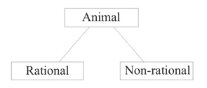

# 分析 analysis (Michael Beaney)

_首次发布于 2003 年 4 月 7 日；实质性修订于 2014 年 3 月 19 日_

分析一直是哲学方法的核心，但它被理解和实践的方式各不相同。或许，从最广义上讲，它可以被定义为通过将某个最初被视为已知的事物分离或追溯到更基本的事物，从而解释或重建它。解释或重建通常会在相应的综合过程中展示出来。然而，具体的方法可以有很大的变化。目标可能是回归基本原理，但实现这一目标的方式可能有各种各样，每种方式都可以称为“分析”。英语世界中“分析”哲学的主导地位，以及现在在世界其他地方的日益增长，可能表明已经形成了关于分析的角色和重要性的共识。然而，这假设了对“分析”含义的一致理解，而这一点远非明确。另一方面，维特根斯坦在分析哲学的早期（逻辑原子主义）时期对分析的批评，以及奎因对分析-综合区别的攻击，例如，导致一些人声称我们现在处于一个“后分析”时代。然而，这些批评只针对特定的分析概念。如果我们看一下哲学的历史，甚至只是看一下分析哲学的历史，我们会发现哲学家们不断借鉴和重新配置各种各样的分析概念。正是因为涉及到各种分析概念，分析哲学才依然充满活力。它可能已经分裂成各种相互关联的子传统，但这些子传统通过它们共同的历史和方法论联系而保持在一起。本文旨在指出哲学史上分析概念的范围及其相互关系，并为那些希望探索分析方法论和相关哲学问题的人提供参考资源。

***

## 1. 概述

本节提供了对分析的初步描述（或不同概念的分析范围）以及对整篇文章的指南。

### 1.1 分析的特征描述

如果被问到“分析”是什么意思，大多数人今天会立刻想到将某物分解成其组成部分；这也是分析通常被官方定义的方式。例如，在《简明牛津词典》中，“分析”被定义为“通过分析将其分解为更简单的元素（相对于合成）”，其他提到的用法只有数学和心理学。而在《牛津哲学词典》中，“分析”被定义为“将一个概念分解为更简单的部分的过程，以显示其逻辑结构”。对概念的限制和对显示“逻辑结构”的参考是重要的限定条件，但核心概念仍然是将某物分解。

这个概念可以称为“分解”概念（见第 4 节）。但这并不是唯一的概念，而且可以说在前现代时期并不是主导概念，也不是至少一种“分析”哲学中的特征性概念。在古希腊思想中，“分析”主要指通过这种方式回溯到第一原理的过程，然后可以通过这些原理来证明某物。这个概念可以称为“回溯”概念（见第 2 节）。另一方面，在弗雷格和罗素的工作中，在分解过程发生之前，要先将要分析的陈述翻译成它们的“正确”逻辑形式。这表明分析也涉及到一个“转化”或“解释”的维度。然而，这也源于早期的思想（特别是关于古希腊几何学和中世纪哲学的补充部分）。

这三个概念不应被视为相互竞争。在实际的分析实践中，这些实践通常比所提供的描述更加丰富，所有这三个概念通常都会得到反映，尽管程度和形式各不相同。为了分析某个事物，我们可能首先需要以某种方式对其进行解释，将初始陈述转化为逻辑、数学或科学的特权语言，然后明确相关的要素和结构，所有这些都是为了通过识别基本原则来解释它。这个概要描述所暗示的复杂性只有通过考虑特定类型的分析才能得到体会。

理解分析的概念不仅仅是关注“分析”一词及其同源词的使用，或者其他语言中明显的等价词，比如希腊语中的“_analusis_”或德语中的“_Analyse_”。苏格拉底的定义可以说是一种概念分析，然而在柏拉图的对话录中并没有出现“_analusis_”这个词（参见[第 2 节](https://plato.stanford.edu/entries/analysis/#AncConc)）。事实上，在欧几里得的《几何原本》中也找不到这个词，该书是理解古希腊几何学的经典著作：欧几里得在呈现他的证明时预设了后来被称为分析方法的方法。在拉丁语中，“_resolutio_”被用来翻译希腊词“_analusis_”，尽管“resolution”有不同的意义范围，但它经常与“analysis”同义使用（参见[Renaissance Philosophy](https://plato.stanford.edu/entries/analysis/s3.html#2)的补充部分）。在亚里士多德的三段论理论中，尤其是从笛卡尔时代开始，分析的形式也涉及“还原”；在早期的分析哲学中，“还原”被视为哲学分析的目标（尤其参见[The Cambridge School of Analysis](https://plato.stanford.edu/entries/analysis/s6.html#6)的补充部分）。

在哲学史上提出的关于分析的特征的进一步细节，包括所有经典的段落和评论（本条目中出现的“\[[Quotation](https://plato.stanford.edu/entries/analysis/s1.html#motto)]”所指的内容），可以在附加文档中找到。

> [分析的定义和描述](https://plato.stanford.edu/entries/analysis/s1.html)

在[《标准文库，§1》](https://plato.stanford.edu/entries/analysis/bib1.html)中可以找到一份关键参考文献、专著和文集的清单

### 1.2 本条目指南

本条目包括三组文件：

1. 现在的文件
2. 六个补充文件（其中一个尚未提供）
3. 关于分析的注释书目，分为六个文件

本文档提供了一个概述，介绍了哲学史上各种分析概念。它还包含了指向补充文档、参考书目中的文档以及其他互联网资源的链接。补充文档在六个主要部分下详细阐述了某些主题。注释书目包含了每个主题的关键阅读列表，并且也按照本条目的各个部分进行了划分。

## 2. 古代对分析的理解与回归概念的出现

单词“analysis”源自古希腊词汇“_analusis_”。前缀“_ana_”意为“向上”，“_lusis_”意为“解开”、“释放”或“分离”，因此“_analusis_”意味着“解开”或“溶解”。这个术语很容易被扩展到解决或解散问题的意义上，并且在古希腊几何学和哲学中被使用。在古希腊几何学中发展起来的分析方法对柏拉图和亚里士多德都产生了影响。然而，苏格拉底对定义的关注也很重要，现代概念分析的根源可以在这里找到。因此，古希腊思想中存在着一种复杂的方法论网络，其中最重要的是苏格拉底的定义方法，柏拉图将其发展成为他的分割方法，以及他所借鉴几何分析的相关假设方法，以及亚里士多德在他的《分析学》中发展的方法。在过去的两千年中，并没有形成共识，这些方法之间的关系如今正成为日益争议的话题。而在所有这些方法的核心，都存在着由孟诺悖论引发的哲学问题，这个悖论预示了我们现在所知的分析悖论，涉及到分析如何既正确又具有信息性（请参阅有关[摩尔](https://plato.stanford.edu/entries/analysis/s6.html#4)的补充部分），以及柏拉图通过追忆理论来解决这个问题，这一理论已经产生了大量的文献。

“分析”一词最早在古希腊几何学中以方法论的意义被使用，而欧几里得几何学提供的模型自那时以来一直是一种启发。尽管欧几里得的《几何原本》约写于公元前 300 年，因此在柏拉图和亚里士多德之后，很明显它借鉴了许多先前几何学家的工作，尤其是与柏拉图和亚里士多德密切合作的忒泰特和欧多克索斯。柏拉图甚至被狄奥根尼斯·拉尔修斯（《希腊哲学家传》I, 299）认为是发明分析方法的人，但无论真相如何，几何学的影响开始在他的中期对话中显现，他确实鼓励在他的学院进行几何学研究。

我们对古希腊几何分析的理解的经典来源是帕普斯的《数学集》，该书约于公元 300 年编写，因此借鉴了自欧几里得《几何原本》以来六个世纪的几何学工作：

现在分析是从所寻求的东西（仿佛它已被承认）的伴随物（_akolouthôn_）的方式，以便得到综合中已被承认的东西。因为在分析中，我们假设所寻求的东西已经完成，然后我们询问它的结果是什么，再问后者的前因是什么，直到我们在回溯的过程中找到一些已知的东西，并且这些已知的东西是按照顺序排列的。我们将这种方法称为分析，因为它是一种向后解决问题的方法（_anapalin lysin_）。

在综合中，我们假设在分析中最后达到的已经完成，并按照它们的自然顺序作为结果（_epomena_）排列前面的前因和将它们相互连接，最终我们得到了所寻求的事物的构造。这就是我们所说的综合。\[[完整引用](https://plato.stanford.edu/entries/analysis/s1.html#Pappus)]

在这里，分析显然是以回归的意义被理解的——通过假设“所寻求的”到更基本的东西，然后通过它的逆向来建立它。例如，为了证明毕达哥拉斯定理——直角三角形的斜边上的平方等于另外两边上的平方之和——我们可以假设一个直角三角形，并在其边上绘制三个正方形。在研究这个复杂图形的性质时，我们可以在特定点之间绘制进一步的（辅助）线，并发现存在一些全等三角形，从而我们可以开始推导出相关面积之间的关系。毕达哥拉斯定理因此依赖于关于全等三角形的定理，一旦这些定理（和其他定理）被确定下来（并且被证明），毕达哥拉斯定理就可以被证明。（该定理在欧几里得的《几何原本》第一卷的命题 47 中被证明。）

这里的基本思想提供了分析概念的核心，人们可以在柏拉图和亚里士多德的作品中以不同的方式找到这种反映（参见有关[柏拉图](https://plato.stanford.edu/entries/analysis/s2.html#3)和[亚里士多德](https://plato.stanford.edu/entries/analysis/s2.html#4)的补充部分）。尽管对实际分析实践的详细研究揭示了不仅仅是回归到第一原因、原则或定理，而且还包括“分解”和“转化”（尤其是参见有关[古希腊几何学](https://plato.stanford.edu/entries/analysis/s2.html#2)的补充部分），但回归的概念在早期现代时期一直主导着对分析的看法。

然而，古希腊几何学并不是后来分析概念的唯一来源。柏拉图可能没有自己使用过“分析”这个术语，但对定义的关注是他对话的核心，而定义经常被视为“概念分析”应该产生的内容。将“知识”定义为“合理的真实信念”（或者用更柏拉图式的术语说是“带有解释的真实信念”）可能是一个经典的例子。柏拉图的关注可能是实际定义而不是名义定义，是“本质”而不是心理或语言内容（参见有关[柏拉图](https://plato.stanford.edu/entries/analysis/s2.html#3)的补充部分），但概念分析也经常被给予“现实主义”的解释。当然，概念分析的根源可以追溯到柏拉图对定义的追求，我们将在下面的[第 4 节](https://plato.stanford.edu/entries/analysis/#4)中看到。

进一步的讨论可以在附加文档中找到

> [分析的古代概念](https://plato.stanford.edu/entries/analysis/s2.html)中可以找到。

进一步阅读可以在以下地方找到：

> [注释书目，§2](https://plato.stanford.edu/entries/analysis/bib2.html)。

## 3. 中世纪和文艺复兴时期的分析概念

中世纪和文艺复兴时期的分析概念在很大程度上受到古希腊概念的影响。但对这些概念的了解往往是间接的，通过各种评论和不总是可靠的文本进行过滤。中世纪和文艺复兴时期的方法论往往是柏拉图、亚里士多德、斯多噶派、伽利略和新柏拉图主义元素的混合体，其中许多声称在几何分析和综合的概念中有一些根源。然而，在中世纪晚期，更清晰和更原创的分析形式开始形成。例如，在所谓的“同类词”和“解释性”文献中，我们可以追溯到解释性分析概念的发展。例如，“一些驴子每个人都看到”的句子被认为是模棱两可的，需要“解释”来澄清。

在约翰·布里丹（John Buridan）14 世纪中期的杰作《逻辑小结》（_Summulae de Dialectica_）中，我们可以找到上述[1.1 节](https://plato.stanford.edu/entries/analysis/#1.1)中概述的三种概念。他明确区分了划分、定义和证明，分别对应分解、解释和回归分析。在这里，我们特别可以看到对现代分析哲学的预见，同时也是对古代哲学的改编。然而，不幸的是，尽管对原始希腊文献的兴趣日益增长，但这些更清晰的分析形式在文艺复兴时期被掩盖了。就理解分析方法论而言，人文主义对学院派逻辑的否定使情况变得模糊不清。

更多讨论可以在附加文件中找到

[中世纪和文艺复兴时期对分析的理解](https://plato.stanford.edu/entries/analysis/s3.html)。

更多阅读可以在上述链接中找到

[注释文献，§3](https://plato.stanford.edu/entries/analysis/bib3.html)。

## 4. 分析的早期现代概念与分解概念的发展

十七世纪的科学革命带来了新的分析形式。其中最新的形式是通过更复杂的数学技术的发展而出现的，但即使这些技术仍然根植于早期的分析概念。到了近代时期末期，分解分析已经成为主导（如下所述），但这种分析也有不同的形式，各种分析概念之间的关系通常并不清晰。

与文艺复兴一样，近代时期以方法论为重要特征。在这个革命性的时期，人们对方法论的关注似乎是不足为奇的，因为人们正在开发新的理解世界的技术，并且这种理解本身正在发生变革。但是，出现在十七世纪的许多关于方法论的论文和评论的特点是，它们经常自觉地呼应古代的方法（尽管对传统思想的内容进行了批判，或许是出于外交原因），尽管新的观点通常被灌输到旧的观点中。几何分析模型在这里是一个特别的灵感，尽管是通过亚里士多德传统的过滤，亚里士多德传统将从定理到公理的回归过程与从效果到原因的过程相结合（参见附录中关于[亚里士多德](https://plato.stanford.edu/entries/analysis/s2.html#4)的部分）。分析被视为一种发现的方法，从通常已知的事实反推到潜在的原因（证明“事实”），而综合则被视为一种证明的方法，从已发现的事实再次向需要解释的事物前进（证明“原因”）。因此，分析和综合被视为互补的方法，尽管对它们各自的优点仍存在争议。

有一份由伽利略撰写的手稿，大约写于 1589 年，是对亚里士多德《后分析》的适当评论，显示了他对方法论和回归分析的关注（参见 Wallace 1992a 和 1992b）。霍布斯在 1655 年出版的《物体论》第一部分中写了一章关于方法的内容，提供了他对分析和综合方法的解释，其中分解形式的分析与回归形式并列\[[引用](https://plato.stanford.edu/entries/analysis/s1.html#Hobbes)]。但也许最有影响力的方法论描述是从 17 世纪中期一直持续到 19 世纪中期的《波尔图瓦尔逻辑学》第四部分，第一版于 1662 年出版，最终修订版于 1683 年出版。第 2 章（第一版中的第一章）开头如下：

> 适当地安排一系列思想的艺术，无论是为了在我们不知道真相时发现真相，还是为了向他人证明我们已经知道的事实，通常可以称为方法。

因此，有两种方法，一种是用于发现真理的方法，称为“分析”或“分解方法”，也可以称为“发现方法”。另一种是在找到真理后让他人理解的方法。这被称为“综合”或“组合方法”，也可以称为“教学方法”

这里可能会吸收多种不同的方法，尽管文本确实继续区分了四种主要类型的“关于事物的问题”：通过效果寻找原因，通过原因寻找效果，从部分找到整体，以及从整体和给定部分寻找另一部分（_同上_，234 页）。前两种涉及回归分析和综合，而第三和第四种涉及分解分析和综合。

正如《逻辑学》的作者明确指出的那样，他们文本中的这一部分主要来源于笛卡尔于 1627 年左右撰写的《指导思维的规则》，但直到 1684 年才在他去世后出版。四种类型的具体规定很可能是在详细阐述笛卡尔的第十三条规则时提出的，该规则指出：“如果我们完全理解一个问题，我们必须将其从每个多余的概念中抽象出来，将其简化为最简单的术语，并通过列举的方式将其分解为可能的最小部分。”（_PW_，I，51 页。参见_PW_，I，54 页，77 页的编辑评论。）这里明确了分解分析的概念，如果我们继续阅读于 1637 年出版的《方法论演讲》，可以明显看出焦点已从回归分析转向分解分析。在早期作品中提供的所有规则现在已经减少到只有四条。这是笛卡尔报告他在科学和哲学工作中采用的规则的方式：

第一点是，如果我没有确凿的知识来证明其真实性，就不要接受任何东西为真：也就是说，要小心避免草率的结论和先入为主的观念，在我的判断中只包括那些在我的脑海中清晰明确地呈现出来，以至于我没有理由怀疑它的东西。

第二个是将我所检查的每个困难分解为尽可能多的部分，并根据需要进行分解，以便更好地解决它们。

第三，通过从最简单和最容易知道的对象开始，逐渐一步一步地上升，逐渐了解最复杂的知识，并假设在没有自然顺序的对象之间有一定的顺序，以有序地引导我的思维。

最后，通过完整的列举和全面的回顾，我可以确保没有遗漏任何内容。（_PW_，I，120）

前两个是分析的规则，后两个是综合的规则。但尽管分析/综合的结构仍然存在，这里涉及的是分解/组合而不是回归/进展。然而，笛卡尔坚持认为是几何学在这里对他产生了影响：“那些由非常简单和容易的推理组成的长链，几何学家通常用来得出最困难的证明，使我有理由认为所有可以落入人类知识范围的事物都以同样的方式相互联系。”（_同上_。[更多引用](https://plato.stanford.edu/entries/analysis/s1.html#Descartes)）

笛卡尔的几何确实涉及将复杂问题分解为简单问题。然而，更重要的是他在发展所谓的“分析几何”时使用了代数，这使得几何问题可以转化为算术问题并更容易解决。通过用“_x_”表示要找到的“未知数”，我们可以看到在分析中，“给定”的概念起到了核心作用，并从那个点开始逆向推导，这使得将代数视为“分析的艺术”似乎是合适的，这暗示了古代人对逆向概念的理解。然后，在分析几何的发展形式中，我们可以看到上述[1.1 节](https://plato.stanford.edu/entries/analysis/#1.1)中概述的分析概念的所有三个构想，尽管笛卡尔自己强调了分解概念。有关此问题的进一步讨论，请参阅附加部分[笛卡尔与分析几何](https://plato.stanford.edu/entries/analysis/s4.html#2)。

然而，笛卡尔对分解分析的强调并非没有先例。它不仅已经涉及到古希腊几何学，而且还隐含在柏拉图的收集和分割方法中。我们可以通过以下方式解释从逆向到分解（概念）分析的转变，以及两者之间的联系。考虑一个简单的例子，如下图所示，将所有动物“收集”起来，并将它们分为“有理性”和“非有理性”，以便将人定义为有理性动物。

根据这个模型，在寻求定义任何事物时，我们沿着适当的分类层次结构向上工作，找到更高级别（即更基本或更一般）的“形式”，通过这些形式我们可以确定定义。尽管柏拉图本人并没有使用“分析”这个词——“分割”的词是“_dihairesis_”——但寻找适当的“形式”本质上就是分析。作为苏格拉底寻求定义的延伸，我们可以清楚地看到这是概念分析的起源。关于“人类是理性动物”的定义，我们寻求的就是这种类型的定义，通过其他概念（即“理性”和“动物”）来定义一个概念（即“人类”）。但是，对于这个定义提供的解释存在一些问题。从分类层次的外延理解来看，即根据所指的事物类别，上层类别显然更大，作为子类别包含了下层类别（例如，动物类别包含人类类别作为其子类别之一）。然而，从内涵理解来看，“包含”的关系被认为是相反的。如果有人理解了“人类”这个概念，至少在强烈的意义上知道它的定义，那么他们必须理解“动物”和“理性”这两个概念；因此，自然而然地会说“人类”这个概念“包含”了“理性”和“动物”这两个概念。在“分析”中向上工作（在回归的意义上）随后就被认为是将一个概念“拆解”或“分解”为其“组成”概念（在分解的意义上的“分析”）。当然，严格来说，将一个概念“分解”为其“组成”概念只是一个隐喻（正如奎因在《经验主义的两个谬论》第 1 节中所著名地指出的），但在早期现代时期，这种说法开始被更加字面地理解。

有关进一步讨论，请参阅附加文档：

> [分析的早期现代概念](https://plato.stanford.edu/entries/analysis/s4.html)，

包括笛卡尔和解析几何、英国经验主义、莱布尼兹和康德的部分。

更多阅读，请参见

[注释文献，§4](https://plato.stanford.edu/entries/analysis/bib4.html)。

## 5. 现代分析概念，超越分析哲学

如《康德》的补充文件所建议的，分解性分析的概念在 18 世纪末康德的作品中得到了经典表述。但康德只是表达了当时广泛存在的一个概念。这个概念可以在非常明显的形式中找到，例如在摩西·门德尔松的著作中，对他来说，与康德不同，它甚至适用于几何学的情况。在康德和门德尔松对概念的看法中，这个概念也反映在科学实践中。事实上，它的流行受到了 18 世纪末拉瓦锡耶化学革命的推动，哲学分析与化学分析之间的比较经常被提及。正如利希滕贝格所说，“无论你怎么看，哲学总是分析化学”。

这种分解性分析的概念为哲学方法论和（晚期）现代时期（19 和 20 世纪）的哲学方法和辩论设定了议程。广义上，对此的回应和发展可以分为两种。一方面，人们接受了基本上是分解性的分析概念，但对此持批判态度。如果分析只是简单地将某物分解，那么它似乎是破坏性的和削弱生命力的，对分析的批判成为了唯心主义和浪漫主义的一个共同主题，从德国、英国和法国到北美洲的各种形式都有。例如，席勒对分析思维的否定和破坏力的评价\[[Quotation](https://plato.stanford.edu/entries/analysis/s1.html#Schiller)]，黑格尔\[[Quotation](https://plato.stanford.edu/entries/analysis/s1.html#Hegel)]和德尚\[[Quotation](https://plato.stanford.edu/entries/analysis/s1.html#DeChardin)]对此的评价，布拉德利认为分析是伪造\[[Quotation](https://plato.stanford.edu/entries/analysis/s1.html#Bradley)]，以及勃尔格森对“直觉”的强调\[[Quotation](https://plato.stanford.edu/entries/analysis/s1.html#Bergson)]都反映了这一点。

另一方面，分析被看作更为积极，但康德的观念经历了一定程度的修改和发展。在 19 世纪，这一点尤其体现在博尔扎诺和新康德主义者身上。博尔扎诺最重要的创新是变异方法，它涉及到在将一个成分术语替换为另一个时，一个句子的真值会发生什么变化。这为他对分析/综合区分的重建奠定了基础，他认为康德对此的解释是有缺陷的。新康德主义者强调结构在概念化经验中的作用，并更加重视数学和科学中的分析形式。从许多方面来看，他们的工作试图公正地对待哲学和科学实践，同时承认唯心主义的核心主张，即分析是一种必然涉及伪造或扭曲的抽象。在新康德主义观点中，经验的复杂性是形式和内容的复杂性，而不是可分离的成分，需要将其分析为“时刻”或“方面”，而不是“要素”或“部分”。在 1910 年代，恩斯特·卡西勒以极其微妙的方式表达了这一观点，并在格式塔心理学中变得熟悉。

在 20 世纪，分析哲学和现象学都可以被看作是对分析的更为复杂的概念的发展，它们借鉴了但超越了仅仅分解性分析。以下[部分](https://plato.stanford.edu/entries/analysis/#6)提供了分析哲学中对分析的解释，展示了涌现的概念和实践的范围和丰富性。但重要的是要将这些放在 20 世纪方法论实践和辩论的更广泛背景中来看，因为分析方法不仅仅在“分析”哲学中扮演着核心角色，尽管它的名字如此。尤其是现象学包含了自己独特的一套分析方法，与分析哲学的方法有相似之处，也有不同之处。例如，现象学分析经常与普通语言传统中的概念澄清进行比较，而胡塞尔在 1905 年发明的“现象学还原”方法与罗素的描述理论所开启的还原项目有着引人注目的相似之处，后者也在 1905 年出现。

就像弗雷格和罗素一样，胡塞尔最初关注的是数学的基础，而在这种共同关注中，我们可以看到分析的回归观念的持续影响。根据胡塞尔的说法，“本质还原”的目的是隔离我们各种形式思维的“本质”，并通过“本质直观”（_Wesenserschauung_）来理解它们。术语可能不同，但这类似于罗素早期的项目，即确定哲学逻辑的“不可定义”部分，并通过“熟悉”来理解它们（参见_POM_，第 xx 页）。此外，在胡塞尔后来对“阐释”的讨论中（参见_EJ_，§§ 22-4 \[[Quotations](https://plato.stanford.edu/entries/analysis/s1.html#Husserl)]），我们发现对分析的“转化”维度的赞赏，这可以与卡尔纳普对阐释的描述进行有益的比较（请参阅有关[卡尔纳普和逻辑实证主义](https://plato.stanford.edu/entries/analysis/s6.html#7)的补充部分）。卡尔纳普本人将胡塞尔在这里的想法描述为“混乱的、非表达的意义与随后有意识的明确、表达的意义之间的识别综合”（1950 年，第 3 页\[[Quotation](https://plato.stanford.edu/entries/analysis/s1.html#Carnap)])。

现象学并不是分析传统之外的分析方法的唯一来源。在第二次世界大战之前，英国唯心主义传统仍然是一个强大的力量，R.G.科林伍德就是在这个传统中工作的。例如，在他的《哲学方法论论文》（1933 年）中，他批评了摩尔哲学，并对分析的悖论（关于分析如何既正确又有信息）提出了自己的回应，他认识到这个悖论的根源在于孟诺悖论。在他的《形而上学论文》（1940 年）中，他提出了自己对形而上学分析的理解，直接回应了逻辑实证主义者对形而上学的错误否定。在这里，形而上学分析被描述为发现“绝对前提”，这些前提被认为是构成哲学和科学历史中可以确定的各种概念实践的基础和塑造因素。因此，即使在那些明确批评分析哲学核心思想的人中，分析在某种形式上仍然可以被视为活跃和健康的。

进一步阅读，请参阅

> [注释书目，§5](https://plato.stanford.edu/entries/analysis/bib5.html)。

## 6. 分析哲学中的分析概念与逻辑（转化）概念的引入

如果有什么能够表征“分析”哲学的话，那就是对分析的强调。但正如前面的章节所示，对于分析有着广泛的概念，因此这样的表征并不能将分析哲学与之前或与之并行发展的许多内容区分开来。鉴于分解概念通常被提供为主要概念，可能会认为这正是表征分析哲学的特点。但是，这个概念在早期现代时期就很普遍，例如英国经验主义者和莱布尼兹都持有这个观点。然而，考虑到康德否认了分解分析的重要性，可以提出这样的观点，即表征分析哲学的是它对这种分析的价值。这可能适用于摩尔早期的工作和分析哲学中的某一派别，但并不普遍适用。作为由弗雷格和罗素创立的分析哲学的特点是逻辑分析的作用，这依赖于现代逻辑的发展。尽管其他形式的分析，如语言分析，与形式逻辑系统的联系较少，但逻辑分析的核心洞察力仍然存在。

Pappus 对古希腊几何学中的方法的描述表明，分析的回归观念在当时占主导地位，尽管其他观念可能也隐含其中（参见附录中的[古希腊几何学](https://plato.stanford.edu/entries/analysis/s2.html#2)部分）。在近代早期，分解观念变得普遍（参见[第 4 节](https://plato.stanford.edu/entries/analysis/#4)）。表征分析哲学的特点，或者至少是起源于弗雷格和罗素的那个核心流派的特点，是对分析的“转化”或“解释”维度的认识（参见[第 1.1 节](https://plato.stanford.edu/entries/analysis/#1.1)）。任何分析都预设了一个特定的解释框架，并且在回归和分解的过程中，对我们所寻求分析的内容进行“解释”的工作是必不可少的。这可能涉及以某种方式对其进行“转化”，以便利用给定理论或概念框架的资源。欧几里得几何学提供了一个很好的例证。但在分析几何学的情况下更加明显，其中几何问题首先被“翻译”成代数和算术的语言，以便更容易解决（参见附录中的[笛卡尔和分析几何学](https://plato.stanford.edu/entries/analysis/s4.html#2)部分）。笛卡尔和费马为分析几何学所做的事情，弗雷格和罗素为分析哲学所做的事情也是如此。分析哲学之所以“分析”，更多地是指分析几何学之所以“分析”的意义，而不是康德所理解的粗糙的分解意义。

现代哲学分析的解释维度也可以看作是中世纪学院哲学的先兆（参见附录中的[中世纪哲学](https://plato.stanford.edu/entries/analysis/s3.html#1)部分），令人惊讶的是，现代关于命题、意义、指称等问题的许多关注点在中世纪文献中都能找到。解释性分析也可以在 19 世纪的本丹的“释义”概念中找到例证，他将其描述为“通过将一个没有其他虚构实体作为主语的命题转化为一个以某个真实实体作为主语的命题所提供的那种阐述”\[[完整引文](https://plato.stanford.edu/entries/analysis/s1.html#Bentham)]。他将这个思想应用于“分析掉”对“义务”的讨论，我们可以在这里看到对罗素的描述理论的预见，这一点已经被 Wisdom（1931）和 Quine 在“经验主义的五个里程碑”中指出\[[引文](https://plato.stanford.edu/entries/analysis/s1.html#Quine)]。

然而，在 20 世纪分析哲学的出现中，至关重要的是量化理论的发展，它提供了一个比此前任何东西都更强大的解释系统。在弗雷格和罗素的情况下，被“翻译”成的系统是谓词逻辑，由此引发的语法和逻辑形式之间的分歧意味着翻译过程本身成为了一个哲学关注的问题。这引发了对我们使用语言及其误导性潜力的更大自觉，并不可避免地引发了关于语言、逻辑、思维和现实之间关系的语义学、认识论和形而上学问题，这些问题自那时以来一直是分析哲学的核心。

弗雷格和罗素（后者在最初与唯心主义的调情之后）都致力于反对康德，证明算术是分析真理而不是综合真理的系统。在《基础》中，弗雷格提出了对分析性的修订概念，可以说是赞同并概括了康德的逻辑标准而不是现象学标准，即（ANL）而不是（ANO）（请参阅有关[康德](https://plato.stanford.edu/entries/analysis/s4.html#5)的补充部分）。

（AN）如果一个真理的证明仅依赖于一般的逻辑法则和定义，那么它就是_分析的_。

关于算术真理是否是分析的问题，归结为它们是否可以纯粹地通过逻辑推导得出。（在这里，我们已经在理论层面上有了“转化”，涉及对分析性概念的重新解释。）为了证明这一点，弗雷格意识到他需要发展逻辑理论，以便形式化数学陈述，这些陈述通常涉及多个普遍性（例如，“每个自然数都有一个后继数”，即“对于每个自然数_x_，都存在另一个自然数_y_，它是_x_的后继数”）。这一发展，通过将函数-论元分析在数学中扩展到逻辑，并提供量化的符号表示，基本上是他的第一本书《概念符号》（1879 年）的成就，他不仅创造了第一个谓词逻辑系统，而且还利用它成功地对数学归纳进行了逻辑分析（参见弗雷格_FR_，47-78）。

在他的第二本书《算术的基础》（1884 年）中，弗雷格继续对数字陈述进行了逻辑分析。他的核心思想是，数字陈述包含了对一个概念的断言。例如，“木星有四颗卫星”这样的陈述不是要断言木星具有四颗卫星的属性，而是要断言概念“木星的卫星”具有第二级属性“有四个实例”，这可以在逻辑上定义。通过考虑否定存在陈述（与涉及数字 0 的数字陈述等价），可以突显出这种解释的重要性。考虑以下否定存在陈述：

> （0a）独角兽不存在。

如果我们试图以分解的方式进行分析，将其语法形式视为逻辑形式的镜像，那么我们会发现自己在问这些具有不存在属性的独角兽是什么。我们可能会被迫假设独角兽的存在，而不是存在，就像迈农和早期的罗素所做的那样，为了有一个可以作为我们陈述的主题的东西。然而，在弗雷格的观点中，否认某物的存在意味着说相关的概念没有实例：没有必要假设任何神秘的对象。对于（0a），弗雷格的分析在于将其改写为（0b），然后可以在新逻辑中轻松地形式化为（0c）：

> （0b）概念“独角兽”没有被实例化。

类比与类推推理

类似地，说上帝存在就是说概念“上帝”被（唯一地）实例化，即否认该概念有 0 个实例（或 2 个或更多个实例）。在这种观点下，存在不再被视为（一级）谓词，而是以（二级）谓词“被实例化”的形式进行存在性陈述的分析，通过存在量词来表示。正如弗雷格所指出的，这为本体论论证的问题提供了一个巧妙的诊断，至少在其传统形式下（_GL_，§53）。如果我们尝试应用分解分析（至少直接应用），所产生的所有问题都会消失，尽管当然还需要解释概念和量词。

这种“翻译”成逻辑语言的策略所开启的可能性是巨大的：我们不再被迫将陈述的表面语法形式视为其“真实”形式的指南，而是提供了一种表示该形式的方法。这就是逻辑分析的价值所在：它使我们能够“分析掉”问题语言表达，并解释其“真正”含义。这种策略最著名的应用是在罗素的描述理论中，这是维特根斯坦《逻辑哲学论》背后思想的主要动力（参见有关[罗素](https://plato.stanford.edu/entries/analysis/s6.html#3)和[维特根斯坦](https://plato.stanford.edu/entries/analysis/s6.html#5)的补充部分）。尽管随后的哲学家们对于能否对给定陈述进行明确的逻辑分析提出了质疑，但普通语言可能会系统性地误导的观点仍然存在。

为了说明这一点，考虑一下来自赖尔 1932 年经典论文《系统性误导性表达》的以下例子：

> (Ua) 不守时是可责备的。

> (他) 琼斯讨厌去医院的想法

在每种情况下，我们可能会被诱使做出不必要的实体化，将“不守时”和“去医院的想法”视为指代对象。正因为如此，Ryle 将这样的表达描述为“系统性误导”。因此，（Ua）和（Ta）必须重新表述：

> （Ub）谁不守时，就应该受到他人的责备。

%%

> (Tb) 琼斯想到自己去医院会经历什么，感到很痛苦。

在这些表述中，根本没有提到“不准时”或“思想”，因此没有任何诱使我们假设存在相应实体的东西。因此，否则会出现的问题已经被“分析掉”。

在莱尔撰写《系统性误导性表达》时，他也假设每个陈述都有一个潜在的逻辑形式，这种形式应该在其“正确”的表述中展示出来\[[引用](https://plato.stanford.edu/entries/analysis/s1.html#Ryle)]。但是当他放弃了这个假设（原因见附录中的[剑桥分析学派](https://plato.stanford.edu/entries/analysis/s6.html#6)部分）时，他并没有放弃逻辑分析的激励思想 - 显示误导性表达的问题所在。例如，在《心灵的概念》（1949）中，他试图解释所谓的将心灵视为一种“机器中的幽灵”的“范畴错误”。他写道，他的目标是“纠正我们已经拥有的知识的逻辑地理”（1949 年，9），这个想法导致了对分析的_连接_而不是_还原_概念的阐述，重点是阐明概念之间的关系，而不假设存在一组特权的基本概念（请参见附录中的[牛津语言哲学](https://plato.stanford.edu/entries/analysis/s6.html#8)部分）。

这些不同形式的逻辑分析所暗示的是，在分析哲学中，分析的特征远远超出了将概念“分解”为其“组成部分”的简单意义。但这并不意味着分解的分析观念完全没有作用。例如，在摩尔的早期作品中可以找到这种观念（详见[摩尔](https://plato.stanford.edu/entries/analysis/s6.html#4)的补充部分）。它也可以被看作是反映在对概念分析的方法中，寻求指定其正确运用的必要和充分条件。在这个意义上的概念分析可以追溯到柏拉图早期对话中的苏格拉底（详见[柏拉图](https://plato.stanford.edu/entries/analysis/s2.html#3)的补充部分）。但可以说，它在 20 世纪 50 年代和 60 年代达到了鼎盛时期。正如上文的[第 2 节](https://plato.stanford.edu/entries/analysis/#AncConc)中提到的，将“知识”定义为“合理的真实信念”可能是最著名的例子；而这个定义在 1963 年的盖蒂尔经典论文中受到了批评（有关详细信息，请参见本百科全书中关于[知识分析](https://plato.stanford.edu/entries/knowledge-analysis/)的条目）。在概念分析中，指定必要和充分条件可能不再被视为主要目标，特别是对于像“知识”这样备受争议的哲学概念；但考虑这些条件仍然是分析哲学家工具箱中的有用工具。

有关这些和相关分析观念的更详细说明，请参见补充文件

[Analytic Philosophy](https://plato.stanford.edu/entries/analysis/s6.html) entry in the Stanford Encyclopedia of Philosophy.

[注释文献，§6](https://plato.stanford.edu/entries/analysis/bib6.html)。

## 7. 结论

哲学的历史揭示了对分析概念的丰富来源。它们的起源可能可以追溯到古希腊几何学，从这个意义上说，分析方法论的历史可以被看作是对欧几里得的一系列注释。但是，分析在源自柏拉图和亚里士多德的两个传统中以不同但相关的方式发展，前者基于对定义的追求，后者基于回归到第一原因的思想。这两个传统所代表的两极在早期现代时期之前一直定义了方法论空间，并在某种程度上今天仍然有所反映。17 世纪分析几何的创立引入了一种更为简化的分析形式，而在 20 世纪初弗雷格和罗素的逻辑工作中引入了一种类似甚至更强大的形式。尽管概念分析从莱布尼茨和康德时代开始就被理解为分解的构造，通过摩尔的工作进行中介，通常被视为分析哲学的特征，但逻辑分析，即涉及到转化为逻辑系统的翻译，是开创了分析传统的东西。分析也经常被视为还原主义的，但连接形式的分析同样重要。从历史的角度来看，连接分析似乎特别适用于理解分析本身。

## Bibliography

What follows here is a selection of thirty classic and recent works published over the last half-century that together cover the range of different conceptions of analysis in the history of philosophy. A fuller bibliography, which includes all references cited, is provided as a set of supplementary documents, divided to correspond to the sections of this entry:

> [Annotated Bibliography on Analysis](https://plato.stanford.edu/entries/analysis/bib1.html)

* Baker, Gordon, 2004, _Wittgenstein's Method_, Oxford: Blackwell, especially essays 1, 3, 4, 10, 12
* Baldwin, Thomas, 1990, _G.E. Moore_, London: Routledge, ch. 7
* Beaney, Michael, 2004, ‘Carnap's Conception of Explication: From Frege to Husserl?’, in S. Awodey and C. Klein, (eds.), _Carnap Brought Home: The View from Jena_, Chicago: Open Court, pp. 117-50
* –––, 2005, ‘Collingwood's Conception of Presuppositional Analysis’, _Collingwood and British Idealism Studies_ 11, no. 2, 41-114
* –––, (ed.), 2007, _The Analytic Turn: Analysis in Early Analytic Philosophy and Phenomenology_, London: Routledge \[includes papers on Frege, Russell, Wittgenstein, C.I. Lewis, Bolzano, Husserl]
* Byrne, Patrick H., 1997, _Analysis and Science in Aristotle_, Albany: State University of New York Press
* Cohen, L. Jonathan, 1986, _The Dialogue of Reason: An Analysis of Analytical Philosophy_, Oxford: Oxford University Press, chs. 1-2
* Dummett, Michael, 1991, _Frege: Philosophy of Mathematics_, London: Duckworth, chs. 3-4, 9-16
* Engfer, Hans-Jürgen, 1982, _Philosophie als Analysis_, Stuttgart-Bad Cannstatt: Frommann-Holzboog \[Descartes, Leibniz, Wolff, Kant]
* Garrett, Aaron V., 2003, _Meaning in Spinoza's Method_, Cambridge: Cambridge University Press, ch. 4
* Gaukroger, Stephen, 1989, _Cartesian Logic_, Oxford: Oxford University Press, ch. 3
* Gentzler, Jyl, (ed.), 1998, _Method in Ancient Philosophy_, Oxford: Oxford University Press \[includes papers on Socrates, Plato, Aristotle, mathematics and medicine]
* Gilbert, Neal W., 1960, _Renaissance Concepts of Method_, New York: Columbia University Press
* Hacker, P.M.S., 1996, _Wittgenstein's Place in Twentieth-Century Analytic Philosophy_, Oxford: Blackwell
* Hintikka, Jaakko and Remes, Unto, 1974, _The Method of Analysis_, Dordrecht: D. Reidel \[ancient Greek geometrical analysis]
* Hylton, Peter, 2005, _Propositions, Functions, Analysis: Selected Essays on Russell's Philosophy_, Oxford: Oxford University Press
* –––, 2007, _Quine_, London: Routledge, ch. 9
* Jackson, Frank, 1998, _From Metaphysics to Ethics: A Defence of Conceptual Analysis_, Oxford: Oxford University Press, chs. 2-3
* Kretzmann, Norman, 1982, ‘Syncategoremata, exponibilia, sophistimata’, in N. Kretzmann _et al._, (eds.), _The Cambridge History of Later Medieval Philosophy_, Cambridge: Cambridge University Press, 211-45
* Menn, Stephen, 2002, ‘Plato and the Method of Analysis’, _Phronesis_ 47, 193-223
* Otte, Michael and Panza, Marco, (eds.), 1997, _Analysis and Synthesis in Mathematics_, Dordrecht: Kluwer
* Rorty, Richard, (ed.), 1967, _The Linguistic Turn_, Chicago: University of Chicago Press \[includes papers on analytic methodology]
* Rosen, Stanley, 1980, _The Limits of Analysis_, New York: Basic Books, repr. Indiana: St. Augustine's Press, 2000 \[critique of analytic philosophy from a ‘continental’ perspective]
* Sayre, Kenneth M., 1969, _Plato's Analytic Method_, Chicago: University of Chicago Press
* –––, 2006, _Metaphysics and Method in Plato's Statesman_, Cambridge: Cambridge University Press, Part I
* Soames, Scott, 2003, _Philosophical Analysis in the Twentieth Century_, Volume 1: _The Dawn of Analysis_, Volume 2: _The Age of Meaning_, New Jersey: Princeton University Press \[includes chapters on Moore, Russell, Wittgenstein, logical positivism, Quine, ordinary language philosophy, Davidson, Kripke]
* Strawson, P.F., 1992, _Analysis and Metaphysics: An Introduction to Philosophy_, Oxford: Oxford University Press, chs. 1-2
* Sweeney, Eileen C., 1994, ‘Three Notions of _Resolutio_ and the Structure of Reasoning in Aquinas’, _The Thomist_ 58, 197-243
* Timmermans, Benoît, 1995, _La résolution des problèmes de Descartes à Kant_, Paris: Presses Universitaires de France
* Urmson, J.O., 1956, _Philosophical Analysis: Its Development between the Two World Wars_, Oxford: Oxford University Press

## Academic Tools

|  | [How to cite this entry](https://plato.stanford.edu/cgi-bin/encyclopedia/archinfo.cgi?entry=analysis).                                                                      |
| ------------------------------------------------------------------- | --------------------------------------------------------------------------------------------------------------------------------------------------------------------------- |
|  | [Preview the PDF version of this entry](https://leibniz.stanford.edu/friends/preview/analysis/) at the [Friends of the SEP Society](https://leibniz.stanford.edu/friends/). |
|          | [Look up topics and thinkers related to this entry](https://www.inphoproject.org/entity?sep=analysis\&redirect=True) at the Internet Philosophy Ontology Project (InPhO).   |
|       | [Enhanced bibliography for this entry](http://philpapers.org/sep/analysis/) at [PhilPapers](http://philpapers.org/), with links to its database.                            |

## Other Internet Resources

* [Analysis](http://analysis.oxfordjournals.org/), a journal in philosophy.
* [Bertrand Russell Archives](http://www.mcmaster.ca/russdocs/russell.htm)

## Related Entries

[abstract objects](https://plato.stanford.edu/entries/abstract-objects/) | [analytic/synthetic distinction](https://plato.stanford.edu/entries/analytic-synthetic/) | [Aristotle](https://plato.stanford.edu/entries/aristotle/) | [Bolzano, Bernard](https://plato.stanford.edu/entries/bolzano/) | [Buridan, John \[Jean\]](https://plato.stanford.edu/entries/buridan/) | [Descartes, René](https://plato.stanford.edu/entries/descartes/) | [descriptions](https://plato.stanford.edu/entries/descriptions/) | [Frege, Gottlob](https://plato.stanford.edu/entries/frege/) | [Kant, Immanuel](https://plato.stanford.edu/entries/kant/) | [knowledge: analysis of](https://plato.stanford.edu/entries/knowledge-analysis/) | [Leibniz, Gottfried Wilhelm](https://plato.stanford.edu/entries/leibniz/) | [logical constructions](https://plato.stanford.edu/entries/logical-construction/) | [logical form](https://plato.stanford.edu/entries/logical-form/) | [Moore, George Edward](https://plato.stanford.edu/entries/moore/) | [necessary and sufficient conditions](https://plato.stanford.edu/entries/necessary-sufficient/) | [Ockham \[Occam\], William](https://plato.stanford.edu/entries/ockham/) | [Plato](https://plato.stanford.edu/entries/plato/) | [Russell, Bertrand](https://plato.stanford.edu/entries/russell/) | [Wittgenstein, Ludwig](https://plato.stanford.edu/entries/wittgenstein/)

### Acknowledgments

In first composing this entry (in 2002-3) and then revising the main entry and bibliography (in 2007), I have drawn on a number of my published writings (especially Beaney 1996, 2000, 2002, 2007b, 2007c; see Annotated Bibliography [§6.1](https://plato.stanford.edu/entries/analysis/bib6.html#6.1), [§6.2](https://plato.stanford.edu/entries/analysis/bib6.html#6.2)). I am grateful to the respective publishers for permission to use this material. Research on conceptions of analysis in the history of philosophy was initially undertaken while a Research Fellow at the Institut für Philosophie of the University of Erlangen-Nürnberg during 1999-2000, and further work was carried out while a Research Fellow at the Institut für Philosophie of the University of Jena during 2006-7, in both cases funded by the Alexander von Humboldt-Stiftung. In the former case, the account was written up while at the Open University (UK), and in the latter case, I had additional research leave from the University of York. I acknowledge the generous support given to me by all five institutions. I am also grateful to the editors of this Encyclopedia, and to Gideon Rosen and Edward N. Zalta, in particular, for comments and suggestions on the content and organisation of this entry in both its initial and revised form. I would like to thank John Ongley, too, for reviewing the first version of this entry, which has helped me to improve it (see Annotated Bibliography [§1.3](https://plato.stanford.edu/entries/analysis/bib1.html#1.3)). In updating the bibliography (in 2007), I am indebted to various people who have notified me of relevant works, and especially, Gyula Klima (regarding §2.1), Anna-Sophie Heinemann (regarding §§ 4.2 and 4.4), and Jan Wolenski (regarding §5.3). I invite anyone who has further suggestions of items to be included or comments on the article itself to email me at the address given below.

[Copyright © 2014](https://plato.stanford.edu/info.html#c) by\
[Michael Beaney](https://www.philosophie.hu-berlin.de/de/lehrbereiche/geschichte-analytische-phil) <[_michael.beaney@hu-berlin.de_](mailto:michael%2ebeaney%40hu-berlin%2ede)>
