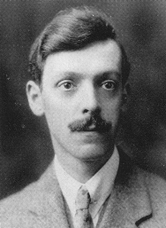
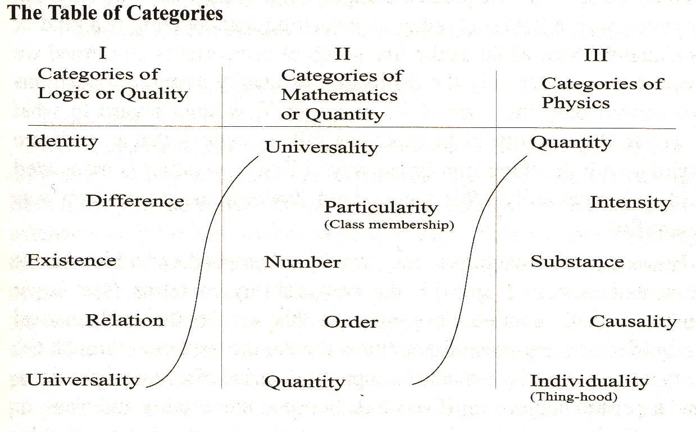

# 约翰·安德森 Anderson, John (Creagh McLean Cole)

_首次发布于 2012 年 10 月 22 日；实质性修订于 2021 年 11 月 8 日_

**约翰·安德森，约 1926 年，悉尼大学档案馆。**

约翰·安德森（1893-1962）是一位苏格兰哲学家，主要在澳大利亚工作。1927 年，他被任命为悉尼大学查利斯哲学教授，并一直担任该职位直到 1958 年退休。在相对孤立的环境中，他发展出了一种独特的现实主义哲学，对悉尼大学的几代学生产生了启发。在发展这一立场的同时，他承担了大部分的哲学教学工作，撰写了他主要知名的文章，并作为撰稿人和编辑维持着《澳大拉西亚心理学与哲学杂志》的运作。在抵达悉尼后不久，他曾担任澳大利亚共产党的理论顾问，但在 30 年代逐渐远离该党，并最终采取了强烈的反共立场。然而，他在整个职业生涯中一直活跃于一系列关于审查制度、大学改革、学术自由和反对宗教教育的公开争议中。根据不同的观点，这些活动要么使他偏离了严肃的哲学工作，要么是他哲学观点的自然表达。无论哪种观点，他在悉尼的思想影响力都是压倒性的。像大卫·马莱特·阿姆斯特朗、约翰·帕斯莫尔、约翰·莱斯利·麦基、尤金·卡门卡、吉姆·贝克和大卫·斯托夫这样的哲学家都承认安德森对他们的形成影响。从他在爱丁堡的早期教学开始，安德森影响了拉什·里斯的社会和政治思想，间接地也影响了阿拉斯代尔·麦金泰尔对伦理学的社会学和历史观的认识和价值。在学术界之外，安德森对传统道德的批评以及他对促进一种承诺、努力、风险和对仅仅习俗期望的批判性反对的积极伦理价值观，对一群小而有影响力的反事业主义知识分子、律师、记者和艺术家集体称为“悉尼推动力”的人群产生了强大的刺激作用。

***

## 1. 生活与工作

约翰·安德森（John Anderson）出生于 1893 年的斯通豪斯（Stonehouse），这是一个位于格拉斯哥附近约 20 公里的纺织和煤矿村庄。他的父亲是该村的校长，并在独立工党中积极参与政治活动。1911 年，安德森开始在格拉斯哥大学攻读大学学位，先后报读了两个荣誉学位：数学/自然哲学（包括实验室培训）和逻辑/道德哲学（包括政治经济学）。他的本科学习贯穿了整个第一次世界大战期间，并在 1917 年以他关于威廉·詹姆斯哲学的硕士论文毕业。由于身体不适合服役，他在战争中的经历主要是红色克莱赛德（Red Clydeside）的工业和租金纠纷，工人们抵制国家和工业界试图以所谓的共同国家利益为由重新组织工作方式和人员。这些纠纷最终导致战争结束时英国军队和炮兵部队进驻格拉斯哥进行国家镇压。

安德森的哲学方向受到澳大利亚出生的哲学家塞缪尔·亚历山大的强烈影响，他在 1918 年在格拉斯哥发表了吉福德讲座。在前一年，安德森因为支持亨利·琼斯的实用主义观点，即将国家视为道德行为者的论文而获奖。在亚历山大的讲座（后来出版为《空间、时间和神》）之后，安德森接受了完全摒弃这种形式的唯心主义，转而支持一项新的系统的现实主义计划。

1919 年，安德森与同为哲学学生的珍妮·贝利结婚，并被任命为南威尔士大学学院的助理讲师（他还提供工人教育课程），随后被任命为格拉斯哥大学的逻辑学助理讲师。1920 年，他被任命为爱丁堡大学的讲师，成为诺曼·肯普·史密斯逻辑学和形而上学系的主要代表。同年，他的兄弟威廉接受了新西兰奥克兰大学学院的心理学和道德哲学主席职位。

到 1926 年，安德森因为他从 1922 年开始着手准备的一本逻辑教科书被拒绝出版而感到沮丧。由于他支持英国的大罢工，他在系里也变得政治上孤立。这些因素可能促使他接受悉尼大学的查利斯哲学教授职位，尽管像他的兄弟一样，苏格兰哲学家移居英联邦大学并不罕见。1927 年，他和珍妮以及他们的小儿子亚历山大（“桑迪”）搬到了悉尼。

安德森的第一个严肃的专业参与是对 F.C.S.席勒的逻辑进行批判性讨论，包括《命题与判断》和《命题的真实性》（1926 年）。在《经验主义》和《认识者与被认识者》（1927 年）中，他首次勾勒出了一种独特的现实主义立场。安德森到达悉尼后，致力于发展这一立场，并对“语言转向”后国际哲学的零碎性质持不屑一顾。在安德森看来，重要的哲学工作是建立和保持一个现实主义哲学学派，作为批判性探究传统的存储库，以保持对腐败的外部力量和期望的警惕。

约翰·安德森抵达悉尼后不久，成为澳大利亚共产党的“理论顾问”，从而开始了与该市保守派政治和文化代表的长期对抗历史。他一再被退伍军人组织、教会和保守派政党指责不忠和对共产主义的同情。大学校务委员会最终进行了谴责辩论，尽管一项宣布他不适合担任哲学主席的动议被否决。

1930 年，詹姆斯·乔伊斯的《尤利西斯》在澳大利亚被禁止，自由思想协会成立，安德森担任主席。安德森在悉尼的政治影响主要采取自由主义多元主义的形式，特别关注国家和宗教审查以及对教育的干预问题。到了 1940 年代和 1950 年代，他的政治立场变得强烈反共。然而，他仍然不受保守派政治家和教士的欢迎，并在 1961 年被指责“败坏了这座城市的年轻人”。

1935 年，安德森成为《澳大利亚心理学与哲学杂志》的编辑。他之前曾在该杂志上发表过多篇重要文章，包括《决定论与伦理学》（1928 年）、《意识的不存在》、《“普遍性”与事件》（1929 年）、《黑格尔在哲学史上的地位》、《功利主义》（1932 年）、《现实主义及其批评者》（1933 年）和《心灵作为感觉》（1934 年）。他一直担任该杂志的编辑工作，直到 1947 年，该杂志更名为《澳大利亚哲学杂志》，编辑工作由约翰·帕斯莫尔接任。

1958 年，安德森退休，并于 1962 年在悉尼北郊的家中去世。接下来的 30 年里，查利斯哲学讲座由安德森的学生 J·L·麦基（1959-1963 年）和 D·M·阿姆斯特朗（1964-1991 年）担任。这两位哲学家对安德森的哲学持批评态度，并更加关注当代哲学的辩论，但他们也都承认安德森对他们工作的形成性影响。

1972 年，悉尼大学哲学系的成员陷入了一场关于学科内容、教育实践和哲学研究本身性质的激烈争议，到 1974 年初，该系已经分裂成两个独立的单位。D·M·阿姆斯特朗带领少数派的传统与现代哲学系远离他所认为的政治激进但哲学上贫瘠的普通哲学系。20 世纪 70 年代初，学术界普遍存在政治动荡，但悉尼冲突双方所表现出的特殊顽固和分离倾向，可能至少部分是安德森教学和实践的遗产。该系最终在三十年后重新合并。

## 2. 安德森哲学概述

安德森的现实主义强调“独立性”，特别针对构成关系的概念（他认为这是唯心主义的核心错误），但也用于限定还原主义和工具主义形式的科学解释。他的立场是，尽管任何存在物都有关系并受到条件限制，但它仍然是一个具体的存在物，具有自己的特质。在任何给定领域的批判性探究的目标是识别相关的特质和特征，并以客观和可传达的真理的形式陈述问题。无论我们的兴趣引起我们的注意，事实的真相都独立于我们的考虑。无论我们对特定事物进行多么创新和富有想象力的使用，这些用途之所以对我们可用，是因为事物本身具有现有的属性。对于安德森来说，哲学思辨的两个方面在学科的历史中一直是相互关联的，他自己的思想可以被视为具有这些互补方面的单一系统：逻辑和伦理。

首先，存在的方式是唯一的，即普通事物在时间和空间中以普通方式行为。所有关于更高和更低现实的理论只能以我们所知道和共享的共同现实来陈述。安德森将这个论点应用于各个领域：没有不同种类或程度的真理，只有某事是事实或不是事实；普遍性和价值观不存在于超越时间和空间的超验运作领域；能力不是与其解释的过程不同的实体；心理领域不能被构想为在与时间和空间不同或分离的领域中运作。普遍性和个别性之间没有绝对或逻辑上的区别 - 普遍性存在于普通世界中，但从不脱离它们所描述的个别性；也就是说，不存在在状态或被陈述的主体的事实之上或之下的本体论层次。作为对事实的形式特征的研究，逻辑提供了客观真实的说明：逻辑涉及一般本体论。

其次，安德森强调了在努力看清事物本质时所固有的客观和主观困难，以及在持续的批判性探究传统中所获得的必要纪律。面对我们存在的现实意味着要认识到并不回避冲突、紧张和纷争在各个领域的普遍存在。对于安德森来说，伦理善存在于世界上的智力探究、艺术创作和科学研究等活动中。伦理探究主要关注那些由内在正确性和价值标准驱动而不是关注外部奖励或效用的人类活动。但是这些活动在一个严重倾向于停滞和腐败的世界中存在着危险。在这方面，安德森的悲观主义几乎具有神学的深度。

安德森在规范哲学中的观点在伦理探究、狭义上的美学、政治思想和教育哲学的著作中得到了概述。伦理学是对人类活动的实际品质进行研究，而不是对什么是正确或义务的研究，后者被归类为对习俗规范和期望的研究，这些规范和期望源于特定的实践和生活方式。同样，美学是对美丽事物的品质进行研究，既不是对感受、表达或判断的研究，也不是艺术家的指导性来源。一件艺术品的成功程度在于它客观地描绘了其主题，并解释了实际情况（例如，《伊利亚特》中被视为“主题”的“愤怒”）。文学批评就是评估艺术家是否客观地成功地捕捉或描绘了所选择的主题。在他的社会和政治思想中，安德森认为社会是一个由相互竞争和合作的运动组成的复杂体，既没有统一的社会目标，也不能简化为其个体成员。

安德森的思想在逻辑和伦理两个方面都有一个基础，即对哲学思想中的系统混淆和错误的辨识。一个持久的混淆是将关系误认为品质。最常见的是，被认为是某种关系的存在被认为构成了某个特殊状态实体的“本质”。但是，一个术语和一个品质一起就是一个完整的单位，而一个术语和一个关系则是没有第二个术语就是不完整的。安德森广泛应用了这个论点：没有什么东西的本质是被知道或被感知的（“思想”）；没有什么东西的本质是知道的（“意识”）；没有什么东西的本质是追求的或指导行动的（“价值观”被构想为超越这个生活的好和价值）。关系对我们来说通常比相关事物的基本品质更明显，因此关系解释对我们来说是很自然的。另一方面，在任何给定的领域中，需要进行重要的智力努力来理解这种解释的虚幻性以及它们如何阻碍真实问题的辨识和断言。

根据安德森的观点，自笛卡尔以来，感染现代哲学的一个核心混淆是对认识论问题的痴迷，即试图为我们对外部世界的知识提供不可动摇的基础。心灵与世界之间没有需要弥合的鸿沟，因为心灵与其他一切一样属于时空世界。这并不是说误解是不可能的，只是说理解是可能的。之所以能够首先了解事物的各种条件和特征，是因为事物独立于我们的探究而具有这些特征。而且，作为认识者，我们处于同样的时空世界中，与我们正在调查的事物产生关系。所有的知识都依赖于经验调查，因此是可疑的：它不是建立在更直接或更可靠的实体（如感官数据或自明的观念）之上。认识论和本体论的基石是一种复杂的存在情况，即“在那里并且如此”，一个特定种类的存在。知道的心灵本身是复杂的时空事物，是情感和感觉的社会，没有一个统一的意识可以归属于其中，也没有一个可能站在时空世界之外和超越时空世界的最终自我。现代哲学对认识论的痴迷可以被看作是一个不合逻辑的企图，试图从命题的背后寻找答案，以便侧面了解我们的命题如何与真实世界相联系。

## 3. 理解安德森的作品的困难

吉尔伯特·赖尔将安德森列为“前辈”，他们在他自己的一代之前：如罗素、摩尔、维特根斯坦、布拉德利、斯托特、麦克塔格特、亚历山大、莱尔德和肯普·史密斯等哲学家。对于赖尔来说，安德森的一代代表着“老帮派”，他们中的许多人是“那些主导苏格兰教师”的产物，他们在世界各地的英语大学中确立了哲学作为一门学科。安德森与维特根斯坦和海德格尔是同一时代的人，但比赖尔自己只大七岁。但赖尔似乎有一点指出了他与那一代“虔诚、传统、睿智、装备 - 是的，还有迷信”的代沟（赖尔 1976 年：383）。赖尔描述的是在大战之前或期间成年的哲学家一代。他直到 20 世纪 50 年代才认识安德森，并对安德森以一种在其他地方已经让位于更关注语言使用的哲学的形式继续进行哲学的方式感到震惊。尽管承认了解释上的挑战，但对于安德森的许多追随者来说，赖尔当时对安德森的工作有着根本的误解（赖尔 1950 年），从“语言转向”的角度来阅读。

对于当前的读者来说，确实存在一些接近安德森的作品的障碍。他的出版作品主要是发表在《澳大利亚哲学与心理学杂志》以及当地期刊和报纸上的文章，如果没有安德森更广泛教学的背景，这些文章是很难理解的。它们通常被认为是安德森学徒训练的讲座和教学大纲的附属品。看起来它们是为了受益于已经与他有过个人接触的学生而写的。没有这种接触，我们必须依靠悉尼大学出版社出版的安德森论文系列讲座笔记的出版物（见参考书目）。安德森与他的知识同行的隔离以及他似乎不愿参与国际辩论，也使当代学生失去了将他的作品置于更熟悉领域的机会。

当然，对于当代学生来说，了解安德森的作品的一个途径就是通过他的学生的工作，比如 D. M. 阿姆斯特朗、约翰·帕斯莫尔和 J. L. 麦基。但是即使在这里，他们的专业化也可能扭曲我们对安德森整体作品的看法。正如帕斯莫尔所指出的，安德森是一个通才（帕斯莫尔，《经验哲学研究》安德森遗作导言，以下简称《EMP》）。与下一代不同，他期望所有哲学探究领域都向他的调查敞开，并且他的哲学涵盖了所有领域：逻辑、形而上学、伦理学、政治思想、美学、教育。

安德森将自己的立场描述为经验主义者、现实主义者、自然主义者、物理主义者、实证主义者和多元主义者，将这些看作是真正经验哲学的不同方面。但对于未经启蒙的人来说，他对这些术语的使用是有问题的。安德森的经验主义对真理的表象观和传统经验主义的感觉数据或观念实体没有时间。对于安德森来说，经验主义是一个本体论教义，它断言我们作为调查者所属的一种存在方式。虽然毫无疑问地致力于经验调查和所有命题主张的可疑性，但安德森的经验主义只是次要地成为一个关于我们如何在这个时空世界中认识事物的认识论观点。安德森的现实主义拒绝了关于普遍存在的传统现实主义-名词主义选择。普遍性被降低到（时空）地球上，但纯粹的普遍性和纯粹的个别性在复杂事态中的角色之外并不存在。"心智"是大脑中的物理化学过程的产物，但这并不排除我们对心灵本质的探究，作为一个充满冲突倾向、感受和情绪的领域。无论特殊科学告诉我们什么关于它们的特定主题，哲学在逻辑问题上仍然保持着权威，也就是说，关于话语可能性的条件。事实上，现代科学严重受到工具主义和技术主义观点的感染，需要更真正地成为哲学和批判性，更关注在特定领域内的情况，而不是与感知到的社会需求相关的实用性和有用性（EMP，290）。因此，对于安德森来说，实证主义是对客观和积极情况的承诺，而不是一种工具性或操作性真理的计划，也不是区分有意义和无意义话语的手段。安德森对"伦理学科学"的呼吁并不是将伦理探究同特殊科学的标准相融合。这是对伦理的客观调查的恳求，侧重于人类活动的现有伦理品质，而不是传统道德哲学的虔诚：关于对与义务、责任等等的问题。

莱尔只是被指责误读安德森的第一个人。从英语主流哲学内部对安德森立场的批评似乎总是与他的追随者的观点相左。他们通常未能认识到他的经验主义的本体论、非表象论和非语义基础。罗伯特·布兰多姆最近对 20 世纪英美哲学的“理论、解释和战略承诺”进行了批评和拒绝，列举了以下几点：经验主义、自然主义、表象主义、语义原子主义、逻辑形式主义、实用主义（布兰多姆 2000）。安德森会拒绝所有这些对他自己工作的批评。布兰多姆认为“事实”和“事态”这些概念是原子主义、表象主义思维的象征。安德森会像对吉尔伯特·莱尔的“表象主义”批评一样傲慢地回答：“那对我来说无关紧要”。

许多当代读者在安德森的作品中遇到的问题，是由于他相对国际孤立所导致的。但对于他的许多学生来说，正是安德森的分离主义传统立场，才是安德森式教育的巨大价值所在。他的项目可能失败了，但他在悉尼保持了传统哲学探究的持久价值，而当时主流哲学要么沉迷于语言使用，要么顺从自然科学。安德森的许多学生期望他的哲学在语言哲学必然衰落和对形而上学问题的重新关注之后重新崛起。但如果他的作品在这一复兴中起到了任何作用，那只是通过他的学生 D.M.阿姆斯特朗的工作间接发挥的。对形而上学问题感兴趣的当代哲学家并不参考安德森的作品，对阿姆斯特朗对他老师作品的热情感到困惑。如今，安德森几乎只存在于他更投入和有成就的学生的脚注中。

## 4. 一个系统的现实主义

在安德森看来，由罗素和摩尔发起的现实主义运动以失败告终，因为它试图通过回归前唯心主义的确定性来克服黑格尔哲学（_EMP_，89）。结果，现实主义被剩下了一个没有学派的境地，无法挑战新兴的唯心主义和实用主义学派（_STP_，161）。黑格尔的全面思想体系是一个新的系统性现实主义可以效仿的例子。

简言之，黑格尔试图制定他的观点序列依赖于一个与他整个观点或范畴理论以及它们对整体现实的适应性不相容的现实主义观点。黑格尔“无意中正在以命题的方式进行”，但却陷入了建立一个总体真理（“使一个真命题成为真命题的东西”）的虚幻尝试，而不是建立_真命题_的任务（_JAA_，《威廉·詹姆斯讲演录》，1935 年）。布兰多姆在他完全不同的表现主义项目中似乎对黑格尔提出了同样的批评（布兰多姆，2000 年）。但对于安德森来说，黑格尔的观点学说“基于无法把握真理的独立性”（_EMP_，81）。另一方面，我们只需要拒绝黑格尔的表达学说，就会发现我们所剩下的是实际的_事实状态_，而不是抽象的存在。

既不是笛卡尔的理性主义，也不是英国经验主义能够用任何具有相当范围的哲学立场取代黑格尔的哲学。黑格尔强调系统是正确的，但不是作为整体（对真实问题的假装解决方案），而是以单一逻辑的形式。他也正确地将这种逻辑视为历史性的，但错误地试图用“逻辑发展的”概念来取代“事物发展的逻辑”（_EMP_，80）。安德森总结了这个立场如下。回答黑格尔的唯一方法是完全放弃对认识论问题的现代固执，回到对事物的希腊考虑。除了希腊的直接性外，对黑格尔唯心主义的真正替代应该包括三个主要组成部分：作为感觉和非单一的心灵的积极理论，作为空间和时间现实的一部分，与任何非心灵的事物和事件一样；一个真正的经验主义，承认关系和普遍性与个别相关的事物一样真实（和可知）；以及将空间和时间看作存在的条件，而不是康德的先验唯心主义中的人类知识的条件。安德森提议用约翰·伯内特关于希腊哲学的工作、西格蒙德·弗洛伊德关于心灵的工作、威廉·詹姆斯的激进经验主义以及塞缪尔·亚历山大对康德先验美学的改编来取代黑格尔的整体性（_EMP_，80）。安德森在这里没有提到另一个可能的直接现实主义来源，即苏格兰常识哲学，但他在 1935 年的《托马斯·里德讲座》中考虑了这一点（_LMP_）。

理查德·罗蒂提出，20 世纪初的英语哲学从黑格尔唯心主义的主导地位中崛起，转而倾向于自然科学，部分原因是与现代主义文学的关联似乎威胁到了“一种包含令人不安的非理性主义因素的私人美学主义”（罗蒂 1985 年，第 748 页）。表面上看，安德森的工作似乎试图将哲学融入科学。但在文学文化方面，他是一个真正的现代主义者：他的文章和演讲包括对詹姆斯·乔伊斯等人的批评作品，尤其是对劳伦斯、肖、韦尔斯、格雷厄姆、贝洛克、王尔德、哈代、易卜生、梅里迪斯、陀思妥耶夫斯基和梅尔维尔的批评，以及对侦探小说体裁的批评。对于安德森来说，文学具有特殊的性质，作为文化的具体化或存储库（_JAA_，《斯宾塞和杜威的教育理论讲座》，1949 年）。在 20 世纪 30 年代的悉尼，他捍卫了詹姆斯·乔伊斯的作品（最近被禁止）以及弗洛伊德精神分析对我们理解心灵的冲突和激情以及对文化研究的普遍重要性（参见 Damousi 2005 年）。他认为前现代主义的“文学哲学家”在浪漫主义和唯心主义方面表现出比那些宣称科学精确性的哲学家更大的坚韧性（_EMP_，80）。但他们也倾向于推动一些道德化和神学化的形式，这些形式与思维的精确性和独立性相抵触，并且对“文化总体有害”（_EMP_，87）。安德森认为他对传统亚里士多德逻辑的解释在文学文化的新世界中和自然科学中都有重要作用。

黑格尔对安德森的一个重要成就是他对希腊哲学家研究的鼓励。安德森的讲座探讨了历史背景，以及他对现实的命题观点在前苏格拉底学派提出的问题和柏拉图的对话中的探索。像其他现代主义哲学家和小说家（以及黑格尔本人）一样，安德森在赫拉克利特身上找到了一种鼓舞人心的替代方案，以对抗他认为是他的老师们感伤和智力压抑的唯心主义。

> 这个世界对于所有人来说都是相同的，没有任何神或人创造它；但它一直存在，现在存在，并且将永远是一个永恒的火焰，有着点燃和熄灭的度量。（赫拉克利特碎片 20，约翰·伯内特译，《早期希腊哲学》，第 4 版，1930 年，第 134 页。）

安德森承认赫拉克利特对火元素的强调可能被解读为典型的伊奥尼亚人对“世界由什么构成”的回答，但更重要的主题是他将火纯粹视为过程、交易和交换的处理方式，将其视为冲突和和谐的典范元素。在赫拉克利特身上，安德森发现了许多自己的原则的萌芽：逻辑与伦理之间的密切联系（伦理是冲突首先显现的领域）；存在方式的单一途径，“共同之处”（寻求一般逻辑，一种关于过程的事物可比性理论）；承认现有事物背后的复杂性、冲突和冲突；拒绝在统一中寻求安慰的反感和悲观主义；平衡中的力量的隐藏和谐优于虚幻统一的开放和谐；对主观幻想的不懈攻击，即希望事物如我们所愿（不变和安全）而不是看到它们的真实面貌。

对于安德森的赫拉克利特来说，“看到事物的真实面貌”意味着将它们看作复杂、活跃和变化的；这是与乐观主义、理性主义幻想的简单、固定和静态相对立的观点。这意味着将事物看作是在运动、历史中的、在过程中的，同时又保持平衡。赫拉克利特的“冲突”即和谐：日常经验的事物之所以积极和具体，是因为它们是偶然的和历史的。安德森将这种在所有研究领域中的“基本张力”描述为“客观主义和主观主义”之间的张力，即“承认复杂性和紧张性的批判性思维”与寻求固定和简单的“理性主义幻想”之间的张力（_JAA_，《批判讲座》1955 年，第 11 讲）。在这里，理性主义与更原始的神话思维一样，追求稳定、安全和道德提升。两者都在寻求比所解决的问题更高层次的解决方案。

安德森的教学和著作经常提到哲学史，但安德森并不是一位学术历史学家。他认为哲学中持久存在的问题和立场在历史中是显而易见的（例如，爱利亚学派在学科历史中是一个高度有教益和批判性的阶段，例如在格林对休谟的个别事物的批评中）。哲学史有助于强调他自己立场的价值。另一方面，他的讲座和著作中充满了对哲学家、科学家、小说家、精神分析学家和革命家的引用。在他的作品中，似乎没有什么是与最深奥的讨论主题格格不入的。他的讲座是“引发讨论的良好开端”（帕特里奇在《EAI》中对安德森教学的反思）。约翰·帕斯莫尔承认安德森的讲座对他自己关于休谟、哲学推理、拉尔夫·卡德沃思、完善性以及他对一百年哲学史的历史研究的启发。

## 5. 具体领域

### 5.1 逻辑

安德森在 20 世纪 20 年代初写了一本《逻辑教科书》（_JAA_，《逻辑教科书》，2010 年出版），它的命运告诉我们很多关于他的哲学抱负。根据他的传记作者所说，安德森将手稿提交给了《新时代》（_The New Age_）的编辑 A.R.奥雷奇（Kennedy 1995 p. 64），苏格兰哲学史学家乔治·戴维（George Davie）将该杂志描述为为“自由主义者和常常是左翼自学者”提供服务的读者群体（Davie 1977 p. 57）。尽管在奥雷奇的领导下，该杂志仍然是一个高度有影响力的前卫现代主义文学和政治批评载体。安德森构思他的逻辑具有比仅仅编码推理形式更广泛的文化目标，当奥雷奇因为其被认为是古怪而拒绝了这项工作时，安德森深感失望。

约翰·安德森认为逻辑与陈述有关，而不是问题、命令、规定、劝告或其他表达形式。逻辑基本上与提出“客观问题”的陈述有关，而这些其他形式的言论只是间接地提出这些问题（_JAA_，《科学方法讲座》，约 1950 年）。言论意味着一种共同的断言、蕴涵和定义逻辑（_EMP_，第 6 章）。逻辑形式上的表面差异只是不同表达方式的结果。任何陈述，只要它在说些什么，都可以通过转化为逻辑形式来表明它在断言某个事实：对某个事物的描述，将其归类为某种类型，声称某事是事实。安德森的学生们被要求将一系列陈述转化为亚里士多德的四种命题形式之一，传统上称为 A、E、I 和 O 形式。在任何领域中，直到问题或议题以这四种命题形式之一提出，它们都不可避免地会产生混淆和潜在的误导性，可能会成为调查的基础。

\| **A** | _所有_的_A_都是_B_ | (AaB) |

\| --- | --- | --- |

\| **E** | _没有_ _A_是 _B_的 | (AeB) |

\| **我** | _一些_ _A_是_B_ | (AiB) |

\| **O** | _一些_ _A_不是_B_ | (AoB) |

所以，从安德森逻辑的典型考试试卷中：

1. "众人拾柴火焰高"

→ 所有共享的活动都变得轻松

2. “你不能不打破鸡蛋就做出一个煎蛋卷”

→ E – 没有破壳就没有煎蛋

3. "在制造产品中发现掺假并不罕见"

→ 我 - _一些_ 制造的产品被掺假

4. "他的勇气大于他的谨慎"

→ O - _他的一些勇敢行为并不谨慎_

在安德森对传统逻辑的观点中，“所有的 A 都是 B”这个普遍命题断言了一个简单的事实，即所有的 A 都是 B；一个事物属于某种类型是事实或情况的最小不可约部分；没有对某种“一般联系”的断言。普遍命题也不断言 A 和 B 之间存在某种类别关系 - 类别关系的断言只是说某些命题是真实的一种方式。它也不是关于某个整体 A 的：它只是简单地断言每一个 A 都是 B。虽然它并不直接断言 A 的存在，但它肯定是假设了它的存在。对于安德森来说，他的传统逻辑版本的伟大优点在于它充分揭示了命题的存在前提。此外，安德森认为通常被认为是至高无上的逻辑真理（例如，恒等命题）实际上根本不是真理，因为它们没有说出任何东西。没有分析性真理：如果一个命题说出了任何东西，它就可能是假的。安德森拒绝了数学真理只在一个演算法内部成立的观点，也就是说，它们可以从一组给定的公理中推导出来。

安德森反对米尔的观点，即普遍陈述是从经验中的概括得出的。普遍命题不能通过从特定经验中的概括得出，因为根本就没有这样的直接经验。这样的真理是从其他普遍命题中得出并在经验中进行测试的。在讨论命题中主语、谓语和连系动词的功能以及命题之间的逻辑关系时，逻辑已经在讨论普遍性、个体性、同一性、时空和因果关系。与米尔的归纳主义相反，因为我们直接经验到普遍性和关系，一个实例就足以建立普遍命题（比如说，所有玻璃都是脆的）。进一步的调查可能会对这样的断言提出质疑，因为我们所有的信念都是可疑的，但是全面的怀疑根本不是一个选择。归纳推理提出的个体和普遍之间的逻辑差距是一个无论多少人类推理也无法跨越的差距。休谟在这一点上是正确的，但是他不应该接受怀疑主义，而应该像威廉·詹姆斯一样得出结论，即普遍性和关系与个体一样是我们经验的一部分。

三段论的有效性是基本的，安德森反对三段论推理与其他形式的推理（如关系、假设和分离）的绝对独立性。三段论清楚地证明了一个命题中的主语可以作为另一个命题中的谓语。主语和谓语之间的区别纯粹是功能上的区别：主语术语的功能是定位，谓语术语的功能是描述。这里没有涉及两类实体；也就是说，没有纯粹的位置/个体/物质，就像没有纯粹的描述/普遍性一样。主语和谓语术语之间没有需要跨越的逻辑差距：任何术语都可以扮演个体或普遍、主语或谓语的角色。

对于安德森来说，逻辑是关于现实最一般特征的科学。逻辑不仅仅是在选择原始元素之后的有用的计算方法，安德森的逻辑也不仅仅是谓词演算的一种版本。他认为逻辑描述了事实的一般结构和它们之间的关系。它为所有言论提供了可能性的条件，但它不是关于语言形式或者普遍性等特殊状态实体的。它是关于事实的最一般特征。在这种关于命题的现实观下，有一个基本命题：空间和时间中的事物是不可约的复杂的。每个情境都有特定和一般的方面，由命题中的主语和谓语函数表示。每个谓词都可以成为进一步命题的主语。最简单的单位是一个存在，因此是一种特定方式下的事态，但是特定的和普遍的都不能独立存在。在任何领域中，我们永远无法达到绝对简单的元素。罗素、摩尔和早期的维特根斯坦追求这样的简单元素，表明了他们思维中残留的理性主义元素。另一方面，安德森当然坚持反对这些早期实在论者的唯心主义对手，他坚持没有实体可以完全或部分地由它们的关系构成（_EMP_，43)。

麦基将安德森描述为亚里士多德逻辑学派的最后一位，并指出了他对逻辑概念的一些尴尬后果：虚假命题的问题；处理特殊命题的方法的缺失；处理多重量化的困难；以及在主谓和三段论形式中表达关系命题的困难。对于麦基来说，任何处理虚假命题、矛盾和对立关系、提出论证、证伪和归谬的逻辑必须超越对命题的描述作为“存在之物”的解释（麦基，1985 年）。

安德森将被罗素谴责的唯心主义的实质-属性逻辑与他自己的主-谓逻辑区分开来。然而，他的亚里士多德式的日常经验逻辑似乎与更广泛的寻求能更充分地捕捉各种领域推理形式的逻辑相冲突。安德森式的本体论逻辑似乎在 20 世纪哲学史上显得“天真地现实主义和亚里士多德式”，并且“难以坚持”（罗蒂，1986 年）。不仅仅是因为 20 世纪哲学的“违反直觉的重新描述和相对化选择原始元素”（罗蒂，1986 年）忽视了安德森坚持逻辑不是一种演算法的观点。模态、时态和关系术语逻辑的技术发展在没有参考安德森的本体逻辑形式的情况下进行。

### 5.2 形而上学

然而，在上世纪的最后一个季度，一种传统形式的形而上学在安德森的学生 D.M.阿姆斯特朗的工作中重新兴起。阿姆斯特朗接受了安德森的观点，即空间和时间的本质是科学研究的问题，真实属性的确定也是如此。例如，安德森将三维空间和一维时间视为“本体学基石”，这种观点是无法维持的（阿姆斯特朗，《空间、时间和范畴：形而上学讲座》引言）。但他对安德森关于范畴的概念非常感兴趣，这些概念在最近出版的关于塞缪尔·亚历山大的讲座中得到了详细阐述，该讲座名为《空间、时间和范畴：形而上学讲座》（STC - 根据阿姆斯特朗所持有的手稿讲座出版，最初是在 1949-1950 年间进行的）。在这些讲座的引言中，阿姆斯特朗写道：

> 存在的范畴深入到如此之深，以至于量子物理学和其他物理学可能对哲学有趣的观点 - 特别是因果关系是否确定性的问题 - 无法在实验科学的层面上得到解决，但似乎是真正的问题。科学也许能够阐明因果关系是否不可约的统计性质，但它如何决定因果关系本身是什么？它只是普遍或统计的规律性吗？还是它在事物的本质中更深层次的东西？科学不可避免地涉及的属性和数量又如何？它们只是我们心中的概念，还是我们的概念仅仅反映了对象中的某些东西？（STC，x）

在这些讲座中，安德森系统地从命题的性质和主谓结构中推导出了类别的数量和排序。结果是一个包含 13 个类别的方案，按照黑格尔式的“继承”方式组织成三组，并且在两组之间的过渡中，普遍性和数量作为“连接类别”起作用。

（转载自《空间、时间和范畴》，经悉尼大学出版社许可。）

阿姆斯特朗得出结论：

> \[W]ith this scheme, John Anderson joins a very distinguished line of philosophers who have presented us with a set of categories. We have first Plato (the doctrine of Highest Kinds in his dialogue The Sophist), then Aristotle, Kant, Hegel, and Samuel Alexander. (_STC_, xiii)

尽管安德森对黑格尔表示赞赏，但他认为康德奠定了“事物作为历史的逻辑基础”，而“黑格尔只能被视为反动的”（_EMP_，83）。康德已经表明，科学的对象只是观察的对象，“物质”是我们感知到的东西，而不是隐藏在我们感知之后的东西。康德对休谟的回答是，我们感知到的事物彼此相互关联；它们以各种方式相互穿越和影响，因为它们在空间和时间上相关。我们在意识到任何事物时都意识到这种关系。但安德森坚持反对康德，认为关系与相关的事物在同一层次上被认识。康德仍然受到再现主义的假设的影响，将科学的对象视为纯粹的现象。康德将空间和时间视为直观的形式，我们必须在这些形式下体验世界。他将因果关系和实体等范畴视为理解的形式，我们必须在这些范畴下理解世界。事物本身并没有在经验中给予我们，因此超出了我们的认知能力。这样，康德在现象和事物本身之间建立了一个站不住脚的现实分割，并伴随着这种分割，我们的思想、实践和探究形式以某种方式创造或构成我们所居住、影响和调查的现实。安德森在塞缪尔·亚历山大的指导下提出了一个现实主义的替代方案，即将空间和时间视为存在的形式，将范畴视为存在的范畴，所有存在都必须属于这些范畴。根据这样的提议，我们可以将科学的对象视为事物本身。

安德森声称通过他对命题的解释（参见“‘普遍’和事件”，EMP）避免了传统形而上学问题关于普遍实在性的陷阱。H·O·蒙斯提出安德森的现实主义可能无法避免这个问题。特别是，他对普遍的解释在是否直接感知到的关系（比如因果关系）在不同场合是否“相同”（对蒙斯来说，除了完全相同，其他任何情况都是回归名义主义——蒙斯 1989 年）的问题上有倒退为名义主义的危险。蒙斯认为安德森在这里可能无法抵挡休谟的挑战。他将被拉回到关于普遍的本质的熟悉的现实主义-名义主义辩论中，这也可以解释为什么阿姆斯特朗的哲学将柏拉图的“一与多”的问题作为形而上学思考的起点（阿姆斯特朗 1997 年）。然而，从奎因的角度来看，尽管阿姆斯特朗的形而上学在科学凭证上有所改进，但仍然关注旧学派的伪问题（奎因 1953 年）。 （迈克尔·德维特在 2010 年明确将阿姆斯特朗与奎因对传统苏格兰形而上学家“麦克斯”进行了模仿）。

对于他那些更注重经验的学生来说，安德森的逻辑似乎依赖于一种不受欢迎的“先验主义”成分。例如，对于我们对安德森将逻辑和本体论等同的确认的信心的任何削弱，都将严重削弱该立场的重要组成部分。首先，不再清楚的是，被一起谈论的事物必须以相同的方式存在——一个层次存在的概念将成为一个需要调查的问题（存在哪些差异），而不是由一般原则决定（麦基 1985 年）。关于他的社会思想，解释社会运动和机构的性质和运作的重要性将需要调查，而不仅仅是基于一般原则的断言。此外，安德森对理性主义观点的拒绝——即“必须存在”可以建立复杂事物的简单或最终单位——并不意味着没有进一步的论证就可以得出“不能存在”这样的简单部分或整体的观点（麦基 1985 年）。

根据安德森的观点，大卫·休谟的怀疑主义是他无法建立逻辑、创造一个连贯的存在解释的直接结果。但在爱丁堡，他的导师诺曼·肯普·史密斯长期以来一直认为休谟的重要性在于展示了所有逻辑的事实限制。如果休谟未能满足安德森对逻辑的要求，那是因为在他看来，哲学家应该抵制这种“系统性的工作”诱惑（Davie 1977）。休谟对“系统性的工作”持保留意见，在胡·普赖斯提出的“语言回归”中以另一种形式出现。普赖斯成为 1974 年分裂后悉尼大学哲学系首位任命的查利斯哲学教授。普赖斯将这个项目描述为“对形而上学的语言再装备”（Price 2011, p. 18），并特别试图避免麦基提出的“位置”问题，该问题源于对语言的表征方面的过度关注（尽管麦基本人将其视为安德森所认为的本体论问题 - 见下面的第 5.4 节）。在普赖斯的观点中，多样性以一种完全熟悉的方式存在于世界中：一种多样的交谈方式和行为方式，不需要在任何本体论中得到反映。

观察发现，安德森最杰出的学生实际上对他的体系接受得很少。尽管如此，他们最基本的哲学承诺仍然可以追溯到安德森立场的大胆性。阿姆斯特朗认为，哲学家在某个时刻只能概述他或她最基本的承诺。斯蒂芬·芒福德总结了阿姆斯特朗自己的立场如下：没有上帝，没有非空间的心灵，没有超越时空的抽象实体，没有柏拉图的形式或普遍领域；一种不带超越普遍性的简朴本体论，没有超越普遍性的世界，没有超越价值标准，没有超越时间的命题，不存在的对象，可能性，可能世界，抽象类（Mumford 2007 p. 5）。阿姆斯特朗在强调科学自然主义方面与安德森有所不同，他认为世界应该完全以完成的物理学来描述。存在的属性最终将完全由科学决定，并且从亚里士多德的常识观点来看，结果必然会显得违反直觉。但对于阿姆斯特朗来说，这种科学观点可以与从安德森的教导中得出的形而上学实在论形式相一致，即普遍性存在于内在而非超越的领域；世界只包含具有属性并相互关联的个体；世界只是一个单一的时空系统；现实被视为一种以个体为特征的事态世界；坚持事态是存在的最小单位，因为个体和普遍性都无法独立存在。

### 5.3 认识论

根据安德森的说法，希腊人

> 在许多问题上，古代哲学家比现代哲学家更清晰...他们避免了许多现代错误，尤其是...他们不像现代人那样着迷于“知识问题”——在他们准备好了解任何事情之前，他们不会去发现（即了解！）我们可以知道如何、以及我们可以知道多少。这种“对工具的批评”等于科学的悲观主义，而心灵的工具观念既阻碍了对心灵本身的了解，也妨碍了对逻辑和其他科学问题的直接探究。（_EMP_，82）

安德森对现代哲学和笛卡尔主义对认识论的执着的诊断很可能会引起许多当代读者的认同和赞赏。在安德森看来，现代哲学中的笛卡尔主义代表了一种反古典主义的运动：一种对历史和传统的反感。现代哲学在抽象的理性中寻求人类知识的基础，而不是在具体而多面的文化中。整个现代时代都以这种缺乏具体性为特征。（_EMP_，195）

在现代哲学史上，黑格尔在这方面是一个孤独的古典人物（_EMP_，201）。自笛卡尔以来，哲学已经被实用主义和进步主义所感染，逻辑已经被降低为一种工具，一种获取新知识的普遍方法。随着对逻辑的这种工具观的看法，人们对三段论的蔑视也随之而来，被培根用“归纳推理”取代，被笛卡尔用理性直觉取代。

对于安德森来说，经验主义主要是否认任何更高形式的存在，否认通过经验得到的现实存在可能存在不足、依赖或努力模仿等情况。同样，现代实在论的重要性不在于其对知识的解释，而在于其对独立性的理论的发展，对相对存在的任何概念的拒绝以及对情境逻辑的发展（_JAA_，哲学 II 区分讲座，1937 年）。

没有“真理”的标准，“我们相信其他事物的信念”（_EMP_，55）。真理只是由连词传达的，命题的“是”。它不能存在于相信的命题与我们称之为现实的其他事物之间的对应关系，也不能存在于命题之间的一致性关系中。命题不是词语的形式：我们通过词语传达我们的信念，但我们提出的是事态本身，而不是词语的形式。真理主义和对应理论是“试图超越命题的企图 - 以（用词语！）维持我们的意思超过我们所能说的。”（_EMP_，5）。我们必须放弃“思想”作为与事物对立或与事物等同的概念。我们的思想只是我们与事物打交道的方式 - 安德森与诺曼·肯普·史密斯共享一种准加尔文主义的知识观念，即将知识视为与问题的努力和搏斗，而不是反映外部现实。安德森将大多数当代哲学视为“表象主义的各种形式”（_EMP_，87）。命题并不是以表示外部现实的意义“关于”任何事物。

安德森最大胆的文章之一是 1934 年的《心灵作为感觉》，试图准确地阐明心灵应该如何被看作属于时空领域。安德森认为，一旦我们承认心灵或任何心理现象的空间性质，“笛卡尔主义就会消失”（_JAA_，《瑞德讲义》，1935 年）。心理领域与自然和社会世界一样，由情境构成，因此我们对心灵的认识与非心理的认识处于同等地位。他否定了笛卡尔的主体-客体模型，该模型将哲学的任务视为研究知识的媒介，理解为一种关系，其中一个实体在自身内部再现另一个实体的本质或内在特征。没有这样的媒介，因为在空间和时间内没有不同的实体需要这样的调解。没有被构想为意识点的“知者”，它已经超越了历史，超越了空间和时间。在我们努力和搏斗的过程中，为了与自己和周围的事物达成和解，我们从未超越事物的运动，也从未看到命题的背后；从未超越命题主张和反驳的领域。

这个东西是什么在奋斗？安德森采用了尼采式的前苏格拉底观点，将心智视为一种本能和激情的社会结构，相互竞争和合作。正是情感或感受本身在奋斗。例如，好奇心的激情是探究的实际动力。没有一个有意识的意愿实体来指导我们对世界的关注。“当然，欺骗的一部分，‘分析’神话的一部分，是自私的性质（‘当我启动我的分析机器时，我会发现什么？’），这与语言和探究是社会生活的固有部分，是沟通的一部分。”（_EMP_，181）

批判性的探究本身依赖于特定的生活方式的存在，并从某种明确的生活方式中进行，这与安德森思想的伦理方面有着重要的联系。这些能够使个体摆脱平庸生活和物质关切的生活方式，是安德森所认为的伦理善的体现。对于安德森来说，如果善存在，我们必须将其视为这个世界上的一种自然品质，就像我们认识和辨认其他自然品质一样。然而，善不仅仅是我们发现的东西，而是“我们发现事物的方式”（_EMP_，266）。安德森意识到，他将善视为一种自然品质的观点不会说服每个人，他对于说服怀疑者几乎无能为力。但他声称，将会有那些认识到他立场真理的人，他们将会看到这种对善的看法是“他们长期以来在某种程度上熟悉的东西”（_EMP_，267）。

### 5.4 伦理学

“事实上，我们并没有脱离事物的运动，询问‘我该做什么？’，然后得到答案后再重新加入其中。我们所有的行动，所有的问题和回答，都是事物运动的一部分。”（_EMP_，241）。

对于安德森来说，积极的伦理探究关注的是将善作为一种自然品质进行识别，他发现这最自然地与某些实际存在的实践和生活方式相关联，这些实践和生活方式存在于共同经验的世界中。传统上，善被抽象地认定为一个要实现或追求的目标，要么是一个我们只能向往的超越现实的实体（但以某种未解释的方式被认为可以指导我们的道德行为），要么是一个超越我们行动的现实世界的目标，通过这个目标可以评估我们的行动；例如，一些最佳的幸福或福利量，适用于涉及的最大人数。无论哪种情况，都是错误地提供了一种关系性解释，而不是识别真正的品质。这一直是自古希腊以来几乎所有道德思想的问题，尽管安德森认为 G·E·摩尔在这些问题上取得了重要进展。安德森提出，善存在于企业形式中，这些企业形式是能够通过“交流”以特殊方式发展的生产活动-个体被卷入这些善，并在这个过程中超越了他们更直接和平凡的目标和需求。任何社会生活理论都必须考虑没有明确目标的活动：习俗、常规行为形式和在目标制定之前的实践（_JAA_，《马克思主义的哲学意义》，1945 年）。

价值具有客观现实性，但并不是在一个超越事实或事态的世界中与之分离的超验领域。安德森同意“事物的本来面目”包括道德事实：“讨论社会过程除了以生活方式或企业形式的方式之外别无选择，这就是道德的特征”（_EMP_，330 页）。但他不能接受道德特征意味着道德规定，因为这将使我们臣服于命令的道德和旨在实现纯粹外在善的行动和改革计划。伦理探究的重要性在于对涉及特定心态或精神运作的_生产性_活动进行解释。在这样的活动中，不存在要实现的外在目标或奖励的问题。善存在于对这些运动和活动的自由、自发的参与中（当然，并不是指决定自由意志的形而上学意义上的自由-这些实践、社会运动和生活方式不是我们作为个体可以随意选择加入的事物；它们在某种意义上_选择了我们_）。根据这种观点，因为我们感到“有义务”而行动是善的_缺席_的表现。尽管“美德”这个概念对他来说并不太吸引人，但安德森强调实践和生活方式对个体伦理观的转变作用似乎与许多主要的美德伦理学家的主要关注点相吻合。阿拉斯代尔·麦金泰尔承认安德森对当代亚里士多德式美德伦理学的重要价值，他对冲突的赫拉克利特式欣赏以及他对批判传统的重视（麦金泰尔，1981 年）。

伦理学特别关注于揭示冲突的事实，不同事物的对立，尤其是在人类和心理生活中。因果关系的范畴对伦理领域至关重要 - 对因果关系的错误看法代表了逃避冲突、获得高于斗争和相互纠缠的立场的尝试（_JAA_，《批评讲座》，1954 年）。积极的伦理学展示了艰难斗争和受外部或工具性考虑驱使的其他生活方式不断努力追求美好生活（_JAA_，《希腊教育理论讲座》，1954 年）。美好存在于斗争中，因此无法得到保障（_JAA_，《哲学 I 讲座》，1943 年）。在生活的各个领域中，美好只能坚持立场。调和和妥协的尝试常常模糊问题，并可能对美好产生不利影响。这种独立和不妥协的立场最能服务于赫拉克利特式的和谐。

社会学研究适用于大部分传统道德术语。社会组织形式发展出常规的行为习惯，被视为义务：权利、责任等等在同一生活方式中的参与者很容易理解。资产阶级社会以商品化和契约关系为基础。市场破坏了民间生活，以及文化可以得到更新的重要来源之一（_JAA_，《马克思讲座》，1950 年）。马克思主义在这个领域取得了重要进展，但安德森指出大多数马克思主义者在道德问题上的“简单主义” - 利他主义似乎是他们对道德思考的巅峰（参见，对考茨基的评论，_EMP_，321），并且很少考虑到多样化的生活方式的重要性。

参与无私活动代表了“对事业的奉献”的伦理价值。安德森甚至提出了一种对罪恶的社会学解释，即一个人对社会运动的不足感，无法坚持旗帜飘扬，全身心地投入这些活动。罪恶则表现为一种倒退和主观主义：个体将自己设立为标准。安德森反对所有形式的宗教教导和对教育实践的干预，但他偶尔会以一种准神学的方式震惊他的学生，对世界上的邪恶存在表示赞赏。帕斯莫尔评论说，强调我们的生活不是我们创造的，它独立于我们的计划之外的宗教形式，从安德森的观点来看，比任何形式的世俗感伤人道主义更可取（帕斯莫尔，《EMP》导言）。

J·L·麦基认为，安德森对善的积极概念“作为道德言论和推理的解释是无望的”（麦基 1985 年）。然而，尽管他是伦理反实在主义的现行代表之一，但麦基对价值主观性问题的提出方式在很大程度上受到了安德森的本体论立场的影响。麦基似乎很费力地解释他对伦理术语主观主义观点与安德森的主要关注点是一致的。对于麦基来说，伦理学中的主观主义是指这个领域的客观事实不包括对行为的善恶或正确性的描述。正是“因为我们想要区分什么是简单而绝对的情况，我们才说价值观/义务是相对的。”（麦基 1985 年）。麦基认为，语言哲学使得现实主义-反现实主义的对立成为一个哲学上的伪问题，并且随着对本体论问题的新兴兴趣，这种对立在关于世界上各种“奇怪”实体的“位置”问题上以一种紧迫的形式回归。

Rush Rhees 是安德森在爱丁堡的学生，当然后来也是路德维希·维特根斯坦的学生。像麦基一样，他对安德森的伦理学理论持批评态度，但与麦基不同的是，他更倾向于安德森对伦理学的积极观点。他认为安德森关于“生活方式”的概念在某种程度上与维特根斯坦的观点相同（Rhees 1969）。但他认为安德森对道德问题如何对个体提出的方式关注不够，安德森过于轻易地将个体关注描绘为低级、以自我为中心的关注，与参与社会运动所带来的令人振奋的关注形成对比。Rhees 得出结论，安德森对道德问题以及道德问题对个体的紧迫性缺乏认识（Rhees 1999，第 xiii 页），也缺乏对其与更实际的继续进行的问题的独特性的认识。然而，Rhees 始终强调安德森的教训，即价值观扎根于不同的传统和运动中。我们必须抵制将价值观定位于超越这些背景的领域的诱惑。争论道德个体位于历史之外、超越特定的时空细节是徒劳的。只有在这些背景中，个体的信念、问题、斗争和困难才有意义。对道德准则的批评资源存在于运动中，批评只能在生活方式中发展。关于“共同利益”的概念通常掩盖了特殊利益（Rhees 1989，第 53 页）。

### 5.5 社会与政治思想

安德森的道德和政治思想受到法国社会主义者乔治·索雷尔（以及在他之前的自由社会主义者皮埃尔-约瑟夫·普鲁东）的著作的强烈影响。尽管安德森放弃了共产主义和社会主义作为已经过时的运动，但这些思想家对他产生的影响仍然存在（Cole 2009）。在人类活动的所有领域中，存在着索雷尔所描述的“生产者伦理”与“消费者伦理”的冲突。前者以自发和合作的努力为特征，而后者以奖惩、义务和期望的工具性道德为特征，从社会学角度来看，后者最适合市场（从纯粹心理学角度来看，最适合强迫性神经质个性的义务）。更准确地说，对于安德森来说，消费者伦理是一个没有“主题”的伦理。在历史上，有着经典的文化成就时期，与我们在其中努力寻找主题的时期形成对比；也就是说，在这些时期中，没有真正发生任何事情，没有任何事情从内部发展。安德森还赞赏维科对历史的循环观点，并且在 20 世纪 40 年代不仅接受了 19 世纪英雄式社会主义的崩溃，而且在战后乐观和国家计划的时代中看到了维科时期野蛮的早期阶段（EMP，290）。更积极地说，对于安德森来说，拒绝所有总体观点的论题“没有一个公式适用于所有事物”，在实践上支持和鼓励那些准备面对现实情况的人“过上负责任和冒险的生活”（EMP，86）。

安德森打算对抗自柏拉图的《理想国》以来在我们对政治问题的思考中明显存在的唯心主义影响。他打算发展现代主义、现实主义的项目，以对抗英国唯心主义的政治观点，并借鉴冲突、斗争和循环历史运动的主要理论家：赫拉克利特、维科和索雷尔。安德森坚持不简单地将个体与国家对立起来，而是强调运动、制度和传统的复杂相互作用。他坚持不断增加社会和谐的无争论倾向，而是强调冲突和不断调整的必然性，回归的持续危险以及因此需要明确的批判参与的必要性。秩序是赫拉克利特式的一种平衡状态，是复杂相互作用力之间的平衡，而不是用来衡量现有社会和政治形态的规范标准。冲突不是社会功能紊乱的指标，需要被克服或合理化，而是任何社会制度的必要特征。任何没有这些特征的理想国家的概念对我们目前的现实生活情况没有任何影响。

安德森的政治思想在于他拒绝将国家作为政治调查和反思的基本对象。他的这一思想方面与现代尼采主义和反人本主义的政治思想相当一致。对于安德森来说，社会并不可简化为原子个体之间的协议。然而，在他的反个人主义言论中，他似乎回应了一个理想主义的社会运动观，比如伯纳德·博萨基特也同样谴责了原子个人主义的“令人厌恶的孤立”。文化和人类成就依赖于人类参与使他们超越自我的活动。除了与自然的斗争或广泛的社会运动之外，一个人就会变成无实体存在（博萨基特 1899 年，第 xxxiii 页以下）。

安德森对好作为一个要实现的目标的拒绝也适用于他对社会主义作为一个进步运动以及对马克思主义的最终拒绝。“历史斗争的学说既是马克思主义的自由主义部分，也是科学部分；社会主义作为要建立的东西（‘无阶级社会’）则是它的奴性部分”（_EMP_，339 页）。对于安德森来说，社会主义不是一个要实现的目标，而是一个要加入的运动。工人们改善社会条件将通过他们自己在更广泛的社会政治领域中肯定他们的生活方式的价值和有效性的过程中实现。但是一旦缓解成为工人运动和代表的主要目标，那么这个运动就作为一个进步和解放力量而结束了。它可以被雇主和国家收买。社会主义被理解为一种游说国家采取行动和提供资金来纠正市场不公平的力量，已经陷入了作为历史事实的“奴性”状态。

### 5.6 教育

在 20 世纪 50 年代，安德森放弃了他在 40 年代讲座和写作中的广泛政治理论，转而更多地关注当地和机构问题。这种新的重点体现在他关于教育和批评的讲座中。安德森对教育的观点的核心是拒绝任何功利或工具性的教育观，即将教育视为达到其他目的的手段。教育需要被理解为一种具有自身积极特征的活动。教育是批判性的，致力于发展和抛弃假设，看穿各种虚伪。对个体来说，它意味着“找到一种生活方式”，并影响受教育个体的整个生活。批判性的知识分子生活作为一种社会传统得以延续，是一个吸引人并使人陷入其中的“运动”。

安德森的古典主义推崇欧洲文化的历史，从早期的希腊人开始，作为一种批判性思维的传统，可以使当代教育在现代世界的实用主义和奴性侵害中得到更新和巩固。教育关注培养品味和判断力。受过教育的个体不受其社会或群体的假设所束缚（_JAA_，《斯宾塞和杜威的教育理论讲座》，1949 年）。但为了发挥其作用，教育必须抵制外部标准（如商业社会的态度和能力所设定的标准，或商业的职业需求），以确定在教育机构中允许和重视什么。里斯（Rhees）认为安德森主要关注“文法学校教育”，而不适合“大众”（里斯，1969 年，第 168 页）。特别是对于安德森来说，职业和道德标准必须抵制。真正的学习并不容易，也不能变得容易——它只能通过克服阻力来推进。探究的生活必须为自己辩护。它与其他活动一样真实、实用、积极地成为社会的一部分（J. L. Mackie，《EAI》中）。

任何学习的活动或机构只能沿着某些传统的轨道进行，有其守护者和共同的活动（_JAA_，《希腊教育理论讲座》，1954 年）。因为教育只是社会本身中的一种努力趋势，与其他努力趋势并存——即使在被认为致力于教育目标的机构内部，真正的教育价值也必须争取。

安德森关于教育的讲座很有意思，因为他在其中详细阐述了他对马修·阿诺德古典主义的赞赏，尤其是他对约翰·杜威哲学的态度。除了他早期承认威廉·詹姆斯的重要性（至少是关于激进经验主义的更形而上学的著作）和他对 F.C.S.席勒的批评文章之外，对杜威的教育理论的考虑是安德森作品中对美国实用主义最重要的反思。理论与实践的关系问题一直是安德森反复思考的问题。他的立场是，这种联系是密切的，但不是他所认为实用主义所主张的方向。理论的有效性并不依赖于实践。相反，研究是从特定形式的实践中进行的。某些生活形式使客观事物的观察成为可能。此外，理论并不是以工具性的方式从属于实践，因为它本身是一种独特的实践形式，具有自己的要求和标准。安德森在教育讲座中以及在他关于马克思主义的讲座中，尤其是关于马克思的《费尔巴哈论纲》的讲座中，对这个问题进行了思考，他关注的是争论西德尼·胡克对这些论纲的实用主义解读（《马克思主义的哲学意义》）。他对这个神秘的《论纲》的考虑事实以及他对理论与实践关系的重要结论都会引起 20 世纪 70 年代普通哲学系的阿尔都塞派马克思主义者的共鸣。

### 6. 超越大学的影响：悉尼推动者

安德森的影响超越了学术界的范围。安德森的一位学生，来自太平洋岛国汤加的年轻人富塔·赫鲁（Futa Helu），后来声称约翰·安德森的现实主义彻底改变了他的思维，特别是对于“塔普”或神圣的概念，作为掩盖汤加统治阶级特殊要求的手段。在 20 世纪 60 年代初返回汤加后，他以希腊哲学理念为基础，创办了阿特尼西（雅典）学院作为一所独立的高中。他于 1975 年又成立了“阿特尼西大学”，在那里，由安德森解读的赫拉克利特的哲学思想成为哲学课程的支柱。赫鲁以公共参与的安德森为榜样，被认为是汤加民主运动的知识建筑师之一（基思·坎贝尔，个人交流）。

安德森对自称为“悉尼推动派”的影响更为广泛。后者是悉尼市中心在 20 世纪 50 年代和 60 年代聚集的一群分散的无政府主义者。成员们充满了反事业主义的精神，在他们的会议、讲座和饮酒场合中，约翰·安德森的哲学对他们产生了重大影响，他曾向他们中的许多人讲授冒险的价值、努力、远离消费主义社会以及批评对社会健康的重要性。通过对这些人物的影响，安德森影响了悉尼及其它地方的知识辩论和讨论的氛围。如果这个运动的关键人物相对不为人知，那么还有更著名的人物曾经在这个环境中活动，并且受到了它的知识刺激的深刻影响，比如杰曼·格里尔、罗伯特·休斯和克莱夫·詹姆斯。

更加与 Push 的生活密切相关，并且更加特别地与约翰·安德森的直接教导有关的是无政府主义活动家和哲学家乔治·莫尔纳。他在 20 世纪 50 年代参加了安德森的讲座，并在 20 世纪 60 年代与阿姆斯特朗和 C·B·马丁有关的形而上学问题的辩论中积极参与。学生们回忆起阿姆斯特朗和莫尔纳在大学操场上围绕着 1970 年左右的性格和能力问题进行激烈争论，这无疑是由于他们当时的政治分歧所推动的。莫尔纳在 20 世纪 70 年代初开设了无政府主义和教育理论课程，但在 1976 年辞去了大学的职位，这与 Push 的反事业主义精神和当时的激进政治一致。也许他还发现自己的哲学兴趣站在了系内一个不可调和的分裂的错误一边。三十年后，他重返学术生活，在悉尼大学担任约翰·安德森研究员的兼职职位，但在 2002 年意外去世。他的著作《能力：形而上学研究》于 2007 年由牛津大学出版社在他的老对手 D·M·阿姆斯特朗的敦促下追授出版。

虽然与传统形而上学和理性主义相比，安德森的哲学在语言学、科学和实用主义哲学的通缩野心方面有一些共同之处，但他的哲学是 20 世纪哲学的独特表达，起源于 19 世纪唯心主义的世界。安德森使用的术语不仅对当代读者具有系统性的误导性，而且他的工作属于一个更高哲学抱负的世界，一个哲学可以渴望在文化事务中扮演核心角色的世界，与他在中世纪哲学中看到的“摇摇欲坠的哲学装置”和整个“知识混乱”不同（_EMP_，187-88）。

对安德森缺乏哲学兴趣的现状似乎与他在澳大利亚知识界的地位以及他的作品的内在品质有关。这部分是由于他在 20 世纪 50 年代坚决反共立场引发的文化战争中的身后角色。对他的作品的任何考虑很快就会陷入不受欢迎和无关的辩论中。此外，安德森对哲学的理解，将其视为一种主导科学、心理学、社会研究、文学、语言学和人文学科合法研究形式的主导学科，加上他个人中的“某种长老会的不妥协性”（_EAI_，22），使他在学术界成为一个不受欢迎的人物（参见 Partridge 和 Kamenka 关于他们与安德森学习的描述，_EAI_）。

大卫·阿姆斯特朗将安德森描述为“一个失败的伟大哲学家-他比我们其他人玩得更高”（个人交流）。这种对他重要性的评估中透露出一种矛盾的态度。另一方面，虽然有人认为安德森几乎英勇地坚持了错误的哲学潮流，但也有很多人认为他在悉尼的主导地位完全是负面的：他对 19 世纪以来技术逻辑的发展、理论物理学的发展以及对语言使用和科学研究性质的哲学兴趣的漠不关心。安德森在面对零散而不健全的哲学趋势时，是维护传统哲学价值观和研究标准，还是使悉尼的学生与国际哲学和科学接触的生命之源隔绝？他的许多学生在哲学上的突出地位强烈表明了前者，但即使是他最忠诚的追随者也承认他在教育实践中存在促进盲目从众的倾向。

最终，问题涉及哲学探究和学徒制度的价值和深度，与追求这种传统而排除其他一切的机会成本相比。安德森去世十年后，悉尼大学哲学系因政治原因分裂成两个独立的单位，但不可避免地也涉及哲学探究和研究本身的性质。尽管该系最终重新合并为一个专业而富有成效的单位，其成员对重新审视困扰历史的兴趣非常有限。这尤其适用于约翰·安德森教授的高度独特的工作和遗产，他在 20 世纪的大部分时间里是悉尼哲学界的主导力量。

## Bibliography

### Works by Anderson

#### Published in his lifetime

| \[_EAP_] | _Education and Politics_, Sydney: Angus and Robertson, 1931.          |
| -------- | --------------------------------------------------------------------- |
| \[_EMP_] | _Studies in Empirical Philosophy_, Sydney: Angus and Robertson, 1962. |

#### Selections published after his death

| \[_AAR_] | _Art and Reality: John Anderson on Literature and Aesthetics_, Janet Anderson, Graham Cullum and Kim Lycos (eds.), Sydney: Hale and Iremonger, 1982.      |
| -------- | --------------------------------------------------------------------------------------------------------------------------------------------------------- |
| \[_EAI_] | _Education and Inquiry_, D. Z. Phillips (ed.), Oxford: Basil Blackwell, 1980.                                                                             |
| \[_JAA_] | The John Anderson Archive, online archive of Anderson’s unpublished lectures and other works available at the University of Sydney Library.               |
| \[_LGP_] | _Lectures on Greek Philosophy 1928_, with an Introduction by Graham Cullum, Sydney: Sydney University Press, 2008.                                        |
| \[_LMP_] | _Lectures on Modern Philosophy 1932–35: Hume, Reid, James_, Sydney: Sydney University Press, 2008.                                                        |
| \[_STC_] | _Space, Time and the Categories: Lectures on Metaphysics 1949–50_, with an Introduction by D. M. Armstrong, Sydney: Sydney University Press, 2007.        |
| \[_PFL_] | _A Perilous and Fighting Life: the Political Writings of John Anderson_, Mark Weblin (ed.), Sydney: Pluto Press, 2003.                                    |
| \[_LPT_] | _Lectures on Political Theory 1941–45_, Sydney: Sydney University Press, 2007.                                                                            |
| \[_STP_] | _Space-Time and the Proposition: the 1944 Lectures on Samuel Alexander’s Space Time and Deity_, Mark Weblin (ed.), Sydney: Sydney University Press, 2005. |

### Secondary Literature

* Armstrong, D. M., 1977, “On Metaphysics”, _Quadrant_, 21 (7): 64–69.
* –––, 1997, _Universals and Scientific Realism_, Cambridge: Cambridge University Press.
* –––, 2001, “Interview”, _Matters of the Mind: Poems, Essays and Interviews in Honour of Leonie Kramer_, Lee Jobling and Catherine Runcie (eds.), Sydney: University of Sydney Press, 322–32.
* Baker, A. J., 1979, _The Social Thought and Political Life of Professor John Anderson_, Sydney: Angus and Robertson.
* –––, 1986, _Australian Realism: the Systematic Philosophy of John Anderson_, Cambridge: Cambridge University Press.
* Barcun, A., 2002, _Radical Students: the Old left at Sydney University_, Melbourne: Melbourne University Press.
* Birchall, B., 1983, “The Problem of Form”, _International Studies in Philosophy_, 15: 15–40.
* Bosanquet, Bernard, 1899, _The Philosophical Theory of the State_, London: Macmillan.
* Boucher, David, 1990, “Practical Hegelianism: Henry Jones’s Lecture Tour of Australia”, _Journal of the History of Ideas_, 51(3): 423–52.
* Brandom, Robert, 2000, _Articulating Reasons: an introduction to inferentialism_, Cambridge: Cambridge University Press.
* Cole, Creagh McLean, 2009, “John Anderson’s Political Thought Revisited”, _Australian Journal of Political Science_, 44(2): 229–44.
* –––, 2010, “The Ethic of the Producers: Sorel, Anderson and Macintyre”, _History of Political Thought_, 31(1): 155–76.
* Damousi, Joy, 2005, _Freud in the Antipodes: A Cultural History of Psychoanalysis in Australia_, Sydney: University of New South Wales Press.
* Davie, George, 1961, _The Democratic intellect: Scotland and Her Universities in the Nineteenth Century_, Edinburgh: Edinburgh University Press.
* –––, 1977, “John Anderson in Scotland”, _Quadrant_, 21(7): 55–57.
* Devitt, Michael, 2010, “‘Ostrich Nominalism’ or ‘Mirage Realism’”, in _Putting Metaphysics First: Essays on Metaphysics and Epistemology_, Oxford: Oxford University Press.
* Eddy, Harry, 1944, “Ethics and Politics”, _Australasian Journal of Psychology and Philosophy_, 22: 70–92.
* Franklin, James, 2003, _Corrupting the Youth: a History of Philosophy in Australia_, Sydney: Macleay Press.
* Gasking, D. A. T., 1949, “Anderson and the Tractatus Logico-Philosophicus”, _Australasian Journal of Philosophy_, 27(1): 1–26.
* Hibberd, Fiona, 2009, “John Anderson’s Development of (Situational) Realism and its Bearing on Psychology Today”, _History of the Human Sciences_, 22(4): 63–92.
* Hylton, Peter, 1990, _Russell, Idealism and the Emergence of Analytic Philosophy_, Oxford: Clarendon Press.
* Kennedy, Brian, 1995, _A Passion to Oppose: John Anderson, Philosopher_, Melbourne: Melbourne University Press.
* Macintyre, Alasdair, 1981, _After Virtue: a Study in Moral Theory_. London: Duckworth.
* –––, 1988, _Whose Justice; Which Rationality_, London: Duckworth.
* Mackie, J. L., 1946, “A Refutation of Morals”, _Australasian Journal of Psychology and Philosophy_, 24(1–2): 77–90.
* –––, 1951, “Logic and Professor Anderson”, _Australasian Journal of Philosophy_, 29(2): 109–113.
* –––, 1985, “The Philosophy of John Anderson”, _Logic and Knowledge: Selected Papers_ (Volume I), Oxford: Clarendon Press, pp. 1–20.
* Mounce, H. O., 1989, “Anderson on Generality”, _Wittgenstein: Attention to Particulars. Essays in Honour of Rush Rhees (1905–89)_, D. Z. Phillips and Peter Winch (eds.), London: Macmillan.
* Mumford, Stephen, 2007, _David Armstrong_, Durham: Acumen.
* Passmore, John, 1943, “Logical Positivism” (Parts I and II), _Australasian Journal of Psychology and Philosophy_, 21(2–3): 65–92; 22(3): 129–53.
* –––, 1948, “Logical Positivism” (Part III), _Australasian Journal Philosophy_, 26(1): 1–19.
* –––, 1962, “John Anderson and Twentieth Century Philosophy”, Introduction to John Anderson’s posthumous work, _Studies in Empirical Philosophy_, Sydney: Angus and Robertson, pp. ix-xxiv.
* –––, 1963, “Philosophy”, in _The Pattern of Australian Culture_, A. L. McLeod (ed.), New York: Cornell University Press.
* –––, 1997, _Memoirs of a Semi-Detached Australian_, Melbourne: Melbourne University Press.
* Price, Huw, 2011, _Naturalism Without Mirrors_, Oxford: Oxford University Press.
* Quine, W. V. O., 1953, _From a Logical Point of View_, Cambridge MA: Harvard University Press.
* Redding, Paul, 2007, _Analytic Philosophy and the Return of Hegelian Thought_, Cambridge: Cambridge University Press.
* Reinhardt, Lloyd, 1980, “Olympian Pessimist”, _Quadrant_, 24(4): 48–52.
* Rhees, Rush, 1969, _Without Answers_, London: Routledge and Kegan Paul.
* –––, 1999, _Moral Questions_, London: Macmillan.
* Rorty, Richard, 1986, “From Language to Play”, _Proceedings of the American Philosophical Association_, 59(5): 747–53.
* Ryle, Gilbert, 1950, “Logic and Professor Anderson”, _Australasian Journal of Philosophy_, 28(3): 137–53.
* –––, 1976, “Fifty Years of Philosophy and Philosophers”, _Philosophy_, 51(198): 381–89.
* Schiller, F. C. S., 1926, “Judgments and Propositions”, _Mind_ (New Series), 35(139): 337–43.
* –––, 1927, “The Two Logics”, _Mind_ (New Series), 36(141): 64–68.
* Stavropoulos, Pam, 1992, “Conservative Radical”, _Australian Journal of Anthropology_, 3: 67–79.
* Stewart, A. W., 2009, “A Debate about Anderson’s Logic”, _History and Philosophy of Logic_, 30(2): 157–69.
* Weblin, Mark, 2003, “Introduction”, in M. Weblin (ed.), _A Perilous and Fighting Life: Political Writings of John Anderson_, London: Pluto Press.
* –––, 2007, “John Anderson”, _Dictionary of Twentieth Century British Philosophers_, London: Bloomsbury Academic.
* –––, 2007, “John Anderson on Reid and Scottish Philosophy”, _Monist_, 90: 310.
* –––, 2010, “John Anderson and Idealism”, _Biographical Encyclopedia of British Idealism_, London: Bloomsbury Academic.
* –––, 2014, “John Anderson Arrives: 1930s”, _History of Philosophy in Australia and New Zealand_, Graham Oppy and Nick Trakakis (eds.), Dordrecht: Springer, pp. 55–87.

## Academic Tools

|  | [How to cite this entry](https://plato.stanford.edu/cgi-bin/encyclopedia/archinfo.cgi?entry=anderson-john).                                                                      |
| ------------------------------------------------------------------- | -------------------------------------------------------------------------------------------------------------------------------------------------------------------------------- |
|  | [Preview the PDF version of this entry](https://leibniz.stanford.edu/friends/preview/anderson-john/) at the [Friends of the SEP Society](https://leibniz.stanford.edu/friends/). |
|          | [Look up topics and thinkers related to this entry](https://www.inphoproject.org/entity?sep=anderson-john\&redirect=True) at the Internet Philosophy Ontology Project (InPhO).   |
|       | [Enhanced bibliography for this entry](https://philpapers.org/sep/anderson-john/) at [PhilPapers](https://philpapers.org/), with links to its database.                          |

## Other Internet Resources

* [The John Anderson Archive](https://adc.library.usyd.edu.au/index.jsp?page=home\&database=anderson), the online archive of Anderson’s lectures and articles at the University of Sydney Library (compiled 2006–2010).

## Related Entries

[Aristotle, General Topics: logic](https://plato.stanford.edu/entries/aristotle-logic/) | [Bosanquet, Bernard](https://plato.stanford.edu/entries/bosanquet/) | [categories: medieval theories of](https://plato.stanford.edu/entries/medieval-categories/) | [causation: counterfactual theories of](https://plato.stanford.edu/entries/causation-counterfactual/) | [ethics: virtue](https://plato.stanford.edu/entries/ethics-virtue/) | [facts](https://plato.stanford.edu/entries/facts/) | [Green, Thomas Hill](https://plato.stanford.edu/entries/green/) | [Heraclitus](https://plato.stanford.edu/entries/heraclitus/) | [logic: classical](https://plato.stanford.edu/entries/logic-classical/) | [logic: informal](https://plato.stanford.edu/entries/logic-informal/) | [logic and ontology](https://plato.stanford.edu/entries/logic-ontology/) | [metaphysics](https://plato.stanford.edu/entries/metaphysics/) | [Parmenides](https://plato.stanford.edu/entries/parmenides/) | [realism: challenges to metaphysical](https://plato.stanford.edu/entries/realism-sem-challenge/) | [Reid, Thomas](https://plato.stanford.edu/entries/reid/) | [Russell, Bertrand](https://plato.stanford.edu/entries/russell/) | [Ryle, Gilbert](https://plato.stanford.edu/entries/ryle/) | [Scottish Philosophy: in the 19th century](https://plato.stanford.edu/entries/scottish-19th/) | [square of opposition](https://plato.stanford.edu/entries/square/) | [states of affairs](https://plato.stanford.edu/entries/states-of-affairs/)

### Acknowledgments

Many thanks to the close reading and very helpful suggestions of an anonymous referee.

[Copyright © 2021](https://plato.stanford.edu/info.html#c) by\
Creagh McLean Cole <[_creaghmcole@gmail.com_](mailto:creaghmcole%40gmail%2ecom)>
