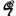

# 胡果·格劳秀斯 Grotius, Hugo (Jon Miller)

*首次发表于 2005 年 12 月 16 日星期五；实质性修订于 2021 年 1 月 8 日星期五*

胡果·格劳秀斯（1583-1645）[Hugo, Huigh 或 Hugeianus de Groot] 是 17 世纪及其后数百年哲学、政治理论、法律及相关领域的重要人物。他的工作涉及广泛的主题，尽管今天的哲学家们最熟悉他对自然法规范理论的贡献，这些理论在中世纪晚期和近代早期出现。本文将尝试解释他对自然法律及相关问题的看法，同时对他在思想史上的地位进行一些更广泛的评估。

---

## 1. 生平与著作

### 1.1 生平

逃狱者、高风险政治家、海难幸存者，胡果·格劳秀斯是一位非凡的人，过着非凡的一生。他生于 1583 年 4 月 10 日，出生在荷兰代尔夫特——正如他的传记作者们总是指出的那样——他的家庭相对富裕，受过良好教育并且雄心勃勃。从这些丰富而并不特别显赫的背景中，胡果很快证明了自己的非凡之处。八岁时，他开始用拉丁语写出娴熟的挽歌；十一岁时，他成为莱顿大学文学院的学生。1598 年，年仅十五岁的他随着当时荷兰的主要政治家约翰·范·奥尔登巴内维尔前往法国皇室进行使节活动。在那里，亨利四世国王对他的博学多才印象深刻，称赞他为“荷兰的奇迹”。三年后，当联合省决定通过聘请一位官方拉丁语编年史学家来记录他们的历史以加强他们与西班牙的自治时，他们选择了胡果而不是莱顿大学修辞学教授多米尼库斯·鲍迪乌斯。

在荷兰上流社会的小圈子里，胡果·格劳秀斯显然被认定为一个有前途的年轻人。在法国期间，他获得了（或者可能只是买到了）奥尔良大学的法律学位。回到海牙后，他建立了一家律师事务所，不久，他的客户包括奥尔登巴内维尔、荷属东印度公司（V.O.C.）和拿骚的莫里茨王子。显然他给莫里茨留下了深刻印象，因为 1607 年荷兰、泽兰和西弗里斯兰的总检察长职位空缺时，王子选择了他，而不是其他两位更年长、更有经验的候选人。胡果并不特别喜欢从事法律实践——在信件中，他表达了今天律师熟悉的抱怨，抱怨工作的乏味和难缠的客户——因此在被任命为总检察长后，他关闭了自己的律师事务所。也许是利用他的新职位和丰厚的薪水，他很快就与强悍的玛丽亚·范·雷格斯贝根结婚，他们最终育有三个女儿和四个儿子。

担任总检察长数年后，胡果于 1613 年被任命为鹿特丹的彭赛纳里（大致相当于美国州长）。同年，当英国人和荷兰人就海洋自由发生争端时，他被要求将理论付诸实践。细节虽然有趣但复杂：基本上，根据两艘荷兰船违反英格兰在格陵兰附近拥有的海域的主张，一支小型英国舰队扣押了荷兰船的货物。胡果率领代表团前往英国抗议英国的行动。尽管历史可能偏向胡果——他认为海洋对所有人开放的观点最终成为国际法——但现实政治使他当时无法取得胜利。英国比荷兰更强大，他们既不归还货物，也不让步法律观点。

1613 年可能带来了一些兴奋，但这十年的结束是胡果·格劳秀斯生命中真正的顶峰之一（或者说是最低谷，这取决于一个人的观点）。正统加尔文主义者和改革者之间关于我们现在看来不再重要的神秘神学问题的争执迅速地具有了巨大的政治意义。胡果·格劳秀斯、奥尔登巴内维尔和其他支持宗教宽容的人站在改革者或“提出抗议的人”一边；而莫里斯、加尔文主义建制派和其他所谓的“反对提出抗议的人”则站在另一边。1618 年 8 月 29 日，莫里斯和他的盟友发动政变，推翻了荷兰联邦（胡果·格劳秀斯因其作为鹿特丹市长的地位而成为其中一员），并将他与奥尔登巴内维尔、莱顿市长霍格贝茨一起监禁。莫里斯很快巩固了自己的权力，随后着手消灭政府中的提出抗议者及其支持者；在这场政变中，奥尔登巴内维尔被处决，胡果·格劳秀斯和霍格贝茨被判处终身监禁。说胡果·格劳秀斯在那里受苦是过于夸张的：他被允许与外界通信；此外，他有书籍和写作材料，事实上，他在这段时间内创作了许多重要作品。但是寒冷潮湿的牢房远非宜居之地，而且当局可能会重新审视他的案件并施加更严厉的惩罚。因此，1621 年 3 月，胡果·格劳秀斯和他的妻子玛丽亚决定已经忍无可忍。胡果·格劳秀斯将自己藏在玛丽亚寄给他的一个大衣箱里，通过声称箱子里装有一些书籍的借口，成功逃离监狱。他逃往安特卫普，然后前往巴黎，他的家人最终也加入了他。

现在开始了一个更加稳定和富有成效的时期。法国当局通过授予他年金来欢迎格劳秀斯，尽管这个年金并非总是发放，但至少给予了安全的承诺。他开始创作《战争与和平法》（De iure belli ac pacis），该书于 1625 年由巴黎出版社出版。这使格劳秀斯很快就出名了：例如，弗西斯在写给格劳秀斯的一封信中说，笛卡尔告诉他最近见到了这位荷兰人（格劳秀斯回信说他不记得见过笛卡尔，这表明了他们当时的相对地位）。或许受到自己作品受到好评的鼓舞，格劳秀斯于 1631 年试图返回荷兰。最初，他可能有理由乐观：在阿姆斯特丹从事了一段时间的律师工作后，他被提名为荷属东印度公司的总督。然而很快，当局对他采取行动，悬赏捉拿他，并迫使他于 1632 年 4 月逃离祖国。格劳秀斯再也没有踏足荷兰。

这一次，他前往德国的汉堡。附近的瑞典（当时的超级大国之一）与这座城市有着多种联系，这使得瑞典当局自然而然地注意到了这位杰出人物的出现和可雇佣性。为了利用这种情况，他们于 1634 年任命他为驻法国大使。格劳秀斯于次年开始在巴黎履行外交职责。很难评估他作为大使的成功：虽然他帮助谈判了一项导致三十年战争结束的条约，但在外交游戏中他也可能被人算计——有一次，他的笨拙迫使瑞典总理奥克森斯蒂尔纳亲自前往巴黎解决问题。尽管有这样的故事，但事实上他在当时最高级别和最具挑战性的外交岗位上任职了十年。

在这段时间里，胡果·格劳秀斯回到了早些时候让他如此痛苦的神学问题上。基督教团结的计划——协调各种新教派别以及新教徒与天主教徒之间的关系——对他变得越来越重要。无论从智力上还是从实际上看，这都是一项适合他和他生活中地位的任务：从智力上看，因为基督教团结引发了许多挑战他思维的概念难题；从实际上看，因为作为一个伟大欧洲强国的大使，他可以利用自己的地位来推动这个事业。当然，这个事业注定要失败——毫无疑问，这远远超出了胡果·格劳秀斯的能力。然而，这确实促使他写出了一些非常有趣和有影响力的作品，其中许多被收集在他的《全集神学作品》中。

1644 年，克里斯蒂娜女王登基后，她开始系统地削弱她的对手奥克森斯蒂尔纳，并作为这场内斗的一部分，召回了胡果·格劳秀斯的大使职务。她没有解雇他；相反，她指示他前往斯德哥尔摩并担任不同的职位。起初，胡果·格劳秀斯不想去，但在皇家特权的压力下（更不用说经济上的必要性），他于 1645 年 3 月启航前往斯德哥尔摩。这是一个决定命运的选择：波罗的海冬末的旅行条件可能很恶劣；他的船只遇难，胡果·格劳秀斯勉强脱险。在瑞典呆了几个月后，他决定返回德国，于是又进行了另一次航行。再次，条件很差；穿过相对狭窄的水域花了八天的时间。这一次，情况太过艰难：受到最近事件的削弱，胡果·格劳秀斯于 1645 年 8 月 28 日在德国罗斯托克去世。虽然这些可能是假传的，但他所谓的遗言——“尝试了许多事情，却一事无成”——确实唤起了他一生工作的跨度和他对结果的个人评估。

### 1.2 作品

考虑到他在领导着如此活跃的公共生活的同时还抚养着一个庞大的家庭，胡果·格劳秀斯的著作数量简直令人惊叹。对他来说，他年轻时担任驻法国大使的时期是典型的。与大使馆同年，他出版了《Pontifex Romanus》，这是关于最近政治事件的六篇文章集。在处理这个项目的同时，他还编辑了两部作品：第三世纪前的阿拉图斯的《现象》，以及马尔提努斯·卡佩拉的七种自由艺术手册。他还开始研究荷兰历史，这项研究最终成为《安娜莉丝和比利时事务史》。而他在十几岁时就完成了这一切。在他一生中，胡果·格劳秀斯将写作或编辑大约五十多部书籍长度的作品和无数小作品。

对哲学家和具有哲学思维的人来说，其中两部作品尤为突出：《劫掠法评论》（De iure praedae commentarius，以下简称为“DIP”）和《战争与和平法》（De iure belli ac pacis，“DIB”）。前者曾经几乎失传。在他生前或之后的某个时期被放入一个箱子中，唯一的手抄本在 1864 年他的一些后裔出售他的一批文件时被发现（有关这些事件的记载，请参阅 Knight 1925 年：第 5 章和 van Ittersum 2006 年）。这份手稿显然是在 1603 年左右由荷属东印度公司委托完成的。在这部作品中，胡果·格劳秀斯将为荷属东印度公司舰队在今天新加坡附近地区捕获一艘大型葡萄牙商船进行辩护。关键的法律和概念问题是，任何私人代理人（如荷属东印度公司）是否可以合法地对另一个妨碍其行动的私人代理人使用武力（请参阅 Tuck 1993 年：170）。但它也有一个重要的宣传目标，即诽谤葡萄牙人（和西班牙人），同时赞扬荷属东印度公司和荷兰人（有关 DIP 的一般历史背景，请参阅 van Ittersum 2002 年）。现代哲学读者将会发现第二章的“前言”特别有趣，因为那里是胡果·格劳秀斯阐述他对权利的性质和基础观点的地方。虽然胡果·格劳秀斯选择不出版这部作品或大部分手稿，但他确实将第十二章送入印刷。以《自由海洋论》（Mare Liberum）为题，这部作品既有影响力又颇具争议：英国人约翰·塞尔登发表了一篇批判性的回应，其中包括其他人。

无论 DIP 的优点如何，胡果·格劳秀斯 的声誉主要建立在 DIB 上。它包括一个介绍和三本书，总共超过 900 页的翻译。与 DIP 一样，介绍或“Prolegomena”对哲学家最感兴趣，因为在这里胡果·格劳秀斯阐述和捍卫了 DIB 的哲学基础。虽然哲学家自然会被“Prolegomena”吸引，但 DIB 的主体也充满了哲学兴趣的主题。第一卷定义了战争的概念，论证了战争的合法性，并确定了谁可以合法地发动战争。第二卷涉及战争的原因，财产的起源，权利的转移等内容，而第三卷主要致力于战争中交战方的正当行为。在 1625 年首次出版后，胡果·格劳秀斯在其一生中推出了几个版本，每次都增加了更多参考资料，但基本上没有改变论点。（关于对 DIB 的引用的解释，它们通常采用书、章、节和—如适用—段落的形式；因此，“I.1.10.1”表示“第一卷，第一章，第十节，第一段”。）

## 2. 方法

许多读者的第一反应是对胡果·格劳秀斯散文风格的反应。因此，在讨论他的思想和论点之前，应该简要谈谈他的方法，无论是在 DIP 还是 DIB 中。当然，这两部作品之间存在差异。然而，Straumann 已经能够描述它们之间的联系。

> 虽然《论战争与和平法》是在与《论战利品法》根本不同的情况下撰写的，但其主要教义……可以被理解为对早期作品的详细阐述。(2015: 212)

因此，我们可以将这两部作品的关键方面，包括它们的方法，至少视为一致的，最多只是相同基本潜在信念的不同表达。

现在，当我们考虑这两部作品中采用的方法时，我们发现几个明显的问题。首先，最明显的是，我们应该如何看待这两本书的页边所引用的大量古代、中世纪和近代作品。有些人对它们持有相当负面的看法；卢梭在《伊米尔》中的一段轻蔑的文字中写道：

> 真正的政治理论 [le droit politique] 尚未出现，可以假定它永远不会出现。胡果·格劳秀斯，在这个领域的所有学者中都是大师，但只是一个孩子；更糟糕的是，是一个不诚实的孩子 [enfant de mauvaise foi]。当我听到人们对胡果·格劳秀斯赞不绝口，对霍布斯恨之入骨时，我看到明智的人对这两位作者的阅读或理解有多远。事实上，他们的原则完全相同：他们只是在表达上有所不同。他们的方法也有所不同。霍布斯依赖诡辩，而胡果·格劳秀斯依赖诗人；其他一切都是一样的。(卢梭 1762: 第四卷 [1915: 第二卷, 147 页])

否认胡果·格劳秀斯依赖“诗人”是荒谬的——毕竟，他在《国际法大辞典》的“前言”中说，“哲学家、历史学家、诗人，最后还有演说家”的证词将被用来“证明自然法的存在”(§40)。对他来说，权威的论据具有很大的说服力：一个人能引用的权威越多，对一个人的论证就越有利。今天的哲学家可能不会被这样的论据所打动，尽管对哲学史研究者来说，这些论据可能是有启发性的。通过研究胡果·格劳秀斯对文本的运用，人们可以了解这些文本在早期现代时期是如何被解释的——这可以打开理解那个时代的众多障碍之一。

但是，他引用这些文本是否只是对权威可能过分尊重的态度？大多数学者认为不仅如此，尽管他们对可能是什么有分歧。一种可能性是，它们反映了胡果·格劳秀斯对永恒哲学思想的承诺。与几十年后的莱布尼茨一样，胡果·格劳秀斯认为几乎所有伟大思想家都有真理的元素。他写道，

> 我引用他们作为证人，他们共谋的证词来自无数不同的时间和地点，必须归因于某种普遍原因。(DIB Prol. §40)

作为伟大前辈思想的继承人，他的工作是将它们合并或综合成一个统一的理论。而这需要他尽可能经常地借鉴它们。

另一个建议认为，胡果·格劳秀斯深刻关注驳斥国际法方面的怀疑论。当强大的法国红衣主教李舒利耶告诉他“在国家事务上，弱者总是错误的”时，胡果感到不安。他如何能说服怀疑论者，如李舒利耶，相信统治政府在国内和国际上的行为受一套规范约束的存在和力量？这个论点永远不会轻易取胜，但通过分担负担，负担可能会减轻。如果胡果能够表明，历史上如此多的人接受了怀疑论者否认的东西，那么也许数量的力量可以改变怀疑论者的想法。

除了边注提出的问题之外，胡果·格劳秀斯方法的一个完全不同的方面涉及他拒绝将伦理学、政治学和法律划分为独立学科。如今，分门别类是常态；通常情况下，我们研究其中一门学科，很少关注其他学科。现在，胡果·格劳秀斯确实经常指出法律规范与道德或政治规范有所不同的方式（例如，在 DIB I.1 开头对法律的讨论）。同时，他并不认为法律、政治和伦理学是完全不同的领域。如果人们期望胡果·格劳秀斯会把它们分开来阐述，那么他们可能会对他忽略我们认为重要的区别感到困惑。了解他这样做是因为他有兴趣挑选出所有规范基础原则，而不仅仅是其中的一部分。他不能只谈论伦理学，因为他对伦理学的看法是由他对政治和法律的看法所启发的。他思想的一个基本原则是，道德、政治和法律规范都是基于从自然中得出或提供的法律。

这里的问题是复杂且广泛讨论的。更多信息，请参阅 Dufour（1980）、Tanaka（1993）、Vermeulen（1983）和 Whewell（1853）。

## 3. 自然法

自然法是多重模糊的。它可以是描述性的，因为有时被认为描述了一组由于某些自然特征而获得的事实。同时，它也可以是规范性的，因为有时被认为规定某些形式的行为是可以接受的，而禁止其他形式的行为是不可接受的。在另一个层面上，它的适用范围是不固定的。一些自然法理论涉及政治实体（通常是国家和国家之间的关系）；另一些涉及民事法律；还有一些涉及道德主体。在另一个层面上，这种模糊性可以被看作是源自“自然”和“法”的概念本身。“自然”可以指人类的本性，也可以指普遍宇宙的本质，或者两者兼而有之。一个人对自然法理论的有效性和力量的感知将取决于采用哪种参考，这种差异会极大地变化。“法”同样存在争议。一个极端将其解释为文字意义，因此自然法是由某个代理人（通常是上帝）实施的规则，迫使人们服从，否则将受到某种惩罚。另一个极端完全将“法”理解为隐喻，挑选出一些在自然现象中可感知的标准或规范，通过完全非人格化的方式来管理行为。

这种变化并不令人意外，因为自然法传统悠久而强大。虽然与古代世界有联系，但真正开始于阿奎那，因为他是第一个系统化到足以被称为理论的一组观念。这一传统延续至中世纪，一直延续到近代早期，然后（据说）在康德那里终结。考虑到自然法在伦理学、政治学和法律方面是主导范式长达数百年之久——远远超过从康德到我们这里的时期——可以完全预料到理论家们会将这一范式推向许多方向。也许所有自然法理论都有一些共同的本质；例如，最近一位评论家提出，[自然法传统] 中的稳定核心是道德主要是一种规范或规定的问题，只有在次要程度上涉及美德和价值观。（Haakonssen 1992: 884）

> 但是那些研究自然法在其繁荣时期的人会对解释的几乎无限可能性印象深刻。

But those who study natural law in the period of its flourishing will be impressed by the almost unlimited possibilities of interpretation.

虽然这不是一篇关于自然法的文章，但这些观点是考虑胡果·格劳秀斯的自然法观点所必需的前提。如果今天哲学家们对胡果·格劳秀斯有所了解，那是因为他被称为“自然法之父”（例如，Vreeland 1917 所说）。在这一关键时刻，我们无需评估这一说法的有效性（有关胡果·格劳秀斯的独创性，请参见下面的第 6 节）。相反，我们应该了解胡果·格劳秀斯对自然法的实际观点。要了解他的观点，需要考察四个问题：第一，法律的来源；第二，它们的性质或内容；第三，它们的力量或义务地位；最后，它们的范围。

为什么会有自然法？它们是因为事物的本质而存在，还是出于其他原因？这些问题潜藏在来源问题背后。胡果·格劳秀斯在如何回答这些问题上改变了主意。在《国际法原理》中，他宣称

> 上帝所显示为祂的意志的东西，那就是法律。这个公理直接指向法律的原因，并且被正确地确立为首要原则。（第二章）

在这里，胡果·格劳秀斯宣布了一个关于规范性与神圣存在之间关系的论点，这通常被称为“意志论”：上帝通过意志行为决定了所有规范范畴的完整和确切内容——正义、善良等等。意志论是自然法理论中一个历史悠久的传统；《神权论》坚定地属于这一传统。然而，在后来的著作中，胡果·格劳秀斯偏离了这一观点。例如，在《至高权能论》中，他宣称任何形式的规范性

> 都源自行为本身的性质，因此崇拜上帝是正确的，不说谎也是正确的。（《全集神学作品》第三卷，第 187 页）

非意志论的一个更为著名的表达出现在《国际法概论》的“序言”中。在“序言”的最初几节中，胡果·格劳秀斯为他的自然法理论奠定了基础。然后，在第十一节中，他写道

> 即使我们承认，即使我们应该承认，即使没有最大的邪恶也无法承认的事实，我们所说的话即使有一定的有效性，即没有上帝，或者人类的事务与他无关。

伦理学、政治学和法律的基本原则并非源自上帝或以其他方式依赖于上帝，而是凭借自然而得出。正如他所说，“权利的母亲——即自然法的母亲——是人类的本性”（Prol. §16）。稍后，他阐明了为什么人类本性会产生自然法：

> 自然法是正确理性的指示，指出一个行为，根据它是否符合理性本性，具有道德卑劣或道德必要性的特质；因此，这样的行为要么被禁止，要么被命令。（I.1.10.1）

如果一种行为符合人类本性的理性和社会方面，那么它是被允许的；如果不符合，那么就是不被允许的（参见 I.1.12.1）。也就是说，自然法的源头在于行为与我们作为理性和社会存在的本质的（不）相容性。有关 etiamsi daremus 段落的讨论，请参见 St. Leger（1962）和 Todescan（2003）。

假设我们已经确定了法律的来源。这并不会揭示我们四个问题中的第二个：即，法律的内容或它们实际上说了什么。胡果·格劳秀斯关于我们应该如何了解这一点的观点是非常一致的：在他的整个著作中，他始终坚持认为（正如他在《国际法原理》中所说），

> 上帝的意志不仅通过神谕和预兆来显现，而且最重要的是通过造物主的设计；因为自然法正是从这最后的源头派生出来的。（第二章）

正如他在《自然法概论》中所说，自然法“源自于植根于人类内心的基本特质”（序言 §12）。其他一些自然法理论通过诉诸超自然来解决知识问题，但胡果·格劳秀斯并没有这样做。对他而言，研究自然本身——更具体地说，研究人类本性——足以教导我们伦理学、政治学和法律的基本要义。

而这样的研究究竟揭示了关于这些基本规范原则的什么？《国际法原理》和《国际法基础》中的推理可以重建如下。人类的本性由两个基本属性构成：对自我保存的欲望和对社会的需求（见《国际法原理》第 2 章和《国际法基础》序言 §§6-7）。这两个属性相互调和并相互影响：对自我保存的欲望受到社会冲动的限制，因此人类并不自然地追求以任何代价维持和增强他们的存在；相反，对其他人类的需求受到自我保存驱动的限制，因为个体必须自然地努力获取维持他们福祉的手段。此外，自我保存驱动和社交冲动都是情感和认知的；它们既是非理性的又是理性的，具有无反思的本能力量以及深思熟虑的计划。因为我们本质上既是社会的又是自我保存的存在，所以我们成功存在的两个必要条件是不可或缺的。我们应该避免侵犯他人的东西，我们应该合理追求真正符合我们利益的事物。因此，胡果·格劳秀斯将这两点作为《国际法基础》中自然法的第一和第二要素（见序言 §§8、10）；它们构成《国际法原理》中前四个“法则”的核心（见第二章）。尽管这些原则在自然规范的等级体系中享有词汇优先权，但它们并不穷尽列表。对自然的研究还教导我们“邪恶行为必须纠正”和“善行必须得到回报”（《国际法原理》的第五和第六法则）。事实上，胡果·格劳秀斯在《国际法原理》中推导出了大约 22 条基本自然原则的列表，在《国际法基础》中也有一个类似规模的群体（虽然没有以相同方式编号）。对胡果·格劳秀斯自然法理论的任何解释都应该从引用这些第一级原则或原则开始，因为它们构成了其实质。 最近的学术研究试图通过考察胡果·格劳秀斯可能受到古代和近代斯多儿派的启发来阐明前述问题。特别参见布鲁克（2012 年：第 2 章）和斯特劳曼（2015 年）。

回到概念问题，我们应该问为什么自然法则对我们产生作用。为什么它们要求或禁止我们执行某些特定的行为？在这里，我们来到了第三个问题，涉及法律的力量或义务地位。传统上，自然法理论家倾向于通过上帝来解决这个非常深奥的谜团。例如，阿奎那认为，义务是上级对下级的意志行为的结果（见《神学大全》II.ii.q104）。我们被迫遵守民法是因为我们的政治上级通过他们更强大的意志行为强迫我们这样做。我们被迫遵守自然法则是因为上帝通过他无限更强大的意志强迫我们这样做。胡果·格劳秀斯受到这种观点的诱惑；他在《国际法原理》中写道，道德上必要的行为必须被“理解为上帝必然命令或禁止的行为”（I.1.10.2）。

然而，正如任何父母所知道的，“因为我这么说”并不是行动的最具说服力的理由。即使说话的人是上帝，这也是真实的。因此，思想家长期以来一直试图阐明义务的其他基础。例如，在胡果·格劳秀斯的时代，苏亚雷斯写道，

> 在不犯罪的情况下违反自然法涉及一种不一致性……因此，由自然法强加但并非良心问题的义务的存在也涉及一种不一致性。(《法律论》，II.IX.6)

在这里，我们发现了一种非常不同的义务基础解释：我们被迫执行或避免某些与我们的良心不相容的行为，因为如果我们不这样做，我们将会有不一致性的罪过。换句话说，我们被迫执行或避免某些与我们作为理性生物的本性相容或不相容的行为，因为如果我们不这样做，我们将不再是人类。格劳秀斯采纳了这个想法，并根据他对人类本性的丰富构想进行了修改：对他而言，自然法要求我们执行有助于我们的理性、社交性和自我保存需求的行为。这个想法贯穿于他的几条自然法律之中，比如，邪恶行为必须得到纠正的法则。格劳秀斯将这种义务置于补偿正义的范畴之下（《国际法原理》，第二章）。“补偿正义的任务”是“赔偿”：以盗窃为例，格劳秀斯解释说，“这种正义要求被拿走的东西必须被归还”（同上）。邪恶行为扰乱了社会的道德和法律平衡；它们不公正地使一些人受益，同时不公正地伤害了其他人。由于维护健康的社会关系是至关重要的，因此惩罚邪恶行为是必要的。

解释我们为什么应该遵守自然法则的问题，或者为什么我们应该遵守任何一套规范的问题，是哲学中最持久的问题之一；认为在胡果·格劳秀斯那里可以找到解决方案是轻率的。他的论述之一的不足受到了李约瑟的启发：虽然胡果·格劳秀斯试图区分和平衡我们行动的理性、社会和自私动机，但人们可能质疑它们是否实际上是不同且平等的。如果可以证明其中一个比其他动机更为基础——比如说，自私是我们行动的第一个和最基本的理由——那么我们遵守自然法则和道德的理由将与胡果·格劳秀斯所主张的截然不同。（有关更多讨论，请参见科斯加德 1996 年：7、21-22 和 28-30。）

接着，我们来到我们四个问题中的最后一个问题——即范围。在胡果·格劳秀斯的时代，欧洲人与美洲和其他地方土著人民的接触使这个问题变得紧迫（有关讨论，请参见蒂尔尼 1997 年：第十一章）。一些理论家试图对法律的适用范围施加认识论或信念方面的限制，认为法律只对持有特定信念的人施加并保护。由于决定法律适用性的信念通常是宗教性质的，人们普遍认为自然法则只适用于基督徒，而不包括非基督徒。鉴于自然法则构成道德的基础，因此由于它们不包括非基督徒，基督徒就没有义务以道德对待非基督徒。与许多其他人一样，胡果·格劳秀斯坚决反对这种观点。对他而言，自然法则适用于所有理性和社会存在本身。无论他们怎么想或相信，只要他们是理性和社会的，他们就受自然法则的约束（参见，例如，DIB II.20.44）。

## 4. 政治哲学

正如前一节强调的，胡果·格劳秀斯的自然法理论远不止涉及政治；它提供了各种规范性的解释。与此同时，尽管他关心阐明规范性，但明显的证据表明他对政治问题特别感兴趣。毕竟，他过着非常政治化的生活，他的两部最重要的作品都是极具政治性的。本节将讨论他的一些政治观念。

让我们从与义务问题密切相关的一个观念开始。刚才提到，义务的基础在于我们作为理性、社会性、自我保存的存在。这是正确的，但需要进一步阐释。胡果·格劳秀斯并未将我们的本质看作是静态的；相反，它们是动态的，表现出我们的能力和活动。这在他对权利（ius，或复数形式 iura）的概念中得到了强调。他区分了 iura 的几种含义，其中最重要的一种将 ius 看作是“一个人的道德品质，使其有能力正确地拥有或做某事”（DIB I.1.4）。对于胡果·格劳秀斯来说，一项 ius 或权利是代理人拥有的一种能力或权力；它是一个人的“能力”或“才能”（同上）。拥有一项 ius 意味着具备进行某些指定行动的能力，而无需道德或法律的制裁。因此，例如，当他赋予人类自我保存的权利时，他赋予我们追求自身利益的权力，而无需得到国家或其他任何权威的许可或帮助。由于权利以个体主体为中心，人们经常会看到胡果·格劳秀斯提出了“主观权利”理论（例如，参见 Kingsbury＆Roberts 1990 年：31 及其引用）。

胡果·格劳秀斯 的权利理论的重要性可以通过将其与主导中世纪对 iura 的观念进行对比来澄清。这种观念主要源自阿奎那，他认为“‘权利’一词首先是用来表示正义本身的”（《神学大全》II.ii.q57.art1）。在最初的用法中，ius 被应用于事物——行为、实体、情况——而不是人。正如阿奎那及其追随者所构想的那样，当事物与自然法完全一致时，它们就被赋予“权利”这一称号。因此，出于两个原因，中世纪对权利的观念可以被认为是“客观的”：首先，因为正确的事物是客体（而不是主体）；其次，因为事物在满足客观、与行动者无关的一组必要和充分条件时才变得值得被称为“权利”，即那些符合自然法的条件。现在，确实，这种中世纪观点在胡果·格劳秀斯 的时代开始被取代；例如，苏亚雷斯说，“对 ius 的严格理解” 赋予了它

> 每个人都有一定的道德权力，无论是对自己的财产还是对应得到的东西。（《论法律》I.2.5）

然而，通常认为胡果·格劳秀斯 是根本性地转变了这一范式的功臣（参见，例如，Haakonssen 1985: 240 和 Schneewind 1998: 78；对相反观点，参见 Irwin 2008: 98）。尽管他的范式需要时间才能成为主导，但最终确实占据了主导地位。当我们说某人有权利做某事时，我们通常指的是他有能力或权力去做那件事：例如，声称某人有思想自由的权利意味着他有权按照自己的意愿思考，没有人或事物能强迫他做出其他选择。这就是胡果·格劳秀斯 的观点；尽管后来被许多其他人中介，但他的贡献是至关重要的。

除了其固有的兴趣外，胡果·格劳秀斯对权利的创新概念产生了许多重要的影响。两个例子可以作为说明。首先，中世纪理论家倾向于谈论“权利”，而胡果·格劳秀斯及其继承者强调拥有权利的人的权力和权利。通过将权利与个人的权力联系起来，现代人能够明显区分权利与义务之间的差异（参见 Finnis 1980: 209）。其次，由于胡果·格劳秀斯将权利转化为人类拥有的权力或能力，他在权利商品化中起到了至关重要的作用。一旦权利变成财产，它们就可以像其他所有财产一样被交易。转让的方式可能与其他商品交换不完全相同，但将自己拥有的东西交换为不拥有的东西的基本概念是存在的。正如评论家所指出的，权利的商品化是十七世纪最重要的政治发展之一（有关更多信息，尤其参见 Macpherson 1962: 3f）。

胡果·格劳秀斯在其著作中利用了后一种观念中的一些更为臭名昭著的部分。以以下为例：

> 首先，必须拒绝那些认为君权无处不在、无一例外地属于人民，因此人民可以在国王滥用权力时加以限制和惩罚的观点...我们通过以下论据加以驳斥。
>
> 对每个人来说，他可以自愿将自己奴役于任何他喜欢的人以获取私人所有权，这一点从希伯来法和罗马法都可以明显看出。那么，为什么一个处于自主地位的民族不可以将自己交付给某个人或几个人，并将治理权转交给他们，自己不保留任何治理权的痕迹呢？（DIB I.3.8.1）。

格劳秀斯在其他地方进一步阐述了这一情况，坚持认为一个民族可以将他们的权利交给一个统治者，作为回报获得一个和平稳定的社会（DIB I.4.2.1）。但是，对于那些已经获得这些权利的统治者，有哪些限制呢？对一些读者来说，格劳秀斯允许代理人转让他们的权利的态度使他容易受到亲近专制者的指责。只要最初的权利转让是合法的，那么一旦统治者拥有了这些权利，那些生活在他或她统治下的人就没有权利抱怨某些行为是不公正的，因为他们根本没有相关的权利。正如卢梭所说，格劳秀斯“不遗余力地剥夺人民所有权利，并将这些权利投资给国王”（《社会契约论》第二卷第二章）。当然，其他读者否认格劳秀斯的理论允许代理人完全转让他们的权利；特别是，他们认为代理人将始终保留他们的基本权利，比如自卫权（见托克 1979 年解释的洛克 172-3 页）。然而，无论理论本身实际上意味着什么，格劳秀斯似乎相信在某些情况下代理人可以放弃所有自由（更多内容请参见 DIB I.3.9-16）。

在更积极的一面上，胡果·格劳秀斯对权利可转让性的认可使他得出了一个关于政治哲学中一个重大问题的新颖解决方案。国家的权利或权力的来源是什么？传统的两种答案是：（1）上帝——他建立了国家，并且国家的权威来自于他的认可；以及（2）力量——因为国家强大，所以它有权治理，因为强权即公理。虽然胡果·格劳秀斯对这两者都有所涉猎，但最终他选择了其他的东西。他在《国际法原理》中写道，

> 正如每一个行政官的权利都来自于国家一样，国家也是从私人手中获得了同样的权利；同样，国家的权力是集体协议的结果。（第八章）

通过无数个别的、连续的决定，在一个漫长的时间内，个人逐渐同意建立治理社会的机构，并赋予这些机构一些他们天然拥有的权力。最终，这些机构凝聚成一个统一的整体，即国家。因此，国家的权力不是来自上帝，也不是来自纯粹的力量，而是来自个人自愿将他们的权力或权利转让给国家的结果。将这个想法解释为一种初期契约主义可能是错误的（参见塔克 1993 年：178-9），但同样，否认这个想法对后来的契约主义者如霍布斯的吸引力也是错误的。

所有这些都突显了胡果·格劳秀斯对当时正在制定的政治自由主义学说的真实但不均衡的贡献。对于新兴的自由主义理论，他提出了个体——无论是个别人还是个别人群体——是权利的持有者的观念。此外，他提出了上述权利性质的引人注目的二阶描述。他还强烈主张赋予几种特定的一阶权利：例如，除了已经提到的（如自卫）之外，他还积极捍卫了财产权。然而，尽管这些以及其他对自由主义的贡献很重要，它们必须与胡果·格劳秀斯的其他观点相平衡。例如，虽然他认为个体拥有权利，但也认为有许多情况下这些权利可能被放弃甚至被忽视。因此，在胡果·格劳秀斯的理论中，我们应该拥有的权利并不完全得到保证。更为不可思议的是他对奴隶制度的看法，这种制度或者至少可以是一个完全正义的制度。在《国际法原理》中，他写道，亚里士多德说某些人天生就是奴隶并不是“错误的”（第六章，问题五，第一条）。尽管胡果·格劳秀斯可能在《国际法原理》中否认了这种想法（见 III.7.1—但也见 I.3.8.4），但一个简单的论点仍然使他相信奴隶制与一个公正的社会是相容的。如果个体可以出售他们的劳动力，胡果·格劳秀斯推理道，那么他们也应该能够出售他们的自由。如果他们出售了所有的自由，那么他们当然就是奴隶（I.3.8.1）。胡果·格劳秀斯自由主义的天平上还要考虑的最后一个因素是他对统治者或君主地位的看法。因为主权是“那种…其行为不受他人法律控制的权力”（《国际法原理》I.3.7.1），由此必然得出一个必然的真理，即拥有主权的人必然优于所有其他人。 由于他们必然优于其他人，胡果·格劳秀斯认为主权者对其臣民负责的建议是令人反感的。他们可能希望考虑他们的臣民的需求（III.15），但这只是“值得赞赏”的，而不是必须的。总之，胡果·格劳秀斯对政治自由主义的贡献可与霍布斯、斯宾诺莎、洛克和其他十七世纪的杰出人物相媲美。他们是真实而重要的，同时又融合了明显非自由主义的主题。

## 5. 公正战争学说

正如他的巨著的标题所暗示的那样，战争的规范地位是胡果·格劳秀斯最关心的问题。关于战争的正义原则和战争中的正义行为之间的普遍区别——即战争的正当原因与战争的正当行为之间的区别——有助于理解他的观点。关于战争的正义原则，胡果·格劳秀斯在《国际法原理》第三章和《国际法原理》第一卷第二章专门讨论了是否有权发动战争的问题。他认为，战争不仅与自然法、国际法和神圣法这三种主要法律相兼容，有时甚至被这三种法律所迫使。为了支持他的观点，他提出了许多概念上的、历史上的和神学上的论据。要列举所有这些论据是有争议的，因此只拿第一类影响深远的例子。

> 愿望实现特定目标的人，也愿意为实现该目标所必需的事物。上帝希望我们保护自己，保持对生活必需品的掌控，获得我们应得的东西，惩罚违法者，并同时捍卫国家... 但这些神圣目标有时构成了发动和进行战争的原因... 因此，某些战争是上帝的旨意... 然而，没有人会否认上帝的一切旨意都是公正的。因此，有些战争是公正的。（DIP 第三章）

格劳秀斯远非认为战争是道德和法律范畴之外的状态，而是将其视为一种权利的工具（参见 Dumbauld 1969: 73）。正如他所写，“司法解决失败，战争开始”（DIB II.1.2.1）。战争可能是为了回应“尚未发生的错误，或已经发生的错误”而正当进行的（同上）。正当化战争的错误清单很长，包括施加惩罚（同上），自卫（II.1.3），捍卫贞操（II.1.7）等。与此同时，尽管格劳秀斯容忍战争，但他确立了一些有争议的限制。例如，他认为一个人没有权利抵御对社会“有用”的攻击者（II.1.9.1）。这一原则适用于个人和国家。因此，个人和国家在受到对社会重要的人的攻击时可能被迫屈服 — 无论是单个国家的社会还是国际社会。总的来说，有人认为，格劳秀斯对战争正义的分析与他的前辈有所不同，体现在他对战争“正当原因”的详细和系统阐述上（Draper 1990: 194）。

即使一场战争是正当进行的，也必须正当地进行才能被认为是公正的。在这里，我们谈到了战争法中的 ius in bello，这是 DIB III 中讨论的一个话题。格劳秀斯首先制定了三条统治战争行为的规则（DIB III.1.2–4），其中第一条也是最基本的一条是“在战争中，为实现预期目标所必需的事情是允许的”（III.1.2）。这显然对可允许的行为设定了广泛的限制，尽管这并不像第一次阅读可能暗示的那样令人不安，因为必要性要求可能很难满足。在提出这些规则之后，格劳秀斯考虑了大量行为的可允许性。这个讨论中的多样性和细节的数量令人着迷。他分析了诡计、欺骗和虚假的典型。他不仅区分了这三种传递虚假印象的方式，还区分了每种方式内部的变化（见 III.1.6–20）。例如，如果欺骗是一个种类，那么消极行为中的欺骗是一种（III.1.7），积极行为中的欺骗是另一种（III.1.8）。而积极行为中的欺骗又可以分为两个亚种（同上）。DIB 的实际目标在这里和整个第三册中都清晰地体现出来，其中优先考虑的似乎是通过考虑交战方可能采取的大量行动并确定它们的道德和法律地位，澄清战争中到底什么是允许的和什么是不允许的。总的来说，格劳秀斯认为，只有当战争为正义服务时，战争才是正当的。由于为正义服务的条件很多且不明显，他必须付出相当大的努力来确定和阐明这些条件（更多信息，请参见 Draper 1990: 191–207）。

## 6. 独创性和影响

最后对胡果·格劳秀斯在思想史上的贡献进行更广泛的评估时，我们应该首先区分他的独创性问题和影响力问题。对于我们的目的，定义独创性为涉及形成新颖重要的概念和/或方法，而影响力则包括对他人产生重大影响。让我们先处理独创性问题，然后再来讨论胡果·格劳秀斯的影响力问题。

鉴于他的工作涉及伦理学、政治理论、政治、宗教等许多不同领域，要断言胡果·格劳秀斯是或不是一个独创性思想家是不可能的。相反，唯一负责任的方法是逐案处理他所声称的贡献。因为在这里逐一讨论所有案例将会很烦琐，让我们只谈两个对哲学家可能最感兴趣的案例：伦理学和政治理论。

学术界对胡果·格劳秀斯的伦理学独创性存在争议。欧文（2008）最近提出了一个观点，认为由于他仅仅从其他作者（尤其是阿奎那和苏亚雷斯）那里提取了他的道德理论的主要要素，“胡果·格劳秀斯在伦理学史上并非先驱”（98）。相比之下，施奈温德（1993）认为胡果·格劳秀斯应该因将竞争论引入伦理学而受到赞扬——这一概念是指...

> 冲突是不可根除的，即使在原则上，也无法通过对世界构成的最完整的形而上知识来消除。(1993: 58)。

在 Irwin 和 Schneewind 出现几十年之前，意大利学者 A.P. d’Entrèves 认为

> 格劳秀斯 的自然法理论并非在其内容上脱离了神学。而是在其方法上。(d’Entrèves 1951 [1970: 54])

根据 d’Entrèves 的说法，胡果·格劳秀斯试图建立一个法律体系，在一个神学争议逐渐失去说服力的时代获得认可... 他的继任者完成了这项任务。 他们精心制定的自然法完全是“世俗的”。（1951 年 [1970 年：55]）

> 其他对胡果·格劳秀斯的伦理学原创性问题发表意见的人包括 Kilcullen（1995 年）、Darwall（2012 年）和 Miller（2020 年）。 Tierney（1997 年：第十三章）对此进行了清晰而平衡的评估。

Others who have weighed in on the subject of the originality of Grotius’ ethics include Kilcullen (1995), Darwall (2012), and Miller (2020). A clear and balanced assessment is given by Tierney (1997: Chapter XIII).

转向政治理论，上述第 4-5 节确定了胡果·格劳秀斯对政治的各种具体贡献。然而，对许多学者来说，胡果·格劳秀斯之所以重要，并不在于他的新观念，而在于他对政治问题的新思考方式。因此，Kingsbury 和 Roberts 说，“DIB 的最大直接贡献是”

> 对传统但基本的战争法主题上的实践和权威进行系统重组，首次围绕根植于自然法的一套原则组织起来。 (1990: 3-4)

在政治领域，对胡果·格劳秀斯独创性的不同评价。通过他的著作，他提出了一种关于国家性质和国家间关系的理论，这种理论被简单地称为“格劳秀斯主义”（这些标签由 Wight（1991）等人使用）。这一理论是对国家起源和身份条件的阐述。它认为国家并非存在于一个原始或反社会的状态，而是存在于一个由规范体系统治的国际社会中。这些规范不依赖于立法机关或立法者的积极行动。同时，尽管坚持这些规范的存在和相关性（这些规范当然是自然法），但它也认识到现实政治的力量。个别国家将追求自己认为符合利益的行动，而不管这些追求是否会使它们与自然法相冲突。通过做到这一切，格劳秀斯学派被认为要在“马基雅维利主义”和过分理想主义的“康德主义”之间寻求一种折中之道（更多内容，请参阅 Wight 以及 Bull 1976 中的批评）。根据这些学派在历史上任何特定时刻的命运，胡果·格劳秀斯对国际关系的影响将会增强或减弱。

提到这种影响，我们就来到了这个结论部分的第二个广泛话题。学者们可能会争论胡果·格劳秀斯是否原创，以及如何原创，但没有人会怀疑他的影响力。例如，瑞典国王古斯塔夫·阿道夫据说曾将《国际法大全》的一份副本放在枕头旁边，靠近《圣经》。詹姆斯一世国王在一次前往英国的外交使命期间对胡果·格劳秀斯的演讲做出了强烈的反应（消极的）。

因此，胡果·格劳秀斯的影响力在当时的一些主要人物身上得到了体现。当然，他的主要影响还是在其他学者身上。贝尔称他为“欧洲最伟大的人之一”（1720 年 [1740 年：2.614]）。莱布尼茨称赞“无与伦比的胡果·格劳秀斯”（见莱布尼茨 1710 年 [1985]，77）。托马斯·里德称其为“不朽的胡果·格劳秀斯”（见里德 1788 年 [1815]，331），哈奇森广泛借鉴了他的观点，休谟在他第二次探寻的第三个附录中赞许地引用了他关于财产起源的论点（见休谟 1748 年 [1975]，307）。当然，并非所有人都如此印象深刻。卢梭的观点已经被引用；自然法理论家普芬多夫也持怀疑态度。伏尔泰认为胡果·格劳秀斯简直无聊。尽管如此，无论是好是坏，胡果·格劳秀斯长期以来一直是文学界的焦点。关于胡果·格劳秀斯的影响的简要概述，重点关注《国际法大全》，请参阅塔克（2005：ix–xii）。

<!--md-padding-ignore-begin-->
## Bibliography

### Primary Texts and Translations

N.B.: This is but a small selection of Grotius’ more important works. For a more complete catalogue, see ter Meulen and Diermanse (1950).

* *Mare liberum*, Leiden: Elzevier, 1609; reprinted and translated many times since. The translation and edition by Ralph van Deman Magoffin (Oxford: Oxford University Press, 1916) contains a facsimile of the 1633 edition. See also the recently published *The Free Sea*, translated by Richard Hakluyt (done circa 1616) with William Welwod’s critique and Grotius’s reply, edited and with an introduction by David Armitage (Indianapolis: Liberty Fund, 2004).
* [*DIB*] *De iure belli ac pacis libri tres*, Paris: Buon, 1625; reprinted and translated many times since. Jean Barbeyrac’s 1735 edition, with extensive notes and commentary, was the most important; it was translated into English and published in London by Innys et al. in 1738. It has been recently reprinted as *The Rights of War and Peace*, Books I–III, edited and with an introduction by Richard Tuck, Indianapolis, IN: Liberty Fund, 2005. Another commonly used edition and translation is by Frank W. Kelsey et al. for the Classics of International Law series, Oxford: Oxford University Press, 1925. Kelsey’s version is printed with a facsimile of the 1646 edition.
* *Annales et Historiae de Rebus Belgicis*, Amsterdam: Blaeu, 1657; translated by Thomas Manley, as *De rebus belgicis, or, The annals and history of the Low-Countrey-warrs*, London: Twyford and Paulet, 1665.
* *Opera omnia theologica*, London: Moses Pitt, 1679.
* [*DIP*] *De iure praedae commentarius*, G. Hamaker (ed.), The Hague: Nijhoff, 1868. Until fairly recently, the most commonly used edition and translation was *Commentary on the Law of Prize and Booty*, by Gwladys L. Williams et al. for the Classics of International Law series, Oxford: Clarendon Press, 1950. Williams’ version is printed along with a collotype of Grotius’ manuscript. The edition of Williams’ translation with Martine Julia van Ittersum as editor (Indianapolis, IN: Liberty Fund, 2006) has superseded Williams’ original.
* *Briefwisseling van Hugo Grotius*, P.C. Molhuysen et al. (eds.), The Hague: Nijhoff, 1928–2001.
* *Grotius Reader: A Reader for Students of International Law and Legal History*, L.E. van Holk and C.G. Roelofsen (eds.), The Hague: T.M.C. Asser Instituut, 1983.
* *De antiquitate Reipublicae Batavicae*, Translated as *The Antiquity of the Batavian Republic*, Jan Waszink et al. (eds. and trans.), Assen: Royal van Gorcum, 2000.

### Select Secondary Literature

N.B.: In addition to the following (which emphasizes English-language literature), interested readers should also consult the scholarly journal *Grotiana* (new series), which regularly publishes articles in several languages on all aspects of Grotius’ thought and legacy.

#### Anthologies

* [Anonymous] (ed.), 1984, *The World of Hugo Grotius: Proceedings of the international colloquium organized by the Grotius Committee of the Royal Netherlands Academy of Arts and Sciences, Rotterdam 6–9 April 1983*, Amsterdam and Maarssen: APA—Holland University Press.
* Asser Instituut (eds.), 1985, *International Law and the Grotian Heritage*, The Hague: T.M.C. Asser Instituut.
* Blom, Hans W. (ed.), 2009, *Property, Piracy and Punishment: Hugo Grotius on War and Booty in De Iure Praedae—Concepts and Contexts*, Leiden: Brill.
* Blom, Hans W. and Laurens Winkel (eds.), 2004, *Grotius and the Stoa*, Assen: Royal Van Gorcum.
* Bull, Hedley, Benedict Kingsbury, and Adam Roberts (eds.), 1990, *Hugo Grotius and International Relations*, Oxford: Clarendon Press.
* Dunn, John and Ian Harris (eds.), 1997, *Grotius*, vols. 1–2, Cheltenham: Edward Elgar Publishing. (N.B.: This large collection reprints a number of the articles cited individually below.)
* Onuma, Yasuaki (ed.), 1993, *A Normative Approach to War: Peace, War, and Justice in Hugo Grotius*, Oxford: Clarendon Press.

#### Bibliographies

* Eyffinger, A.C. et al., 1983, *The Grotius Collection at the Peace Palace: A Concise Catalogue*, The Hague: Peace Palace Library. [[Eyffinger et al. 1983 available online](https://www.peacepalacelibrary.nl/files/Grotius_Collection.pdf)]
* Molhuysen, Philippus Christianus, 1943, “De Bibliotheek van Hugo de Groot in 1618”, *Mededeelingen der Nederlandsche Akademie van Wetenschappen*, Afdeeling Letterkunde, Nieuwe reeks, dl. 6, no. 3. (N.B.: This is a list of books in Grotius’ possession in 1618.)
* ter Meulen, Jacob and P.J.J. Diermanse, 1950, *Bibliographie des écrits imprimés de Hugo Grotius*, The Hague: Martinus Nijhoff.
* –––, 1961, *Bibliographie des écrits sur Hugo Grotius imprimés au XVIIe sicle*, The Hague: Martinus Nijhoff.
* Willems, J.C.M., 1980, 1981, ongoing, *Grotiana* (new series), vols. 1, 2, etc.

#### Biographies

* Bayle, Pierre, 1720 [1740], “Grotius”, in *Dictionaire historique et critique*, 3rd edition, Rotterdam: Michel Bohm. 5th Edition, 1740, Amsterdam, Leyde, La Haye, Utrecht, vol. 2: 614–620. [[Bayle 1720 [1740] available online](https://gallica.bnf.fr/ark:/12148/bpt6k9764671j)]
* Brandt, Caspar, and Cattenburgh, Adriaan van, 1732, *Historie van het leven des heeren Huig de Groot*, 2nd edition, Dordrecht and Amsterdam: Van Braam en onder der Linden.
* Dumbauld, Edward, 1969, *The Life and Legal Writings of Hugo Grotius*, Norman, OK: University of Oklahoma Press.
* Edwards, Charles, 1981, *Hugo Grotius*, Chicago: Nelson-Hall.
* Holk, L.E. van., 1983, “Hugo Grotius, 1583–1645, A Biographical Sketch”, in *Grotius Reader: A Reader for Students of International Law and Legal History*, L.E. van Holk and C.G. Roelofsen (eds.), The Hague: T.M.C. Asser Instituut, 23–44.
* Knight, W.S.M., 1925, *The Life and Works of Hugo Grotius*, London: Sweet and Maxwell Publishers.
* Vreeland, Hamilton, Jr., 1917, *Hugo Grotius: the Father of the Modern Science of International Law*, New York: Oxford University Press.

#### Monographs and articles

* Aquinas, Thomas, *Summa Theologica*, written from 1265–1274. Translated by Fathers of the English Dominican Province, Cincinnati, OH: Benziger Brothers, 1947. [[*Summa Theologica* available online](https://ccel.org/ccel/aquinas/summa/summa.)]
* Blom, Hans, 1995, *Causality and Morality: the Rise of Naturalism in Dutch Seventeenth-Century Political Thought*, Ph.D. thesis, Utrecht University.
* Brandt, Reinhard, 1974, *Eigentumstheorien von Grotius bis Kant*, Stuttgart-Bad Cannstatt: Frommann-Holzboog.
* Brett, Annabel, 2002, “Natural Right and Civil Community: The Civil Philosophy of Hugo Grotius”, *The Historical Journal*, 45(1): 31–51. doi:10.1017/S0018246X01002102
* Brooke, Christopher, 2012, *Philosophic Pride: Stoicism and Political Thought from Lipsius to Rousseau*, Princeton, NJ: Princeton University Press.
* Bull, Hedley, 1976, “Martin Wight and the Theory of International Relations”, *British Journal of International Studies*, 2(2): 101–116. doi:10.1017/S0260210500116602
* Chroust, Anton-Hermann, 1943, “Hugo Grotius and the Scholastic Natural Law Tradition”, *New Scholasticism*, 17(2): 101–133; reprinted in Dunn and Harris 1997. doi:10.5840/newscholas194317217
* Darwall, Stephen, 2012, “Grotius at the Creation of Modern Moral Philosophy”, *Archiv Für Geschichte Der Philosophie*, 94(3): 296–325. doi:10.1515/agph-2012-0013
* d’Entrèves, Alessandro Passerin, 1951 [1970], *Natural Law: An Introduction to Legal Philosophy*, London: Hutchinson & Co. Second edition, 1970.
* Draper, G.I.A.D., 1990, “Grotius’ Place in the Development of Legal Ideas about War”, in Bull, Kingsbury, and Roberts 1990: 177–207.
* Dufour, Alfred, 1980, “L’influence de la méthodologie des sciences physiques et mathématiques sur les fondateurs de l’école du droit naturel moderne (Grotius, Hobbes, Pufendorf)”, *Grotiana* (new series), 1: 33–52; reprinted in Dunn and Harris 1997. doi:10.1163/187607580X00053
* –––, 1984, “Grotius et le droit naturel du dix-septime sicle”, in [Anonymous] (ed.) 1984: 15–41.
* Finnis, John, 1980, *Natural Law and Natural Rights*, Oxford: Clarendon Press.
* Gurvitch, Georges, 1927, “La philosophie du droit de Hugo Grotius et la théorie moderne du droit international”, *Revue de Metaphysique et de Morale*, 34(3): 365–391.
* Haakonssen, Knud, 1985, “Hugo Grotius and the History of Political Thought”, *Political Theory*, 13(2): 239–265; reprinted in Dunn and Harris 1997. doi:10.1177/0090591785013002005
* –––, 1992, “Natural Law”, in Lawrence C. Becker and Charlotte B. Becker (eds.), *The Encylopedia of Ethics*, New York: Garland Publishers, 884–890.
* –––, 1996, *Natural Law and Moral Philosophy: from Grotius to the Scottish Enlightenment*, Cambridge: Cambridge University Press. doi:10.1017/CBO9781139172905
* –––, 1998, “Divine/natural law theories in ethics”, in Daniel Garber and Michael Ayers (eds.), *The Cambridge History of Seventeenth-Century Philosophy* (Volumes 1–2), Cambridge: Cambridge University Press, vol. 2, 1317–1357. doi:10.1017/CHOL9780521572330.009
* Haggenmacher, Peter, 1983, *Grotius et la doctrine de la guerre juste*, Paris: Presses Universitaires de France. (N.B.: This monograph also has an extensive bibliography; see pp. 645–672.)
* Hart, A. C. ’t., 1983, “Hugo de Groot and Giambattista Vico”, *Netherlands International Law Review*, 30: 5–41; reprinted in Dunn and Harris 1997. doi:10.1017/S0165070X00011876
* Hodges, Donald Clark, 1956/7, “Grotius on the Law of War”:, *The Modern Schoolman*, 34: 36–44. doi:10.5840/schoolman19563414
* Hofmann, Hasso, 1977, “Hugo Grotius”, in Michael Stolleis (ed.), *Staatsdenker im 17 und 18 Jahrhundert: Reichspublizistik, Politik, Naturrecht*, Frankfurt am Main: Metzner, 51–77.
* Hume, David, 1748 [1975], *An Enquiry Concerning the Principles of Morals*, 3rd ed., ed. by L.A. Selby-Bigge, revised ed. by P.H. Nidditch, Oxford: Oxford University Press.
* Irwin, Terence, 2008, *The Development of Ethics* (Volume II), Oxford: Oxford University Press.
* Kilcullen, John, 2001, “The Origin of Property: Ockham, Grotius, Pufendorf and Some Others”, in *A Translation of William of Ockham’s “Work of Ninety Days”*, John Kilcullen, and John Scott (eds/trans.), Lewiston, NY: Edwin Mellon Press, 883–932.
* Kingsbury, Benedict, and Roberts, Adam, 1990, “Introduction: Grotian Thought in International Relations”, in Bull, Kingsbury, and Roberts 1990: 1–64.
* Korsgaard, Christine M., 1996, *The Sources of Normativity*, Cambridge: Cambridge University Press. doi:10.1017/CBO9780511554476
* Lauterpacht, Hersch, 1946, “The Grotian Tradition in International Law”, *The British Yearbook of International Law*, 28: 1–53; reprinted in Dunn and Harris 1997.
* Leibniz, G.W.F., 1710 [1985], *Theodicy*, ed. by Austin Farrer, trans. by E.M. Huggard, Chicago: Open Court.
* Macpherson, C.B., 1962, *The Political Theory of Possessive Individualism: Hobbes to Locke*, Oxford: Oxford University Press.
* Miller, Jon, 2003, “Stoics, Grotius and Spinoza on Moral Deliberation”, in Jon Miller and Brad Inwood (eds.), *Hellenistic and Early Modern Philosophy*, Cambridge: Cambridge University Press, 116–140. doi:10.1017/CBO9780511498275.009
* –––, 2020, “Hugo Grotius and the Makings of Modern Natural Law”, in *Christianity and Global Law*, Rafael Domingo and John Witte Jr. (eds.), London, New York: Routledge, 127–142.
* Reid, Thomas, 1788 [1815], *Essays on the Active Powers of Man*, in *The Works of Thomas Reid*, vol. 4, ed. by Dugald Stewart, Charlestown: Samuel Etheridge.
* Remec, Peter Paul, 1960, *The Position of the Individual in International Law according to Grotius and Vattel*, The Hague: Nijhoff.
* Rousseau, Jean-Jacques, 1762, *Du contrat social; ou Principes du droit politique* (*The Social Contract*), Amsterdam.
* –––, 1762, *Émile, ou De l’éducation*, Geneva. Excerpts in Rousseau 1915, volume II.
* –––, 1915, *Political Writings* (Volumes I–II), Charles Edwyn Vaughan (ed. and trans.), Cambridge: Cambridge University Press.
* St. Leger, James, 1962, *The “Etiamsi Daremus” of Hugo Grotius: A Study in the Origins of International Law*, Rome: Pontificium Athenaeum Internationale.
* Schneewind, Jerome B., 1993, “Kant and Natural Law Ethics”, *Ethics*, 104(1): 53–74. doi:10.1086/293575
* –––, 1998, *The Invention of Autonomy: A History of Modern Moral Philosophy*, Cambridge: Cambridge University Press. doi:10.1017/CBO9780511818288
* Shaver, Robert, 1996, “Grotius on Scepticism and Self-Interest”, *Archiv Für Geschichte Der Philosophie*, 78(1): 27–47. doi:10.1515/agph.1996.78.1.27
* Simmonds, Kenneth R., 1957, “Some English Precursors of Hugo Grotius”, *Transactions of the Grotius Society*, 43: 143–157.
* –––, 1957/8, “Hugo Grotius and Alberico Gentili”, *Jahrbuch für Internationales Recht*, 8: 85–100.
* Straumann, Benjamin, 2006, “‘Ancient Caesarian Lawyers’ in a State of Nature: Roman Tradition and Natural Rights in Hugo Grotius’s *De Iure Praedae*”, *Political Theory*, 34(3): 328–350. doi:10.1177/0090591706286459
* –––, 2007, *Hugo Grotius und die Antike*, Baden-Baden: NOMOS.
* –––, 2015, *Roman Law in the State of Nature: The Classical Foundations of Hugo Grotius’ Natural Law*, Cambridge: Cambridge University Press. doi:10.1017/CBO9781316143629
* Suarez, Francisco, 1612 [1944], *De Legibus, ac De Legislatore*, trans. by Gwladys L. Williams, Oxford: Clarendon Press.
* Tanaka, Tadashi, 1993, “Grotius’ Method: with Special Reference to Prolegomena”, in Onuma 1993: 11–31.
* Tierney, Brian, 1983, “Tuck on Rights: Some Medieval Problems”, *History of Political Thought*, 4(3): 429–441.
* –––, 1997, *The Idea of Natural Rights*, Atlanta, GA: Scholars Press.
* Todescan, Franco, 2003, *Etiamsi Daremus: Studi Sinfonici sul Diritto Naturale*, Padua: CEDAM.
* Tuck, Richard, 1979, *Natural Rights Theories: Their Origin and Development*, Cambridge: Cambridge University Press. doi:10.1017/CBO9781139163569
* –––, 1983, “Grotius, Carneades and Hobbes”, *Grotiana* (new series), 4: 43–62; reprinted in Dunn and Harris 1997. doi:10.1163/187607583X00050
* –––, 1987, “The ‘Modern’ Theory of Natural Law”, in *The Languages of Political Theory in Early-Modern Europe*, Anthony Pagden (ed.), Cambridge: Cambridge University Press, 99–120. doi:10.1017/CBO9780511521447.006
* –––, 1991, “Grotius and Selden”, in *The Cambridge History of Political Thought 1450–1700*, J. H. Burns and Mark Goldie (eds.), Cambridge: Cambridge University Press, 499–529. doi:10.1017/CHOL9780521247160.019
* –––, 1993, *Philosophy and Government 1572–1651*, Cambridge: Cambridge University Press. doi:10.1017/CBO9780511558634
* –––, 1999, *The Rights of War and Peace. Political Thought and the International Order from Grotius to Kant*, Oxford: Oxford University Press. doi:10.1093/acprof:oso/9780199248148.001.0001
* –––, 2005, “Introduction” to *The Rights of War and Peace* (Books I–III), by Hugo Grotius, reprinted Indianapolis: Liberty Fund. [[Tuck 2005 available online](https://oll.libertyfund.org/titles/grotius-the-rights-of-war-and-peace-2005-ed-vol-1-book-i)]
* van Ittersum, Martine, 2002, *Profit and Principle: Hugo Grotius, Natural Rights Theories and the Rise of Dutch Power in the East Indies, 1595–1615*, Ph.D. thesis, Harvard University.
* –––, 2006, “Note on the Text”, in Grotius, *Commentary on the Law of Prize and Booty*, Martine van Ittersum (ed.), Indianapolis, IN: Liberty Fund.
* Vermeulen, B. P., 1983, “Grotius’ Methodology and System of International Law”, *Netherlands International Law Review*, 30(3): 374–382. doi:10.1017/S0165070X00012006
* Vollenhoven, C. Van, 1932, *The Framework of Grotius’ Book De Iure Belli ac Pacis (1625)*, Amsterdam: Noord-Hollandsche uitgeversmaatschappij.
* Whewell, William, 1853, “Editor’s Preface”, in William Whewell (ed. and trans.), *Hugonis Grotii de iure belli ac pacis*, Cambridge: Cambridge University Press, iii–xvi.
* Wight, Martin, 1991, *International Theory: the Three Traditions*, Gabriele Wight and Brian Porter (eds.), Leicester: Leicester University Press.

## Academic Tools

> |  | [How to cite this entry](https://plato.stanford.edu/cgi-bin/encyclopedia/archinfo.cgi?entry=grotius). |
> | --- | --- |
> |  | [Preview the PDF version of this entry](https://leibniz.stanford.edu/friends/preview/grotius/) at the [Friends of the SEP Society](https://leibniz.stanford.edu/friends/). |
> |  | [Look up topics and thinkers related to this entry](https://www.inphoproject.org/entity?sep=grotius&redirect=True) at the Internet Philosophy Ontology Project (InPhO). |
> |  | [Enhanced bibliography for this entry](https://philpapers.org/sep/grotius/) at [PhilPapers](https://philpapers.org/), with links to its database. |

## Other Internet Resources

* [Briefwisseling van Hugo Grotius](https://www.historici.nl/Onderzoek/Projecten/BrievenVanHugoDeGroot1594-1645) (in Dutch). A very useful website on Grotius’ correspondence—including a searchable index of all the names in it, maintained at the Instituut voor Nederlandse Geschiedenis.

## Related Entries

[Aquinas, Thomas](https://plato.stanford.edu/entries/aquinas/) | [ethics: natural law tradition](https://plato.stanford.edu/entries/natural-law-ethics/) | [Leibniz, Gottfried Wilhelm: ethics](https://plato.stanford.edu/entries/leibniz-ethics/) | [lying and deception: definition of](https://plato.stanford.edu/entries/lying-definition/) | [political philosophy: medieval](https://plato.stanford.edu/entries/medieval-political/) | [Pufendorf, Samuel Freiherr von: moral and political philosophy](https://plato.stanford.edu/entries/pufendorf-moral/) | [territorial rights and justice](https://plato.stanford.edu/entries/territorial-rights/) | [war](https://plato.stanford.edu/entries/war/)

[Copyright © 2021](https://plato.stanford.edu/info.html#c) by  
[Jon Miller](http://post.queensu.ca/~miller) <[*jon.miller@queensu.ca*](mailto:jon%2emiller%40queensu%2eca)>
<!--md-padding-ignore-end-->
